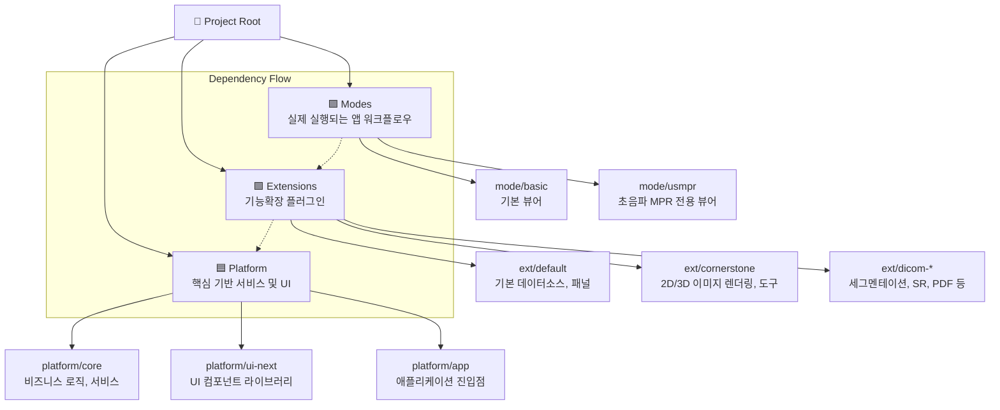
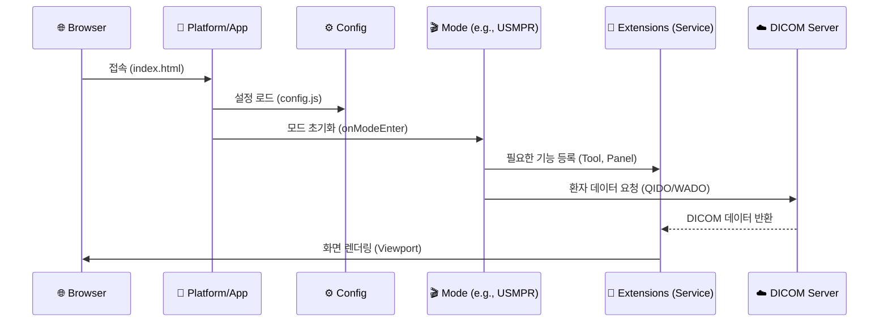

# 🏗️ OHIF 프로젝트 구조 & 모듈 가이드

이 문서는 OHIF 프레임워크의 폴더 구조와 각 모듈의 역할을 개발자가 이해하기 쉽게 시각적으로 정리한 가이드입니다.

---

## 🗺️ 전체 구조도 (Monorepo Architecture)

이 프로젝트는 **Monorepo** 구조로 되어 있으며, 크게 3계층으로 나뉩니다.

---

## 📁 1. Platform (기반 계층)

> _"건물의 기초와 뼈대"_ - 모든 확장이 공통으로 사용하는 핵심 라이브러리입니다.

|         폴더         | 역할 및 설명                                                                                                       | 주요 내용                                                              |
| :------------------: | :----------------------------------------------------------------------------------------------------------------- | :--------------------------------------------------------------------- |
|      **`core`**      | **🧠 두뇌 (Business Logic)** 데이터 관리, 서비스(Services), 유틸리티를 담당합니다. UI와 무관한 순수 로직입니다. | `ServicesManager`, `ExtensionManager`, `Classes` (MetadataProvider 등) |
| **`ui` / `ui-next`** | **🎨 외관 (UI Components)** 버튼, 모달, 뷰포트 등 재사용 가능한 UI 컴포넌트 모음입니다.                         | `Button`, `Icon`, `ViewportGrid`, `Theme`                              |
|      **`app`**       | **🚀 실행 (Application Entry)** 설정(Configuration)을 로드하고 앱을 초기화하여 브라우저에 띄웁니다.             | `index.js`, `public/config/` (설정파일), `unbundled.js`                |
|        `cli`         | **🛠️ 도구 (Command Line)** 프로젝트 생성, 확장 추가 등을 돕는 CLI 도구입니다.                                   | OHIF CLI 커맨드                                                        |
|        `i18n`        | **🌍 언어 (Internationalization)** 다국어 지원을 위한 번역 파일들입니다.                                        | `locales/` (ko.json, en.json 등)                                       |

---

## 🧩 2. Extensions (확장 계층)

> _"레고 블록"_ - 특정 기능을 수행하는 독립적인 플러그인들입니다.

| 확장 (Extension)       | 역할 (Role)            | 주요 기능                                                       |
| :--------------------- | :--------------------- | :-------------------------------------------------------------- |
| **`default`**          | **기본 기능**          | 데이터소스(DicomWeb), 기본 패널/툴바, 레이아웃 관리             |
| **`cornerstone`**      | **이미지 렌더링**      | **Cornerstone3D** 기반 뷰포트, 도구(길이, 각도 등), 동기화 로직 |
| `cornerstone-dicom-sr` | **구조화 리포트**      | DICOM SR(Structured Report) 표시 및 생성                        |
| `dicom-segmentation`   | **분할(Segmentation)** | 장기/병변 분할 데이터 로드 및 표시, 편집 도구                   |
| `dicom-video`          | **비디오**             | DICOM Video 형식을 재생하는 기능                                |
| `dicom-pdf`            | **문서**               | DICOM에 포함된 PDF 문서를 보는 기능                             |
| `dicom-microscopy`     | **현미경**             | 대용량 병리 이미지(Whole Slide Image) 뷰어                      |

---

## 🎬 3. Modes (모드/워크플로우 계층)

> _"조립된 완성품"_ - 확장(Extensions)들을 조합하여 만든 **실제 사용자 앱(Workflow)**입니다.

| 모드 (Mode)    | 설명                                                                                              | 구성 요소 (조합)                             |
| :------------- | :------------------------------------------------------------------------------------------------ | :------------------------------------------- |
| **`basic`**    | **기본 뷰어** 일반적인 방사선 영상(CT, MR, CR 등)을 보기 위한 모드입니다.                      | `default` + `cornerstone`                    |
| **`usmpr`**    | **초음파 MPR 뷰어** 초음파(US) 이미지를 3차원 다평면 재구성(MPR)으로 보여주는 특화 모드입니다. | `default` + `cornerstone` + **US 전용 로직** |
| `tmtv`         | **PET-CT 분석** 종양 추적 및 대사량 분석을 위한 전문 워크플로우입니다.                         | `default` + `cornerstone` + `tmtv`(확장)     |
| `microscopy`   | **병리 뷰어** 디지털 병리 슬라이드를 보기 위한 모드입니다.                                     | `default` + `dicom-microscopy`               |
| `longitudinal` | **추적 관찰** 동일 환자의 과거/현재 검사를 비교하는 모드입니다.                                | `default` + `cornerstone` + 비교 로직        |

---

## 🔄 데이터 흐름도 (Data & Architecture Flow)

사용자가 OHIF 뷰어를 켰을 때 데이터가 어떻게 흐르는지 보여줍니다.

---

## 💡 개발자를 위한 팁 (Developer Tips)

1.  **설정 변경**: `platform/app/public/config/*.js` 파일을 수정하여 서버 주소 등을 변경합니다.
2.  **새 기능 추가**:
    - **도구(Tool)**나 **패널**이 필요하면 👉 `Extensions`을 수정하거나 새로 만드세요.
    - **화면 레이아웃**이나 **워크플로우**가 필요하면 👉 `Modes`를 수정하거나 새로 만드세요.
    - **공통 UI 컴포넌트**가 필요하면 👉 `Platform/UI`를 수정하세요.
3.  **Hanging Protocol**: 화면 배치를 정의하는 로직은 주로 `extensions/default` 내에 있거나 각 `mode` 설정에 포함됩니다.
