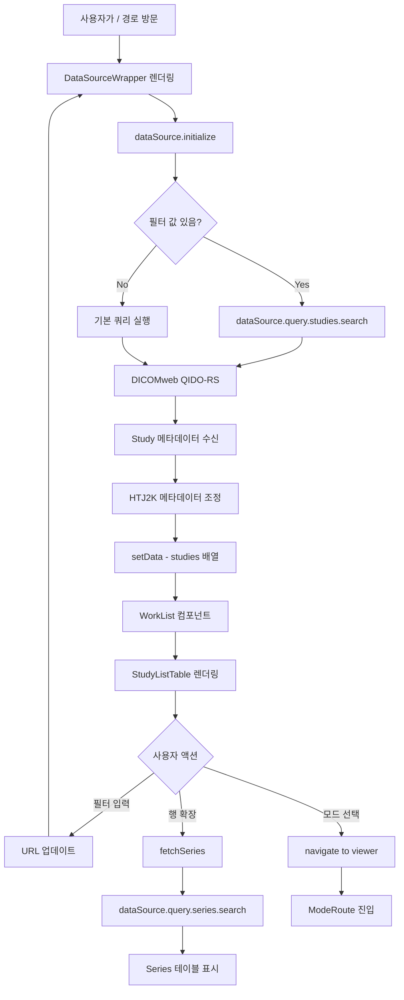
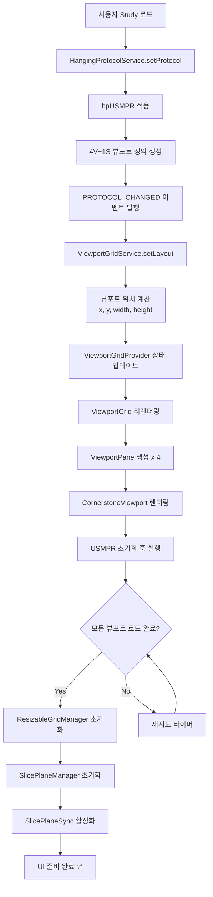

# OHIF Medical Imaging Viewer - UI 구조 시각화 가이드

> **작성일**: 2026-01-08
> **프로젝트**: mView-Web V2 (OHIF v3.12.0-beta 기반)
> **목적**: 웹페이지 UI 레이아웃 및 컴포넌트 구조 시각적 이해

---

## 📋 목차

0. [로그인 페이지 (Login)](#0-로그인-페이지-login)
1. [Study List (Worklist) 페이지](#1-study-list-worklist-페이지)
2. [전체 페이지 레이아웃 (Viewer)](#2-전체-페이지-레이아웃-viewer)
3. [컴포넌트 계층 구조](#3-컴포넌트-계층-구조)
4. [USMPR 모드 특화 레이아웃](#4-usmpr-모드-특화-레이아웃)
5. [UI 레이어별 컴포넌트](#5-ui-레이어별-컴포넌트)
6. [상태 관리 흐름도](#6-상태-관리-흐름도)
7. [확장(Extension)별 UI 기여도](#7-확장extension별-ui-기여도)

---

## 0. 로그인 페이지 (Login)

### 페이지 개요

로그인 페이지는 **인증 진입점**으로, 사용자 인증을 처리하고 세션을 시작합니다.

- **라우트**: `/login` (인증 필요 시 자동 리다이렉트)
- **컴포넌트**: `Login` (platform/app/src/routes/Login/Login.tsx)
- **기능**: 사용자 인증, JWT 토큰 발급, 세션 관리
- **인증 방식**: JWT (JSON Web Token) + AES-CBC 암호화

### 로그인 화면 구조

```
┌─────────────────────────────────────────────────────────────┐
│                                                             │
│                                                             │
│                     ┌─────────────────┐                     │
│                     │                 │                     │
│                     │   MView-Web     │  ← 앱 타이틀        │
│                     │                 │                     │
│                     └─────────────────┘                     │
│                                                             │
│                     ┌─────────────────┐                     │
│         Username    │                 │                     │
│                     │ [___________]   │  ← 아이디 입력      │
│                     └─────────────────┘                     │
│                                                             │
│                     ┌─────────────────┐                     │
│         Password    │                 │                     │
│                     │ [***********]   │  ← 비밀번호 입력    │
│                     └─────────────────┘                     │
│                                                             │
│                     ┌─────────────────┐                     │
│                     │     Login       │  ← 로그인 버튼      │
│                     └─────────────────┘                     │
│                                                             │
│              Open local files without login                 │
│              (로컬 파일 열기 링크)                           │
│                                                             │
└─────────────────────────────────────────────────────────────┘

배경: 검은색 (bg-black)
폼 박스: 테두리 있는 둥근 사각형 (max-width: 28rem)
```

### 컴포넌트 구조

```
🔐 <Login> (platform/app/src/routes/Login/Login.tsx)
 │
 ├─ 상태 관리
 │  ├─ username: string
 │  ├─ password: string
 │  ├─ error: string
 │  └─ isLoading: boolean
 │
 ├─ Hooks
 │  ├─ useNavigate() - 페이지 이동
 │  ├─ useLocation() - 현재 위치
 │  └─ useUserAuthentication() - 사용자 인증 상태
 │
 └─ UI 요소
    ├─ <h1> - "MView-Web" 타이틀
    ├─ <Input id="username"> - 아이디 입력 (@ohif/ui)
    ├─ <Input id="password" type="password"> - 비밀번호 입력
    ├─ {error && <div>} - 에러 메시지 표시
    ├─ <Button onClick={handleLogin}> - 로그인 버튼
    └─ <a href="/local"> - 로컬 파일 열기 링크
```

### 인증 흐름

```mermaid
graph TD
    A[사용자 /login 방문] --> B[Login 컴포넌트 렌더링]
    B --> C[Username/Password 입력]
    C --> D[Login 버튼 클릭 또는 Enter]

    D --> E[handleLogin 실행]
    E --> F{입력값 검증}

    F -->|실패| G[에러 메시지 표시]
    F -->|성공| H[encryptPassword - AES-CBC 암호화]

    H --> I[POST /v2/auth/login]
    I --> J{서버 응답}

    J -->|401 Unauthorized| K[Invalid username or password]
    J -->|Other Error| L[Login failed: status]
    J -->|200 OK| M[토큰 수신]

    M --> N[sessionStorage에 저장]
    N --> O[access_token, refresh_token, token_type]
    N --> P[user 객체 저장]

    P --> Q[UserAuthenticationService.setUser]
    Q --> R{리다이렉트 경로 있음?}

    R -->|Yes| S[ohif-redirect-to에서 경로 읽기]
    R -->|No| T[/ 로 이동]

    S --> U[원래 페이지로 리다이렉트]
    T --> V[Worklist로 이동]
```

### 주요 기능

#### 1. AES-CBC 암호화

**비밀번호 보안 - 클라이언트 측 암호화**:
- **알고리즘**: AES-CBC (Advanced Encryption Standard - Cipher Block Chaining)
- **키 길이**: 128-bit (16 bytes)
- **IV (Initialization Vector)**: 16 bytes
- **인코딩**: Base64

**프로세스**:
1. 평문 비밀번호 → UTF-8 인코딩
2. AES-CBC 암호화 (Web Crypto API 사용)
3. Base64 인코딩
4. 서버로 전송

#### 2. 세션 관리

**sessionStorage 저장 항목**:
- `access_token`: JWT 액세스 토큰
- `refresh_token`: JWT 리프레시 토큰
- `token_type`: "Bearer"
- `user`: 사용자 정보 객체 (JSON 문자열)

**사용자 정보 구조**:
```typescript
{
  username: string,
  name: string,
  role: string,        // "radiologist", "technician", etc.
  group: string,       // "cardiology", "neurology", etc.
  session_id: string,
  authenticated: true,
  loginTime: string    // ISO 8601 timestamp
}
```

#### 3. 리다이렉트 처리

로그인 전에 접근하려던 페이지로 자동 복귀:
- `ohif-redirect-to` 키에 저장된 경로 확인
- 로그인 성공 후 해당 경로로 navigate
- 저장된 경로가 없으면 홈(`/`)으로 이동

### 보안 고려사항

| 항목 | 구현 내용 | 보안 수준 |
|------|----------|----------|
| **비밀번호 암호화** | AES-CBC (클라이언트) | ⭐⭐⭐ |
| **전송 보안** | HTTPS 필수 (프로덕션) | ⭐⭐⭐⭐ |
| **토큰 저장** | sessionStorage (탭 닫으면 삭제) | ⭐⭐⭐ |
| **토큰 만료** | 서버 측 JWT expiry | ⭐⭐⭐⭐ |
| **Refresh Token** | 자동 갱신 로직 필요 (미구현) | ⭐⭐ |

**환경 변수 설정 필수**:
```bash
APP_ENCRYPTION_KEY=sixteen_byte_key  # 정확히 16 bytes
APP_ENCRYPTION_IV=sixteen_byte_iv__  # 정확히 16 bytes
```

### 파일 정보

| 속성 | 값 |
|------|-----|
| **파일 경로** | `platform/app/src/routes/Login/Login.tsx` |
| **라인 수** | 212 |
| **라우트** | `/login` |
| **인증 필요** | ❌ (Public Route) |

---

## 1. Study List (Worklist) 페이지

### 페이지 개요

Study List (Worklist)는 OHIF 뷰어의 **진입점**으로, 사용자가 의료 영상 스터디를 검색하고 선택하여 뷰어로 진입하는 페이지입니다.

- **라우트**: `/` (루트 경로)
- **컴포넌트**: `WorkList` (platform/app/src/routes/WorkList/WorkList.tsx)
- **기능**: 스터디 검색, 필터링, 정렬, 모드 선택

### Worklist 화면 구조

```
┏━━━━━━━━━━━━━━━━━━━━━━━━━━━━━━━━━━━━━━━━━━━━━━━━━━━━━━━━━━━━━━━━━━┓
┃                        🔹 Header 🔹                                ┃
┃  ┌────────────────────────────────────────────────────────────┐   ┃
┃  │ 🏥 OHIF Viewer     [Data Source Config]     [Upload] [≡]   │   ┃
┃  └────────────────────────────────────────────────────────────┘   ┃
┗━━━━━━━━━━━━━━━━━━━━━━━━━━━━━━━━━━━━━━━━━━━━━━━━━━━━━━━━━━━━━━━━━━┛

┏━━━━━━━━━━━━━━━━━━━━━━━━━━━━━━━━━━━━━━━━━━━━━━━━━━━━━━━━━━━━━━━━━━┓
┃                    🔍 StudyListFilter (검색 영역)                  ┃
┃  ┌────────────────────────────────────────────────────────────┐   ┃
┃  │ Physician: [___________]  MRN: [___________]               │   ┃
┃  │ Patient Name: [___________]  Study Date: [____] ~ [____]   │   ┃
┃  │ Description: [___________]  Modality: [CT][MR][US][▼]      │   ┃
┃  │ Accession: [___________]                                   │   ┃
┃  └────────────────────────────────────────────────────────────┘   ┃
┗━━━━━━━━━━━━━━━━━━━━━━━━━━━━━━━━━━━━━━━━━━━━━━━━━━━━━━━━━━━━━━━━━━┛

┏━━━━━━━━━━━━━━━━━━━━━━━━━━━━━━━━━━━━━━━━━━━━━━━━━━━━━━━━━━━━━━━━━━┓
┃                  📊 StudyListTable (검색 결과)                     ┃
┃  ┌────────────────────────────────────────────────────────────┐   ┃
┃  │ Physician ↕ │ MRN ↕ │ Patient ↕ │ Date ↕ │ Desc │ Mod │...│   ┃ ← 헤더 (정렬 가능)
┃  ├────────────────────────────────────────────────────────────┤   ┃
┃  │ Dr. Smith   │ 12345 │ John Doe  │ 2026.. │ CT  │ CT  │ 150│▼ │ ← 스터디 행 1
┃  ├────────────────────────────────────────────────────────────┤   ┃
┃  │ Dr. Jones   │ 67890 │ Jane Smith│ 2026.. │ MRI │ MR  │ 320│▼ │ ← 스터디 행 2 (선택됨)
┃  │ ┌──────────────────────────────────────────────────────┐   │   ┃
┃  │ │ 📋 Series Details (확장 영역)                         │   │   ┃ ← 확장된 시리즈 정보
┃  │ ├──────────────────────────────────────────────────────┤   │   ┃
┃  │ │ Description    │ Series # │ Modality │ Instances │   │   │   ┃
┃  │ │ T1 Axial       │    1     │   MR     │    25     │   │   │   ┃
┃  │ │ T2 Sagittal    │    2     │   MR     │    30     │   │   │   ┃
┃  │ │ FLAIR Coronal  │    3     │   MR     │    28     │   │   │   ┃
┃  │ ├──────────────────────────────────────────────────────┤   │   ┃
┃  │ │ 🚀 Available Modes:                                  │   │   ┃
┃  │ │ [Basic Viewer] [USMPR Mode] [Longitudinal]           │   │   ┃ ← 모드 선택 버튼
┃  │ └──────────────────────────────────────────────────────┘   │   ┃
┃  ├────────────────────────────────────────────────────────────┤   ┃
┃  │ Dr. Lee     │ 11111 │ Bob Brown │ 2026.. │ US  │ US  │  80│▼ │ ← 스터디 행 3
┃  ├────────────────────────────────────────────────────────────┤   ┃
┃  │ ...                                                        │   ┃
┃  └────────────────────────────────────────────────────────────┘   ┃
┗━━━━━━━━━━━━━━━━━━━━━━━━━━━━━━━━━━━━━━━━━━━━━━━━━━━━━━━━━━━━━━━━━━┛

┏━━━━━━━━━━━━━━━━━━━━━━━━━━━━━━━━━━━━━━━━━━━━━━━━━━━━━━━━━━━━━━━━━━┓
┃              📄 StudyListPagination (페이지네이션)                 ┃
┃  ┌────────────────────────────────────────────────────────────┐   ┃
┃  │ Results per page: [25 ▼]  │  ◀ 1 2 3 ... 10 ▶  │ 1-25/101+│   ┃
┃  └────────────────────────────────────────────────────────────┘   ┃
┗━━━━━━━━━━━━━━━━━━━━━━━━━━━━━━━━━━━━━━━━━━━━━━━━━━━━━━━━━━━━━━━━━━┛
```

### 컴포넌트 계층 구조

```
📋 <WorkListRoute> (/)
 │
 ├─ 🔄 <DataSourceWrapper>
 │   ├─ [1] 데이터 소스 초기화
 │   │   └─ dataSource.initialize({ params, query })
 │   │
 │   ├─ [2] 스터디 검색 실행
 │   │   └─ dataSource.query.studies.search(filterValues)
 │   │
 │   └─ [3] 데이터 전달
 │       └─ studies[], dataTotal, isLoadingData
 │
 └─ 📊 <WorkList> (platform/app/src/routes/WorkList/WorkList.tsx)
     │
     ├─ 🔹 <Header>
     │   ├─ Logo / App Name
     │   ├─ Data Source Config Button
     │   ├─ Upload Button (optional)
     │   └─ Menu Dropdown
     │
     ├─ 🔍 <StudyListFilter> (platform/ui/src/components/StudyListFilter/)
     │   └─ <InputGroup>
     │       ├─ <InputText name="requestingPhysician">
     │       ├─ <InputText name="mrn">
     │       ├─ <InputText name="patientName">
     │       ├─ <InputDateRange name="studyDate">
     │       ├─ <InputText name="description">
     │       ├─ <InputMultiSelect name="modalities">
     │       │   └─ [CT] [MR] [US] [PT] [XA] ...
     │       └─ <InputText name="accession">
     │
     ├─ 📊 <StudyListTable> (platform/ui/src/components/StudyListTable/)
     │   ├─ Header Row (정렬 가능한 컬럼 헤더)
     │   │   └─ onClick → setFilterValues({ sortBy, sortDirection })
     │   │
     │   └─ <StudyListTableRow> (각 스터디마다 반복)
     │       ├─ Main Row (스터디 정보 표시)
     │       │   ├─ onClick → setSelectedRow()
     │       │   ├─ onDoubleClick → navigate to viewer
     │       │   └─ onContextMenu → show mode selection menu
     │       │
     │       └─ <StudyListExpandedRow> (확장 시 표시)
     │           ├─ Series Table (시리즈 상세 정보)
     │           │   └─ Lazy load: dataSource.query.series.search()
     │           │
     │           └─ Mode Launch Buttons
     │               ├─ [Basic Viewer]
     │               ├─ [USMPR Mode]
     │               ├─ [Longitudinal]
     │               └─ ... (모달리티에 따라 활성화/비활성화)
     │
     └─ 📄 <StudyListPagination>
         ├─ Results per page selector: [25] [50] [100]
         ├─ Page navigation: ◀ [1] [2] [3] ... ▶
         └─ Total count display: "1-25 of 101+"
```

### 주요 기능

#### 1. 검색 필터 (StudyListFilter)

| 필터 항목 | 입력 타입 | 정렬 가능 | 설명 |
|----------|----------|---------|------|
| **Requesting Physician** | Text | ✅ | 의뢰 의사 이름 |
| **MRN** | Text | ✅ | 환자 의료 기록 번호 |
| **Patient Name** | Text | ✅ | 환자 이름 (Last^First 형식) |
| **Study Date** | DateRange | ✅ | 스터디 날짜 범위 (YYYYMMDD) |
| **Description** | Text | ✅ | 스터디 설명/프로토콜 |
| **Modalities** | MultiSelect | ✅ | 모달리티 (CT, MR, US 등) |
| **Accession** | Text | ✅ | Accession Number |
| **Instances** | Display Only | ❌ | 인스턴스 개수 (표시만) |

**필터 동작 방식**:
```
사용자 입력
  ↓
useDebounce(200ms) ← 과도한 요청 방지
  ↓
URL Query String 업데이트
  ↓
DataSourceWrapper useEffect 감지
  ↓
dataSource.query.studies.search({
  patientId: 'mrn-value',
  patientName: 'name-value',
  studyDescription: 'desc-value',
  modalitiesInStudy: ['CT', 'MR'],
  startDate: '20260101',
  endDate: '20261231',
  pageNumber: 1,
  resultsPerPage: 25,
  sortBy: 'studyDate',
  sortDirection: 'descending'
})
  ↓
QIDO-RS Query (DICOMweb) 또는 Local Search
  ↓
Study List 업데이트
```

#### 2. 스터디 테이블 인터랙션

**테이블 행 동작**:
- **클릭 (Click)**: 행 선택 (배경색 변경)
- **더블클릭 (Double-Click)**: 지능형 모드 선택 후 뷰어 진입
  ```typescript
  // 모달리티에 맞는 첫 번째 모드 선택
  // 없으면 'basic' 모드로 폴백
  const mode = findMatchingMode(study.modalities) || 'basic';
  navigate(`/${mode}/ohif?StudyInstanceUIDs=${study.uid}`);
  ```
- **우클릭 (Right-Click)**: 컨텍스트 메뉴 표시 (사용 가능한 모드 목록)
- **확장 화살표 클릭**: 시리즈 상세 정보 표시

**확장된 시리즈 테이블**:
```
┌─────────────────────────────────────────────────────────┐
│ Description       │ Series # │ Modality │ Instances     │
├─────────────────────────────────────────────────────────┤
│ T1 Axial          │    1     │   MR     │     25        │
│ T2 Sagittal       │    2     │   MR     │     30        │
│ FLAIR Coronal     │    3     │   MR     │     28        │
└─────────────────────────────────────────────────────────┘

🚀 Available Modes:
[Basic Viewer] [USMPR Mode (disabled)] [Longitudinal]
              ↑
         모달리티 불일치로 비활성화
         (툴팁: "This mode requires US modality")
```

#### 3. 페이지네이션 전략

**롤링 윈도우 방식**:
- 최대 **101개** 스터디 조회 (`STUDIES_LIMIT = 101`)
- 100개 이상이면 ">100" 표시
- 오프셋 계산: `Math.floor((pageNumber * resultsPerPage) / 101) * 100`

**페이지당 결과 수**:
- 25개 (기본값)
- 50개
- 100개

**예시**:
```
Page 1: Offset 0,   Studies 1-25
Page 2: Offset 0,   Studies 26-50
Page 3: Offset 0,   Studies 51-75
Page 4: Offset 0,   Studies 76-100
Page 5: Offset 100, Studies 101-125 (새로운 쿼리)
```

### 데이터 흐름



### 상태 관리

**WorkList 컴포넌트 상태**:
```typescript
// 필터 값 (URL과 동기화)
const [filterValues, setFilterValues] = useState({
  requestingPhysician: '',
  mrn: '',
  patientName: '',
  studyDate: { startDate: '', endDate: '' },
  description: '',
  modalities: [],
  accession: '',
  sortBy: 'studyDate',
  sortDirection: 'descending',
  pageNumber: 1,
  resultsPerPage: 25
});

// UI 상태
const [expandedRows, setExpandedRows] = useState([]);
const [selectedRow, setSelectedRow] = useState(null);
const [studiesWithSeriesData, setStudiesWithSeriesData] = useState([]);
const [contextMenu, setContextMenu] = useState(null);
```

**DataSourceWrapper 상태**:
```typescript
const [dataSource, setDataSource] = useState();
const [isDataSourceInitialized, setIsDataSourceInitialized] = useState(false);
const [data, setData] = useState({ studies: [], total: 0 });
const [isLoading, setIsLoading] = useState(false);
```

**URL 쿼리 파라미터** (예시):
```
/?patientName=John&studyDate=20260101-20261231&modalities=CT,MR&pageNumber=2&resultsPerPage=50
```

### 뷰어 진입 시나리오

#### 시나리오 A: 더블클릭으로 진입

```
1. 사용자가 스터디 행 더블클릭
   └─ onDoubleClick handler

2. 지능형 모드 선택
   ├─ Study 모달리티 확인: ['US']
   ├─ 모든 모드 검색
   │   └─ modeModalities가 정의된 모드 중 일치하는 것 찾기
   └─ 결과: 'usmpr' 모드 선택

3. URL 생성
   └─ /usmpr/ohif?StudyInstanceUIDs=1.2.3.4.5

4. React Router 네비게이션
   └─ ModeRoute 진입

5. USMPR 모드 로드
   └─ 4V+1S 레이아웃 표시
```

#### 시나리오 B: 모드 버튼으로 진입

```
1. 사용자가 확장 화살표 클릭
   └─ expandedRows에 studyUID 추가

2. 시리즈 로드 (lazy)
   ├─ dataSource.query.series.search(studyUID)
   └─ studiesWithSeriesData 업데이트

3. 모드 버튼 렌더링
   ├─ 각 모드의 isValidMode() 검증
   ├─ 유효하면: 활성화 버튼
   └─ 무효하면: 비활성화 + 툴팁 (이유 표시)

4. 사용자가 "USMPR Mode" 버튼 클릭
   └─ onClick: navigate('/usmpr/ohif?StudyInstanceUIDs=...')

5. USMPR 모드 로드
```

#### 시나리오 C: 우클릭 메뉴로 진입

```
1. 사용자가 스터디 행 우클릭
   └─ onContextMenu handler

2. ContextMenu 표시
   ┌────────────────────────┐
   │ Open with:             │
   ├────────────────────────┤
   │ ✓ Basic Viewer         │
   │ ✓ USMPR Mode           │
   │ ✓ Longitudinal         │
   │ ✗ Microscopy (disabled)│
   └────────────────────────┘

3. 모드 선택
   └─ onClick: navigate to selected mode

4. 뷰어 로드
```

### HTJ2K 최적화 (Worklist에서)

**메타데이터 조정** (DICOMweb DataSource):
```typescript
// extensions/default/src/DicomWebDataSource/index.ts

// HTJ2K Transfer Syntax 감지
if (instance.TransferSyntaxUID === '1.2.840.10008.1.2.4.201') {
  // Volume viewport용 Level 2 조정
  instance.Rows = instance.Rows / 4;
  instance.Columns = instance.Columns / 4;
  instance.PixelSpacing = [
    instance.PixelSpacing[0] * 4,
    instance.PixelSpacing[1] * 4
  ];

  // 메타데이터에 플래그 추가
  instance.htj2kAdjusted = true;
  instance.htj2kLevel = 2;
}
```

**효과**:
- Worklist에서 썸네일 로딩 속도 향상
- Volume MPR 로딩 속도 4배 개선 (1/4 해상도)
- Stack viewport는 Level 0 (원본 해상도) 유지

### 주요 컴포넌트 파일

| 컴포넌트 | 파일 경로 | 라인 수 | 역할 |
|---------|----------|---------|------|
| **WorkList** | `platform/app/src/routes/WorkList/WorkList.tsx` | 797 | 메인 Worklist 컴포넌트 |
| **DataSourceWrapper** | `platform/app/src/routes/DataSourceWrapper.tsx` | 305 | 데이터 소스 초기화 & 쿼리 |
| **StudyListFilter** | `platform/ui/src/components/StudyListFilter/` | 100+ | 검색 필터 폼 |
| **StudyListTable** | `platform/ui/src/components/StudyListTable/StudyListTable.tsx` | 94 | 테이블 그리드 |
| **StudyListTableRow** | `platform/ui/src/components/StudyListTable/StudyListTableRow.tsx` | 125 | 행 + 확장 기능 |
| **StudyListExpandedRow** | `platform/ui/src/components/StudyListTable/StudyListExpandedRow.tsx` | 150+ | 시리즈 테이블 + 모드 버튼 |
| **StudyListPagination** | `platform/ui/src/components/StudyListPagination/` | 102 | 페이지네이션 |
| **InputGroup** | `platform/ui/src/components/InputGroup/InputGroup.tsx` | 120+ | 필터 입력 로직 |

### 빈 상태 (Empty State)

검색 결과가 없을 때:
```
┌────────────────────────────────────────┐
│                                        │
│         🔍                             │
│    No studies found                    │
│                                        │
│  Try adjusting your search filters     │
│                                        │
└────────────────────────────────────────┘
```

컴포넌트: `EmptyStudies` (platform/ui/src/components/)

---

## 2. 전체 페이지 레이아웃 (Viewer)

### 메인 뷰어 화면 구조

```
┏━━━━━━━━━━━━━━━━━━━━━━━━━━━━━━━━━━━━━━━━━━━━━━━━━━━━━━━━━━━━━━━━━━━━━━━┓
┃                          🔹 ViewerHeader 🔹                            ┃
┃  ┌──────────┬─────────────────────────────────────────┬─────────────┐ ┃
┃  │ ← Return │ 👤 Patient Info (Name, MRN, DOB)        │ ≡ Menu      │ ┃
┃  └──────────┴─────────────────────────────────────────┴─────────────┘ ┃
┃  ┌─────────────────────────────────────────────────────────────────┐   ┃
┃  │ 🔧 Primary Toolbar                                              │   ┃
┃  │ [Length] [Crosshair] [WindowLevel] [Zoom] [Pan] [Layout Config] │   ┃
┃  └─────────────────────────────────────────────────────────────────┘   ┃
┃  ┌─────────────────────────────────────────────────────────────────┐   ┃
┃  │ 🔄 Secondary Toolbar: [↶ Undo] [↷ Redo]                        │   ┃
┃  └─────────────────────────────────────────────────────────────────┘   ┃
┗━━━━━━━━━━━━━━━━━━━━━━━━━━━━━━━━━━━━━━━━━━━━━━━━━━━━━━━━━━━━━━━━━━━━━━━┛

┏━━━━━━━━━━━┳━━━━━━━━━━━━━━━━━━━━━━━━━━━━━━━━━━━━━━━━━━━━━━┳━━━━━━━━━━━━┓
┃           ┃                                              ┃            ┃
┃  📁 Left  ┃          🖼️ ViewportGrid (중앙 영역)           ┃  📊 Right  ┃
┃   Panel   ┃                                              ┃   Panel    ┃
┃ (Resizable┃  ┏━━━━━━━━━━━━━━━━━━━━┳━━━━━━━━━━━━━━━━━━━━┓ ┃ (Resizable)┃
┃   240px)  ┃  ┃                    ┃                    ┃ ┃            ┃
┃           ┃  ┃  Viewport 1        ┃  Viewport 2        ┃ ┃            ┃
┃  ┌──────┐ ┃  ┃  (mpr-0: Axial)    ┃  (mpr-1: Sagittal) ┃ ┃ Measurement┃
┃  │ 🏥  │ ┃  ┃                    ┃                    ┃ ┃  Table     ┃
┃  │Study │ ┃  ┃  [Crosshair 🎯]    ┃  [Crosshair 🎯]    ┃ ┃            ┃
┃  │ Info │ ┃  ┃                    ┃                    ┃ ┃ ┌────────┐ ┃
┃  └──────┘ ┃  ┃                    ┃                    ┃ ┃ │Length: │ ┃
┃           ┃  ┣━━━━━━━━━━━━━━━━━━━━╋━━━━━━━━━━━━━━━━━━━━┫ ┃ │ 15.2mm │ ┃
┃  ┌──────┐ ┃  ┃                    ┃                    ┃ ┃ └────────┘ ┃
┃  │Series│ ┃  ┃  Viewport 3        ┃  Viewport 4        ┃ ┃            ┃
┃  │  #1  │ ┃  ┃  (mpr-2: Coronal)  ┃  (mpr-3: 3D Volume)┃ ┃ ┌────────┐ ┃
┃  │ 🖼️🖼️ │ ┃  ┃                    ┃                    ┃ ┃ │ Angle: │ ┃
┃  └──────┘ ┃  ┃  [Crosshair 🎯]    ┃  [Slice Planes 📐] ┃ ┃ │ 45.0°  │ ┃
┃  ┌──────┐ ┃  ┃                    ┃                    ┃ ┃ └────────┘ ┃
┃  │Series│ ┃  ┃                    ┃  (Red/Yellow/Cyan) ┃ ┃            ┃
┃  │  #2  │ ┃  ┃                    ┃                    ┃ ┃            ┃
┃  │ 🖼️🖼️ │ ┃  ┗━━━━━━━━━━━━━━━━━━━━┻━━━━━━━━━━━━━━━━━━━━┛ ┃            ┃
┃  └──────┘ ┃                                              ┃            ┃
┃           ┃   ⬌ Vertical Drag Handle                    ┃            ┃
┃           ┃   ⬍ Horizontal Drag Handle                  ┃            ┃
┗━━━━━━━━━━━┻━━━━━━━━━━━━━━━━━━━━━━━━━━━━━━━━━━━━━━━━━━━━━━┻━━━━━━━━━━━━┛
```

### 주요 영역 설명

| 영역 | 컴포넌트 | 기능 | 크기/위치 |
|------|----------|------|-----------|
| **Header** | `ViewerHeader` | 환자 정보, 툴바, 메뉴 | 고정 상단 (~120px) |
| **Left Panel** | `SidePanelWithServices` | Study Browser, 시리즈 썸네일 | 좌측, 크기 조절 가능 (기본 240px) |
| **Center** | `ViewportGrid` | 의료 이미지 뷰포트 (4개) | 중앙, 가변 크기 |
| **Right Panel** | `SidePanelWithServices` | Measurement Table | 우측, 크기 조절 가능 |

---

## 3. 컴포넌트 계층 구조

### React 컴포넌트 트리 (축약)

```
📦 <App>
 ├─ 🌐 <BrowserRouter>
 ├─ 🌍 <I18nextProvider>
 ├─ ⚙️ <AppConfigProvider>
 └─ 🎨 <ThemeWrapperNext>
     └─ 🔧 <SystemContextProvider>
         ├─ 🔔 <NotificationProvider>
         ├─ 🪟 <ModalProvider>
         ├─ 💬 <DialogProvider>
         ├─ 🖼️ <ViewportGridProvider>
         ├─ 🎬 <CineProvider>
         ├─ 💡 <TooltipProvider>
         ├─ 📊 <ViewportDialogProvider>
         ├─ 🔐 <UserAuthenticationProvider>
         └─ 🧩 <Compose>
             └─ 🛣️ <Routes>
                 ├─ 📋 <WorkListRoute>         (/worklist)
                 ├─ 🏥 <ModeRoute>             (/viewer/:studyInstanceUIDs)  ⭐
                 ├─ 📁 <LocalRoute>            (/local)
                 └─ ❌ <NotFoundRoute>         (404)
```

### ModeRoute 내부 (USMPR 모드 진입점)

```
🏥 <ModeRoute>
 │
 ├─ [1] 확장 로드 (Extensions Loading)
 │   ├─ @ohif/extension-default
 │   ├─ @ohif/extension-cornerstone
 │   ├─ @ohif/extension-measurement-tracking
 │   └─ ... (기타 확장)
 │
 ├─ [2] 서비스 초기화
 │   ├─ DisplaySetService
 │   ├─ HangingProtocolService ← hpUSMPR 적용 ⭐
 │   ├─ ViewportGridService
 │   ├─ CornerstoneViewportService
 │   ├─ MeasurementService
 │   └─ ...
 │
 ├─ [3] Hanging Protocol 적용
 │   └─ hpUSMPR → 4V+1S 레이아웃 생성
 │       ├─ mpr-0 (Axial)
 │       ├─ mpr-1 (Sagittal)
 │       ├─ mpr-2 (Coronal)
 │       ├─ mpr-3 (3D Volume)
 │       └─ mpr-stack-single (숨김)
 │
 └─ [4] 모드별 레이아웃 렌더링
     └─ <ViewerLayout>
         ├─ <ViewerHeader>
         ├─ <ResizablePanelGroup>
         │   ├─ <ResizablePanel side="left">
         │   │   └─ <WrappedPanelStudyBrowser>
         │   ├─ <ResizablePanel side="center">
         │   │   └─ <ViewportGrid>
         │   │       ├─ <ViewportPane id="mpr-0">
         │   │       │   └─ <CornerstoneViewport>
         │   │       ├─ <ViewportPane id="mpr-1">
         │   │       │   └─ <CornerstoneViewport>
         │   │       ├─ <ViewportPane id="mpr-2">
         │   │       │   └─ <CornerstoneViewport>
         │   │       └─ <ViewportPane id="mpr-3">
         │   │           └─ <CornerstoneViewport>
         │   └─ <ResizablePanel side="right">
         │       └─ <MeasurementTable>
         └─ <ResizableGridManager> (DOM overlay)
```

---

## 4. USMPR 모드 특화 레이아웃

### 4V+1S 뷰포트 배치 (기본 설정)

```
┏━━━━━━━━━━━━━━━━━━━━━━━┳━━━━━━━━━━━━━━━━━━━━━━━┓
┃                       ┃                       ┃
┃  🔴 Viewport #1       ┃  🟡 Viewport #2       ┃
┃  ID: mpr-0            ┃  ID: mpr-1            ┃
┃  View: Axial          ┃  View: Sagittal       ┃
┃  Type: Volume MPR     ┃  Type: Volume MPR     ┃
┃                       ┃                       ┃
┃       🎯 Crosshair    ┃       🎯 Crosshair    ┃
┃  (Red line marker)    ┃  (Yellow line marker) ┃
┃                       ┃                       ┃
┃  Slice: 50/100        ┃  Slice: 75/150        ┃
┃  WL: 40/400           ┃  WL: 40/400           ┃
┃                       ┃                       ┃
┣━━━━━━━━━━━━━━━━━━━━━━━╋━━━━━━━━━━━━━━━━━━━━━━━┫
┃                       ┃                       ┃
┃  🔵 Viewport #3       ┃  🟢 Viewport #4       ┃
┃  ID: mpr-2            ┃  ID: mpr-3            ┃
┃  View: Coronal        ┃  View: 3D Volume      ┃
┃  Type: Volume MPR     ┃  Type: Volume Render  ┃
┃                       ┃                       ┃
┃       🎯 Crosshair    ┃    📐 Slice Planes:   ┃
┃  (Cyan line marker)   ┃    ━━ Red (Axial)     ┃
┃                       ┃    ━━ Yellow (Sagit.) ┃
┃  Slice: 120/240       ┃    ━━ Cyan (Coronal)  ┃
┃  WL: 40/400           ┃                       ┃
┃                       ┃  Preset: US 3D 1      ┃
┃                       ┃                       ┃
┗━━━━━━━━━━━━━━━━━━━━━━━┻━━━━━━━━━━━━━━━━━━━━━━━┛

📌 Hidden Viewport (토글 가능):
   mpr-stack-single - Axial 2D Stack 뷰 (HTJ2K Level 0, 원본 해상도)
```

### 뷰포트 리사이징 메커니즘

```
                     ⬍ Horizontal Drag Handle
┏━━━━━━━━━━━━━━━━━━━━━━━┳━━━━━━━━━━━━━━━━━━━━━━━┓
┃                       ┃                       ┃
┃  mpr-0                ┃  mpr-1                ┃ ← 상단 행 (height: 50%)
┃                       ┃                       ┃
┣━━━━━━━━━━━━━━━━━━━━━━━╋━━━━━━━━━━━━━━━━━━━━━━━┫
┃                       ┃                       ┃
┃  mpr-2                ┃  mpr-3                ┃ ← 하단 행 (height: 50%)
┃                       ┃                       ┃
┗━━━━━━━━━━━━━━━━━━━━━━━┻━━━━━━━━━━━━━━━━━━━━━━━┛
    ⬆                       ⬆
 좌측 열               우측 열
(width: 50%)        (width: 50%)

    ⬌ Vertical Drag Handle
```

**드래그 핸들 기능**:
- **Vertical Handle**: 좌우 너비 조절 (mpr-0↔mpr-1, mpr-2↔mpr-3)
- **Horizontal Handle**: 상하 높이 조절 (mpr-0/mpr-1 ↔ mpr-2/mpr-3)
- **저장**: `sessionStorage` 또는 `localStorage`에 비율 저장
  - Key: `usmpr-mpr-position`
  - Value: `{ horizontal: 0.5, vertical: 0.5 }`

### 1-Port 확대 모드 (더블클릭 또는 토글)

```
┏━━━━━━━━━━━━━━━━━━━━━━━━━━━━━━━━━━━━━━━━━━━━━━━┓
┃                                               ┃
┃                                               ┃
┃                                               ┃
┃           mpr-0 (Axial) - 전체 화면           ┃
┃                                               ┃
┃              🎯 Crosshair                     ┃
┃                                               ┃
┃                                               ┃
┃         [더블클릭하여 4-Port로 복귀]            ┃
┃                                               ┃
┃                                               ┃
┗━━━━━━━━━━━━━━━━━━━━━━━━━━━━━━━━━━━━━━━━━━━━━━━┛
```

---

## 5. UI 레이어별 컴포넌트

### Layer 1: 인프라 Provider (platform/ui-next/src)

```
┌────────────────────────────────────────────────────────────────┐
│                  🔧 Infrastructure Providers                   │
├────────────────────────────────────────────────────────────────┤
│ NotificationProvider    → 🔔 Toast 알림 (우측 상단)            │
│ ModalProvider           → 🪟 모달 다이얼로그 (중앙)            │
│ DialogProvider          → 💬 간단한 확인 대화상자              │
│ ViewportGridProvider    → 🖼️ 뷰포트 레이아웃 상태 관리         │
│ CineProvider            → 🎬 시네 루프 재생 상태               │
│ TooltipProvider         → 💡 툴팁 표시 관리                    │
│ ViewportDialogProvider  → 📊 뷰포트 오버레이 상태              │
│ UserAuthenticationProvider → 🔐 인증 상태                     │
└────────────────────────────────────────────────────────────────┘
```

### Layer 2: 뷰포트 컴포넌트 (platform/ui-next/src/components/Viewport/)

```
┌─────────────────────────────────────────────────────────┐
│              🖼️ Viewport Component Layer                │
├─────────────────────────────────────────────────────────┤
│ ViewportGrid         → 뷰포트 그리드 컨테이너           │
│  └─ ViewportPane     → 개별 뷰포트 래퍼 (활성/비활성)   │
│      ├─ ViewportOverlay     → 측정값 오버레이          │
│      ├─ ViewportActionBar   → 뷰포트 내 툴 버튼        │
│      └─ ViewportActionCorners → 코너 배지 (시리즈 정보)│
└─────────────────────────────────────────────────────────┘
```

### Layer 3: 특화 컴포넌트 (extensions/default/src)

```
┌───────────────────────────────────────────────────────────────┐
│            🧩 Specialized Extension Components                │
├───────────────────────────────────────────────────────────────┤
│ ViewerLayout          → 메인 레이아웃 래퍼                    │
│ ViewerHeader          → 헤더 바 (툴바 포함)                   │
│ SidePanelWithServices → 사이드바 컨테이너                     │
│ StudyBrowser          → 시리즈 썸네일 패널                    │
│ MeasurementTable      → 측정값 테이블 패널                    │
│ Toolbar               → 동적 툴바 렌더러                      │
│ LayoutConfigModal     → USMPR 레이아웃 설정 모달 (커스텀)     │
└───────────────────────────────────────────────────────────────┘
```

### Layer 4: 렌더링 레이어 (extensions/cornerstone/src)

```
┌────────────────────────────────────────────────────────┐
│         🎨 Cornerstone3D Rendering Layer               │
├────────────────────────────────────────────────────────┤
│ CornerstoneViewport  → Cornerstone3D 렌더러            │
│ ViewportOverlay      → 캔버스 기반 어노테이션 렌더링   │
│ SlicePlaneRenderer   → 3D Slice Planes (VTK.js) ⭐     │
└────────────────────────────────────────────────────────┘
```

---

## 6. 상태 관리 흐름도

### USMPR 뷰포트 로딩 시퀀스



### Crosshair 동기화 흐름

```
사용자 마우스 이동 (mpr-0)
         ↓
   Crosshairs Tool 이벤트
         ↓
   Tool Group "mpr" 전파
         ↓
   ┌─────────┬─────────┬─────────┐
   ↓         ↓         ↓         ↓
 mpr-0     mpr-1     mpr-2     mpr-3
(Axial)  (Sagittal)(Coronal)   (3D)
   ↓         ↓         ↓         ↓
 Crosshair Crosshair Crosshair SlicePlane
 업데이트   업데이트   업데이트   업데이트
```

### 측정값 생성 및 표시 흐름

```
사용자 길이 측정 도구 사용 (mpr-1)
         ↓
  Annotation 생성 (Cornerstone)
         ↓
  MeasurementService.addMeasurement
         ↓
  MEASUREMENT_ADDED 이벤트 발행
         ↓
  ┌────────────┬─────────────────┐
  ↓            ↓                 ↓
ViewportOverlay  MeasurementTable  API 전송
(실시간 표시)    (패널 업데이트)   (서버 저장)
```

---

## 7. 확장(Extension)별 UI 기여도

### extensions/default

| 모듈 타입 | UI 기여 내용 | 구체적 예시 |
|-----------|-------------|------------|
| **LayoutTemplateModule** | 메인 페이지 레이아웃 | `ViewerLayout` (헤더+패널+그리드) |
| **ToolbarModule** | 툴바 버튼 & 섹션 | Primary/Secondary 툴바, 드롭다운 |
| **PanelModule** | 사이드 패널 | StudyBrowser (좌), MeasurementTable (우) |
| **HangingProtocolModule** | 레이아웃 규칙 | `hpUSMPR` (4V+1S), `hpMNGrid`, `hpMammo` |
| **CommandsModule** | 액션 핸들러 | toggleOneUp, setHangingProtocol, updateViewport |
| **CustomizationModule** | 오버라이드 포인트 | 커스텀 헤더, 푸터, 모달, 컨텍스트 메뉴 |

### extensions/cornerstone

| 모듈 타입 | UI 기여 내용 |
|-----------|-------------|
| **ViewportModule** | `CornerstoneViewport` 컴포넌트 제공 |
| **ToolbarModule** | 렌더링 도구 (Zoom, Pan, WindowLevel, Length 등) |
| **SopClassHandlerModule** | 이미지 렌더링 파이프라인 (CT, MR, US 등) |

### modes/usmpr (커스텀)

| 구성 요소 | UI 기여 내용 |
|----------|-------------|
| **index.tsx** | USMPR 메인 로직, onModeEnter 훅 |
| **toolbarButtons.ts** | USMPR 전용 툴바 버튼 정의 |
| **LayoutConfigModal.tsx** | 레이아웃 커스터마이징 모달 UI |
| **ResizableGridManager.ts** | 드래그 핸들 DOM 오버레이 (비-React) |
| **SlicePlaneManager.ts** | 3D Slice Plane VTK 액터 (비-React) |

---

## 7. 주요 UI 인터랙션 시나리오

### 시나리오 1: Study 로드

```
1. 사용자가 Worklist에서 Study 선택
   └─ /viewer/:studyInstanceUIDs로 라우팅

2. ModeRoute에서 USMPR 모드 로드
   └─ Extensions 등록 → Services 초기화

3. HangingProtocol 적용
   └─ hpUSMPR → 4개 뷰포트 생성

4. DICOM 데이터 로드
   ├─ DICOMweb 또는 Local DataSource
   ├─ HTJ2K Level 2 (Volume용)
   └─ HTJ2K Level 0 (Stack용)

5. Viewport 렌더링
   ├─ Axial/Sagittal/Coronal MPR
   ├─ 3D Volume Rendering
   └─ Crosshair 활성화

6. UI 준비 완료
   └─ 사용자 측정/주석 가능
```

### 시나리오 2: 레이아웃 커스터마이징

```
1. 사용자가 "Layout Config" 버튼 클릭
   └─ commandsManager.run('openLayoutConfigModal')

2. LayoutConfigModal 표시
   ┌────────────────────────────────────┐
   │  🎛️ Layout Configuration          │
   ├────────────────────────────────────┤
   │  Position 1: ⦿ Axial  ◯ Sagittal  │
   │  Position 2: ◯ Axial  ⦿ Sagittal  │
   │  Position 3: ◯ Axial  ⦿ Coronal   │
   │  Position 4: ◯ Axial  ⦿ 3D        │
   ├────────────────────────────────────┤
   │  3D Preset: [US 3D 1 ▼]           │
   ├────────────────────────────────────┤
   │  Storage: ⦿ Session  ◯ Local      │
   ├────────────────────────────────────┤
   │        [Cancel]  [Apply ✓]         │
   └────────────────────────────────────┘

3. 사용자가 변경 후 "Apply" 클릭
   └─ layoutConfigManager.applyConfig()

4. Hanging Protocol 재적용
   └─ 뷰포트 재배치 (애니메이션 없음)

5. 설정 저장
   └─ sessionStorage/localStorage
      Key: 'usmpr-layout-config'
```

### 시나리오 3: 뷰포트 리사이징

```
1. 사용자가 드래그 핸들 클릭
   └─ ResizableGridManager.onDragStart()

2. 마우스 드래그
   ├─ Vertical Handle → 좌우 너비 조절
   └─ Horizontal Handle → 상하 높이 조절

3. 실시간 미리보기
   └─ DOM 스타일 업데이트 (CSS Grid fr 값)

4. 마우스 릴리즈
   └─ ResizableGridManager.onDragEnd()
      └─ Storage 저장: { horizontal: 0.6, vertical: 0.4 }

5. Cornerstone Viewport 리사이즈
   └─ canvas.resize() 호출
```

---

## 8. 파일 위치 빠른 참조

### 핵심 UI 파일 맵

```
📁 프로젝트 루트
│
├─ 📂 platform/
│  ├─ 📂 app/
│  │  ├─ src/App.tsx                  ← 앱 루트, Provider 설정
│  │  ├─ src/routes/
│  │  │  ├─ WorkList/WorkList.tsx     ← Worklist 메인 ⭐⭐
│  │  │  ├─ DataSourceWrapper.tsx     ← 데이터 소스 래퍼
│  │  │  ├─ Mode/Mode.tsx             ← ModeRoute, 모드 로딩
│  │  │  └─ index.tsx                 ← 라우트 정의
│  │  └─ src/components/ViewportGrid.tsx ← ViewportGrid 컨테이너
│  │
│  ├─ 📂 ui/
│  │  └─ src/components/
│  │     ├─ StudyListFilter/          ← Worklist 필터 ⭐
│  │     ├─ StudyListTable/           ← Worklist 테이블 ⭐
│  │     ├─ StudyListPagination/      ← Worklist 페이지네이션 ⭐
│  │     └─ InputGroup/               ← 필터 입력 로직
│  │
│  └─ 📂 ui-next/
│     └─ src/components/
│        ├─ Viewport/
│        │  ├─ ViewportGrid.tsx       ← 뷰포트 그리드 레이아웃
│        │  └─ ViewportPane.tsx       ← 개별 뷰포트 래퍼
│        ├─ Header/Header.tsx         ← 헤더 컴포넌트
│        ├─ Notification/             ← Toast 알림
│        └─ ResizablePanel/           ← 리사이징 패널
│
├─ 📂 extensions/
│  ├─ 📂 default/
│  │  └─ src/
│  │     ├─ ViewerLayout/
│  │     │  ├─ index.tsx              ← ViewerLayout 메인
│  │     │  └─ ViewerHeader.tsx       ← 헤더 바
│  │     ├─ Panels/
│  │     │  ├─ WrappedPanelStudyBrowser.tsx ← 좌측 패널
│  │     │  └─ PanelMeasurementTable.tsx   ← 우측 패널
│  │     ├─ Toolbar/Toolbar.tsx       ← 동적 툴바
│  │     └─ hangingprotocols/
│  │        └─ hpUSMPR.ts             ← USMPR 레이아웃 정의 ⭐
│  │
│  └─ 📂 cornerstone/
│     └─ src/
│        ├─ Viewport/
│        │  └─ OHIFCornerstoneViewport.tsx ← Cornerstone 렌더러
│        └─ utils/
│
└─ 📂 modes/
   └─ 📂 usmpr/
      └─ src/
         ├─ index.tsx                 ← USMPR 메인 로직 ⭐⭐⭐
         ├─ toolbarButtons.ts         ← 툴바 버튼 정의
         ├─ components/
         │  └─ LayoutConfigModal.tsx  ← 레이아웃 설정 모달
         └─ utils/
            ├─ ResizableGridManager.ts ← 드래그 핸들 매니저
            ├─ SlicePlaneManager.ts   ← 3D Slice Plane
            └─ SlicePlaneSync.ts      ← Plane 동기화
```

---

## 9. 기술 스택 요약

### UI 렌더링

| 기술 | 용도 | 버전 |
|------|------|------|
| **React** | UI 프레임워크 | 18.x |
| **React Router** | 페이지 라우팅 | 6.x |
| **Tailwind CSS** | 유틸리티 스타일링 | 3.x |
| **Radix UI / shadcn/ui** | 접근성 컴포넌트 | - |
| **React DnD** | 드래그앤드롭 | - |

### 의료 이미지 렌더링

| 기술 | 용도 |
|------|------|
| **Cornerstone3D** | 의료 이미지 렌더링 엔진 (WebGL) |
| **VTK.js** | 3D 시각화 (볼륨 렌더링, Slice Planes) |
| **dicom-image-loader** | DICOM 이미지 디코딩 (HTJ2K 포함) |
| **cornerstoneTools** | 측정/주석 도구 |

### 상태 관리

| 방식 | 적용 영역 |
|------|----------|
| **Context API** | 전역 상태 (Providers) |
| **PubSub 패턴** | 서비스 간 이벤트 통신 |
| **Custom Hooks** | 로컬 상태 로직 캡슐화 |
| **sessionStorage/localStorage** | USMPR 레이아웃 설정 영속화 |

---

## 10. 부록: ASCII 아이콘 범례

| 아이콘 | 의미 |
|--------|------|
| 🔹 | 헤더 영역 |
| 🔧 | 툴바/도구 |
| 📁 | 파일/폴더 패널 |
| 🖼️ | 뷰포트/이미지 |
| 📊 | 데이터 테이블 |
| 🎯 | Crosshair (십자선) |
| 📐 | Slice Plane (절단면) |
| 🏥 | Study/환자 정보 |
| 🔍 | 검색/필터 |
| 📋 | Worklist/목록 |
| 🔐 | 로그인/인증 |
| 🔴🟡🔵🟢 | 뷰포트 색상 구분 |
| ⬌ | 세로 드래그 핸들 |
| ⬍ | 가로 드래그 핸들 |
| ⭐ | 중요 파일/기능 |

---

## 📚 참고 자료

- **OHIF 공식 문서**: https://docs.ohif.org/
- **Cornerstone3D**: https://www.cornerstonejs.org/
- **VTK.js**: https://kitware.github.io/vtk-js/
- **프로젝트 내부 문서**:
  - `document/mview-webv2-customization-analysis.md`
  - `document/htj2k-dicomweb-issue-analysis.md`
  - `modes/usmpr/CLAUDE.md`

---

**Last Updated**: 2026-01-08
**작성자**: Claude Code (AI 어시스턴트)
**목적**: 개발자 온보딩 및 UI 구조 이해 가속화
