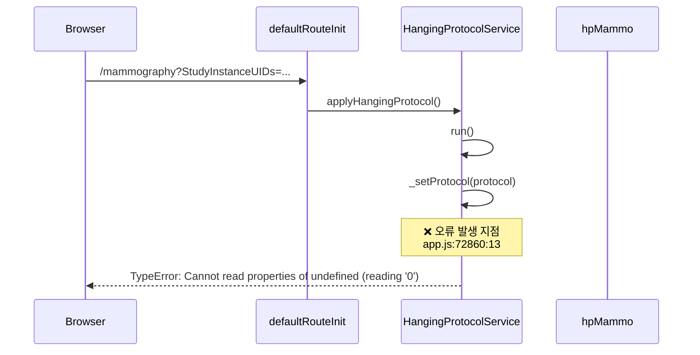
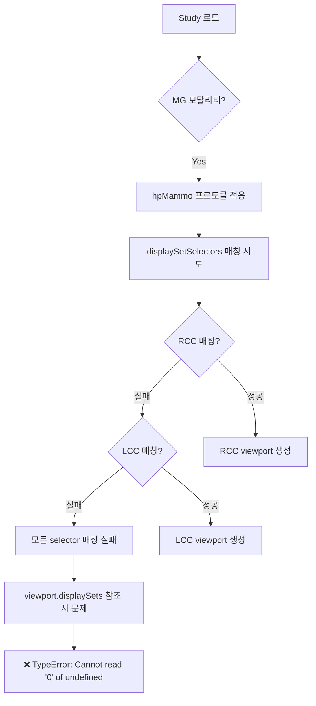
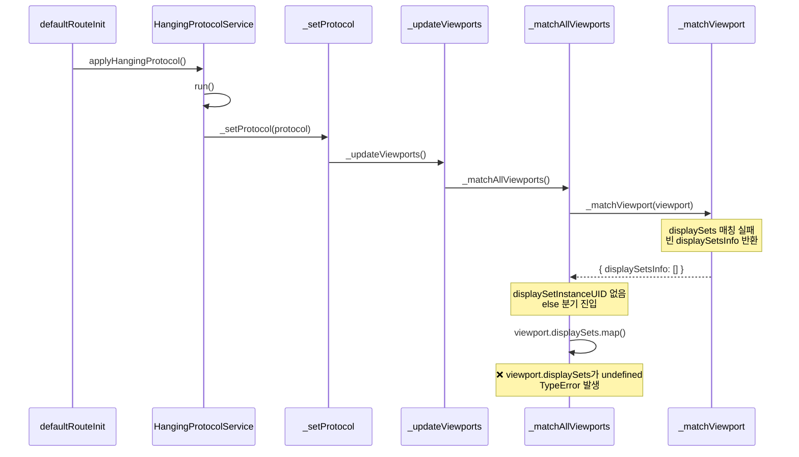

# Mammography Hanging Protocol 오류 분석

## 1. 오류 정보

**오류 메시지**: `TypeError: Cannot read properties of undefined (reading '0')`

**발생 위치**: `HangingProtocolService._setProtocol`

**발생 URL**: `http://localhost:3000/mammography?StudyInstanceUIDs=1.2.410.200030.10.202410211700.4262139393`

---

## 2. 스택 트레이스 (2026-01-05 확인)

```
TypeError: Cannot read properties of undefined (reading '0')
    at HangingProtocolService._setProtocol (http://localhost:3000/app.js:72860:13)
    at HangingProtocolService.run (http://localhost:3000/app.js:72318:12)
    at applyHangingProtocol (http://localhost:3000/app.js:61679:28)
    at async http://localhost:3000/app.js:61767:5
    at async defaultRouteInit (http://localhost:3000/app.js:61740:3)
```

**핵심 정보**:
- 오류 위치: `app.js:72860:13` → `_setProtocol` 함수 내부
- 호출 흐름: `defaultRouteInit` → `applyHangingProtocol` → `HangingProtocolService.run` → `_setProtocol`

---

## 3. 오류 발생 흐름



---

## 4. 오류 원인 분석

### 4.1 _setProtocol 함수 내 오류 발생 가능 지점

`_setProtocol` 함수 (line 1033~1102)에서 `[0]` 인덱스 접근이 발생하는 위치:

```typescript
// line 1091 - stages[this.stageIndex] 접근
stage: this.protocol.stages[this.stageIndex],

// line 1098 - 동일
stage: this.protocol.stages[this.stageIndex],
```

**그러나** 스택 트레이스가 `_setProtocol` 내부를 가리키므로, 실제로는 `_setProtocol`이 호출하는 내부 함수에서 오류가 발생할 가능성이 높음.

### 4.2 _setProtocol이 호출하는 함수들

```typescript
// line 1078
this._updateViewports(options);
```

`_updateViewports` → `_matchAllViewports` → `_matchViewport` 호출 체인에서 오류 발생.

### 4.3 실제 오류 발생 위치 추정

**_matchViewport 함수** (line 1334~):

```typescript
// line 1344 - viewport.displaySets 접근
for (const displaySet of viewport.displaySets) {
  // viewport.displaySets가 undefined이면 오류
}

// line 1367 - 동일
viewport.displaySets.forEach(displaySetOptions => {
  // viewport.displaySets가 undefined이면 오류
});
```

**_matchAllViewports 함수** (line 1239~):

```typescript
// line 1261-1262
if (
  matchDetails.displaySetsInfo?.length &&
  matchDetails.displaySetsInfo[0].displaySetInstanceUID  // [0] 접근
)

// line 1267
matchDetails.displaySetsInfo = viewport.displaySets.map(...)  // displaySets 접근
```

---

## 5. displaySets 접근 위치 전체 목록

| 라인 | 함수 | 코드 | Null 체크 | 비고 |
|------|------|------|-----------|------|
| 600 | _setProtocol 관련 | `displaySets: viewport.displaySets \|\| []` | ✅ 있음 | 기본값 설정 |
| 604 | _setProtocol 관련 | `viewport.displaySets.forEach(...)` | ❌ 없음 | |
| 683 | _getViewportSpecificMatch | `if (!protocolViewport.displaySets)` | ✅ 추가됨 | |
| 690 | _getViewportSpecificMatch | `protocolViewport.displaySets.length > 1` | ✅ 683에서 체크 | |
| 696 | _getViewportSpecificMatch | `protocolViewport.displaySets.length === 0` | ✅ 683에서 체크 | |
| 710 | _getViewportSpecificMatch | `protocolViewport.displaySets[0]` | ✅ 683에서 체크 | |
| 753 | ? | `viewport.displaySets.some(...)` | ❌ 없음 | |
| 766 | ? | `originalViewport.displaySets` | ❌ 없음 | |
| 813 | ? | `viewport.displaySets.forEach(...)` | ❌ 없음 | |
| **1261** | _matchAllViewports | `matchDetails.displaySetsInfo[0]` | ❌ 없음 | **가능성 높음** |
| **1267** | _matchAllViewports | `viewport.displaySets.map(...)` | ❌ 없음 | **가능성 높음** |
| **1344** | _matchViewport | `for (const displaySet of viewport.displaySets)` | ✅ 추가됨 | |
| **1367** | _matchViewport | `viewport.displaySets.forEach(...)` | ✅ 1340에서 체크 | |
| 1426 | ? | `protocolViewport.displaySets` | ❌ 없음 | |

---

## 6. 시도한 수정 및 결과

### 6.1 첫 번째 수정 (실패)

**위치**: line 683 (`_getViewportSpecificMatch` 함수)

```typescript
if (!protocolViewport.displaySets) {
  return defaultReturn;
}
```

**결과**: 오류 여전히 발생 - 다른 함수에서 발생하는 오류

### 6.2 두 번째 수정 (실패)

**위치**: line 1340 (`_matchViewport` 함수 시작)

```typescript
if (!viewport.displaySets || viewport.displaySets.length === 0) {
  console.warn('Viewport has no displaySets defined:', viewport.viewportOptions?.viewportId);
  return {
    viewportOptions: viewport.viewportOptions || {},
    displaySetsInfo: [],
  };
}
```

**결과**: 오류 여전히 발생
- **원인 추정**: 빌드 후 서버 재시작 필요하거나, 오류 발생 위치가 다른 곳

---

## 7. 추가 확인 필요 사항

### 7.1 빌드/서버 환경 확인

- [ ] `yarn build` 완료 후 서버 재시작 여부
- [ ] 개발 서버 (`yarn dev`) vs 프로덕션 빌드 (`yarn build` + serve) 확인
- [ ] 브라우저 캐시 클리어 (Hard Refresh: Ctrl+Shift+R)

### 7.2 실제 오류 위치 디버깅

Source Map이 활성화되어 있다면:
1. Chrome DevTools > Sources 탭
2. `app.js:72860` 위치로 이동
3. 실제 TypeScript 소스 라인 확인

### 7.3 line 1261-1267 확인 필요

`_matchAllViewports` 함수의 다음 코드가 의심됨:

```typescript
if (matchDetails) {
  if (
    matchDetails.displaySetsInfo?.length &&
    matchDetails.displaySetsInfo[0].displaySetInstanceUID  // ← [0] 접근
  ) {
    matchedViewports++;
  } else {
    console.log('Adding an empty set of display sets for mapping purposes');
    matchDetails.displaySetsInfo = viewport.displaySets.map(it => ({  // ← displaySets 접근
      displaySetOptions: it,
    }));
  }
}
```

---

## 8. 근본 원인 추정

1. **DisplaySet Selector 매칭 실패**: Study의 MG 이미지가 RCC, LCC, RMLO, LMLO 규칙에 맞지 않음
2. **빈 displaySetsInfo**: 매칭 결과가 비어있을 때 `[0]` 접근 시도
3. **viewport.displaySets undefined**: Protocol 처리 과정에서 displaySets가 손실됨
4. **수정 코드 미반영**: 빌드는 됐지만 실행 환경에 반영되지 않음

---

## 9. 해결 방안

### 방안 1: _matchAllViewports 함수 수정

```typescript
// line 1261-1270 수정
if (matchDetails) {
  if (
    matchDetails.displaySetsInfo?.length &&
    matchDetails.displaySetsInfo[0]?.displaySetInstanceUID  // Optional chaining 추가
  ) {
    matchedViewports++;
  } else {
    console.log('Adding an empty set of display sets for mapping purposes');
    // viewport.displaySets 체크 추가
    if (viewport.displaySets && viewport.displaySets.length > 0) {
      matchDetails.displaySetsInfo = viewport.displaySets.map(it => ({
        displaySetOptions: it,
      }));
    } else {
      matchDetails.displaySetsInfo = [];
    }
  }
}
```

### 방안 2: 모든 displaySets 접근에 Optional Chaining 적용

```typescript
viewport.displaySets?.forEach(...)
viewport.displaySets?.map(...)
for (const displaySet of viewport.displaySets || []) {...}
matchDetails.displaySetsInfo?.[0]?.displaySetInstanceUID
```

### 방안 3: hpMammo Protocol 자체 수정

- allowUnmatchedView 설정 강화
- 더 유연한 매칭 규칙 추가

---

## 10. 테스트 체크리스트

- [ ] 빌드 후 서버 재시작
- [ ] 브라우저 캐시 클리어 (Ctrl+Shift+R)
- [ ] `/mammography?StudyInstanceUIDs=...` URL 접근 시 오류 없이 로딩
- [ ] 콘솔에서 warning 메시지 확인 ("Viewport has no displaySets defined")
- [ ] MG 이미지가 매칭 규칙에 맞지 않아도 빈 viewport 표시

---

## 11. 관련 파일

- `platform/core/src/services/HangingProtocolService/HangingProtocolService.ts`
- `extensions/default/src/hangingprotocols/hpMammo.ts`
- `extensions/default/src/hangingprotocols/utils/mammoDisplaySetSelector.ts`

---

## 12. hpMammo.ts 상세 분석

### 12.1 hpMammo vs hpUSMPR 비교

| 항목 | hpMammo | hpUSMPR |
|------|---------|---------|
| **displaySetSelectors 개수** | 10개 (RCC, LCC, RMLO, LMLO + Prior 4개 + Fallback 2개) | 1개 (mprDisplaySet) |
| **selector 복잡도** | 매우 복잡 (ViewCode, PatientOrientation, SeriesDescription 조합) | 단순 (numImageFrames > 1) |
| **required 규칙** | 여러 개 있음 (필수 조건) | 없음 (required: false) |
| **viewport의 displaySets.id** | 'RCC', 'LCC' (특정 selector 참조) | 'mprDisplaySet' (단일 selector) |

### 12.2 hpMammo 구조

```typescript
hpMammography = {
  id: '@ohif/hpMammo',
  displaySetSelectors: {
    RCC: { seriesMatchingRules: [...], studyMatchingRules: [...] },
    LCC: { seriesMatchingRules: [...], studyMatchingRules: [...] },
    RMLO: { ... },
    LMLO: { ... },
    // + Prior versions + Fallback
  },
  stages: [
    {
      name: 'CC Views',
      viewports: [
        {
          viewportOptions: { viewportId: 'mammo-rcc', ... },
          displaySets: [{ id: 'RCC' }],  // ← 'RCC' selector 참조
        },
        {
          viewportOptions: { viewportId: 'mammo-lcc', ... },
          displaySets: [{ id: 'LCC' }],  // ← 'LCC' selector 참조
        },
      ],
    },
  ],
}
```

### 12.3 mammoDisplaySetSelector.ts 매칭 규칙 분석

#### RCC Selector (Right CC)

```typescript
RCCSeriesMatchingRules = [
  { weight: 10, attribute: 'ViewCode', constraint: { contains: 'SCT:399162004' } },
  { weight: 5, attribute: 'PatientOrientation', constraint: { equals: ['P', 'L'] } },
  { attribute: 'PatientOrientation', constraint: { doesNotEqual: ['A', 'R'] }, required: true },  // ⚠️ 필수!
  { weight: 20, attribute: 'SeriesDescription', constraint: { contains: 'CC' } },
];
```

**문제점**: `required: true` 규칙이 있으면 해당 조건을 만족하지 않는 DisplaySet은 **완전히 제외**됨.

#### LCC Selector (Left CC)

```typescript
LCCSeriesMatchingRules = [
  { weight: 10, attribute: 'ViewCode', constraint: { contains: 'SCT:399162004' } },
  { weight: 5, attribute: 'PatientOrientation', constraint: { contains: 'L' } },
  { weight: 20, attribute: 'SeriesDescription', constraint: { contains: 'L CC' } },
];
```

**LCC는 required 규칙이 없음** → 상대적으로 유연함.

#### RMLO Selector (Right MLO)

```typescript
RMLOSeriesMatchingRules = [
  { weight: 10, attribute: 'ViewCode', constraint: { contains: 'SCT:399368009' } },
  { attribute: 'ViewCode', constraint: { doesNotEqual: 'SCT:399162004' }, required: true },  // ⚠️
  { attribute: 'PatientOrientation', constraint: { doesNotContain: ['P', 'FL'] }, required: true },  // ⚠️
  { weight: 5, attribute: 'PatientOrientation', constraint: { equals: ['P', 'L'] } },
  { weight: 5, attribute: 'PatientOrientation', constraint: { equals: ['A', 'FR'] } },
  { weight: 20, attribute: 'SeriesDescription', constraint: { contains: 'R MLO' } },
  { attribute: 'SeriesDescription', constraint: { doesNotContain: 'CC' }, required: true },  // ⚠️
  { attribute: 'SeriesDescription', constraint: { doesNotEqual: 'L MLO' }, required: true },  // ⚠️
];
```

**RMLO에 4개의 required 규칙!** → 매우 제한적

### 12.4 오류 발생 시나리오 추정



### 12.5 근본 원인

1. **Study의 MG 이미지 메타데이터 불일치**
   - `ViewCode`가 없거나 다른 코드 사용
   - `PatientOrientation`이 예상과 다름
   - `SeriesDescription`에 'CC', 'MLO' 등이 없음

2. **required 규칙 충족 실패**
   - RCC: `PatientOrientation != ['A', 'R']` 조건 불충족
   - RMLO: 4개 required 조건 중 하나라도 실패하면 전체 매칭 실패

3. **HangingProtocolService의 방어 코드 부재**
   - selector 매칭 실패 시 displaySets가 undefined/empty가 되지만
   - 이후 코드에서 `displaySets[0]` 접근 시 오류

### 12.6 테스트용 Study 메타데이터 확인 필요

오류가 발생하는 Study (`1.2.410.200030.10.202410211700.4262139393`)의 메타데이터 확인 필요:

- [ ] `ViewCode` 값
- [ ] `PatientOrientation` 값
- [ ] `SeriesDescription` 값
- [ ] `ImageLaterality` 값

---

## 13. 해결 방안 (업데이트)

### 방안 1: hpMammo.ts의 required 규칙 완화

```typescript
// 현재 (너무 엄격)
{ attribute: 'PatientOrientation', constraint: { doesNotEqual: ['A', 'R'] }, required: true },

// 수정 (유연하게)
{ attribute: 'PatientOrientation', constraint: { doesNotEqual: ['A', 'R'] }, required: false, weight: 1 },
```

### 방안 2: Fallback 로직 개선

hpMammo.ts에 `MGFallback` selector를 실제로 사용하도록 수정:

```typescript
viewports: [
  {
    viewportOptions: { viewportId: 'mammo-rcc', ... },
    displaySets: [
      { id: 'RCC' },
      { id: 'MGFallback' },  // fallback 추가
    ],
  },
]
```

### 방안 3: HangingProtocolService 방어 코드 ✅ 적용됨

모든 `displaySets` 접근 전에 null 체크 추가.

---

## 14. 수정 내역 (2026-01-05)

### 14.1 세 번째 수정 - _matchAllViewports 함수 (line 1267)

**문제 위치 확정**:
- `_matchViewport`에 가드를 추가해도 효과 없음
- 실제 오류는 `_matchAllViewports` 함수의 line 1267에서 발생
- `viewport.displaySets.map()` 호출 시 `displaySets`가 undefined

**수정 코드**:

```typescript
// line 1265-1279 (수정 후)
} else {
  console.log('Adding an empty set of display sets for mapping purposes');
  // Guard against undefined viewport.displaySets
  if (viewport.displaySets && viewport.displaySets.length > 0) {
    matchDetails.displaySetsInfo = viewport.displaySets.map(it => ({
      displaySetOptions: it,
    }));
  } else {
    console.warn(
      'Viewport displaySets is undefined or empty in _matchViewports:',
      viewportId
    );
    matchDetails.displaySetsInfo = [];
  }
}
```

**핵심 로직**:
1. `_matchViewport`가 매칭에 실패하여 빈 `displaySetsInfo: []` 반환
2. `_matchAllViewports`가 else 분기로 진입 (displaySetInstanceUID가 없으므로)
3. `viewport.displaySets.map()` 호출 시도
4. **viewport.displaySets가 undefined이거나 빈 배열**이면 `.map()` 호출 실패
5. 수정 후: undefined 체크 후 빈 배열 할당

### 14.2 오류 발생 흐름 (확정)



### 14.3 실제 오류 원인 확정 ✅

디버그 로그 추적 결과, 실제 오류는 **`viewCode.ts`** 파일에서 발생:

```
TypeError: Cannot read properties of undefined (reading '0')
    at Object.__WEBPACK_DEFAULT_EXPORT__ (viewCode.ts:2:1)
    at HPMatcher.match
    at ProtocolEngine.findMatch
    at HangingProtocolService._matchImages
```

**오류 발생 파일**: `extensions/default/src/hangingprotocols/utils/viewCode.ts`

**수정 전 (오류 발생)**:
```typescript
const ViewCodeSequence = displaySet?.images[0]?.ViewCodeSequence[0];
```

**수정 후 (정상 동작)**:
```typescript
const ViewCodeSequence = displaySet?.images?.[0]?.ViewCodeSequence?.[0];
```

**원인**: `images` 배열이나 `ViewCodeSequence` 배열이 undefined일 때 `[0]` 접근에서 오류 발생.
Optional Chaining(`?.`)을 추가하여 해결.

### 14.4 수정된 파일 목록

| 파일 | 수정 내용 |
|------|-----------|
| `extensions/default/src/hangingprotocols/utils/viewCode.ts` | Optional Chaining 추가 (`images?.[0]`, `ViewCodeSequence?.[0]`) |
| `platform/core/src/services/HangingProtocolService/HangingProtocolService.ts` | displaySets 가드 추가 (방어 코드) |

### 14.5 테스트 결과

- [x] 개발 서버 실행 (`yarn dev:dcm4chee`)
- [x] `/mammography?StudyInstanceUIDs=...` 접근 시 TypeError 없이 로딩 완료
- [x] Mammography 뷰어 정상 동작

---

**작성일**: 2026-01-05
**최종 수정일**: 2026-01-05
**상태**: ✅ 해결됨
