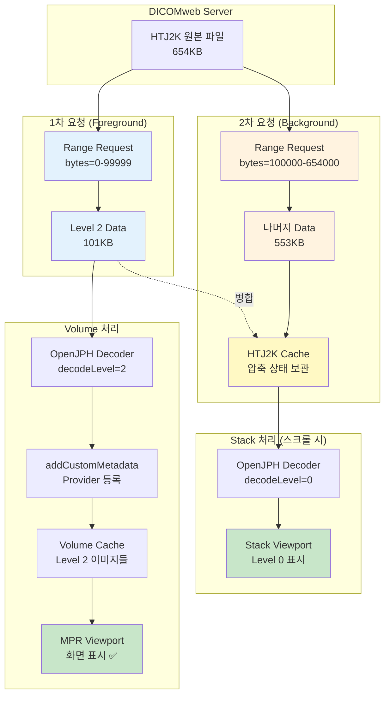
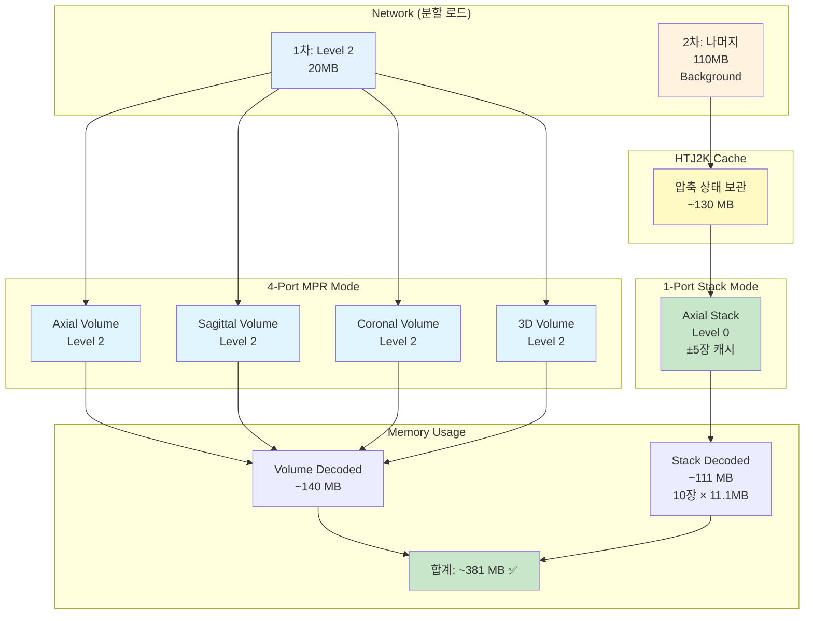

# Task #72: Level 2 HTJ2K 데이터로 MPR Volume 생성 구현

**상태**: ✅ 구현 완료 (런타임 테스트 대기)
**우선순위**: High
**의존성**: Task #69 (완료)
**작성일**: 2025-12-30
**최종 수정**: 2025-12-30 (Phase 1-6 구현 완료, TypeScript 오류 수정)

---

## 최종 목표

### ⚠️ 적용 범위: DICOMweb 엔드포인트만 해당

| 데이터 소스 | 적용 여부 | 설명 |
|-------------|----------|------|
| **DICOMweb (엔드포인트)** | ✅ 적용 | HTJ2K Level 분기 처리 |
| **Local (파일 로딩)** | ❌ 미적용 | 현재 방식 그대로 유지 |

### DICOMweb 모드 Decode Level

| Viewport | Decode Level | 해상도 | 용도 |
|----------|-------------|--------|------|
| **Volume (MPR)** | Level 2 | 1/4 (421×865) | 3D MPR 미리보기, 메모리 효율 |
| **Stack (Axial 1-port)** | Level 0 | Full (1686×3460) | 고화질 진단 |

### Local 모드 (변경 없음)

- Local 파일 로딩 시 기존 동작 유지
- HTJ2K Level 분기 처리 **적용하지 않음**
- DicomLocalDataSource는 현재 구현 그대로 사용

---

## 메모리 분석 (200 슬라이스 기준)

### 이미지당 크기

| 해상도 | Dimensions | 크기 (16-bit) |
|--------|------------|---------------|
| Level 0 (Full) | 1686 × 3460 | **~11.1 MB** |
| Level 2 (1/4) | 421 × 865 | **~0.7 MB** |
| HTJ2K 압축 | - | **~0.65 MB** |

### 메모리 사용량 (A 방식: 전체 캐시 유지)

| 항목 | 계산 | 크기 |
|------|------|------|
| Volume Level 2 디코딩 | 200 × 0.7 MB | **140 MB** |
| HTJ2K 캐시 (전체 유지) | 200 × 0.65 MB | **130 MB** |
| Stack Level 0 (±5장) | 10 × 11.1 MB | **111 MB** |
| **합계** | - | **~381 MB** ✅ |

### 캐시 전략

| 캐시 | 4-Port → 1-Port 전환 시 | 스크롤 시 | 이유 |
|------|------------------------|----------|------|
| **Volume Level 2** | ✅ 유지 | - | 4-Port 복귀 시 빠른 표시 |
| **HTJ2K 압축 데이터** | ✅ 유지 | ✅ 유지 | 스크롤 시 즉시 Level 0 디코딩 |
| **Stack Level 0** | - | ±5장만 유지 | 메모리 효율 |

### 비교

| 시나리오 | 메모리 | 스크롤 속도 | 상태 |
|----------|--------|------------|------|
| **목표 구현 (A 방식)** | 381 MB | 빠름 ✅ | ✅ 안전 |
| Full Volume | 2.2 GB | - | ❌ 위험 |

**결론**: 381MB는 브라우저 제한(~4GB)의 10% 미만으로 안전. 스크롤 시 즉시 디코딩 가능

---

## 현재 상황

### 완료된 사항 (Task #69)
- ✅ HTTP Range Request 동작 (206 Partial Content)
- ✅ Level 2 부분 데이터 다운로드 (~101KB)
- ✅ `_setThrew` WASM 오류 해결 (codec-openjph 패치)
- ✅ Stack Viewport에서 이미지 표시
- ✅ DicomLocalDataSource에서 메타데이터 조정 구현 (`addCustomMetadata()` 사용)
- ✅ DicomWebDataSource에서 `adjustHTJ2KMetadata()` 함수 구현 (instance 직접 수정)

### 현재 문제점
- ❌ MPR Volume 생성 실패 (DICOMweb 모드)
- ❌ 이미지 로딩이 중간에 멈춤
- ❌ **DICOMweb 메타데이터 등록 방식 차이** ← 핵심 문제
- ❌ **imageQualityStatus가 Volume/Stack 구분 없이 FULL_RESOLUTION** ← 핵심 문제

---

## 근본 원인 분석

### 🔴 핵심 원인 1: 메타데이터 등록 방식 차이

```
DicomLocalDataSource: metadataProvider.addCustomMetadata() 사용 ✅
DicomWebDataSource: instance 직접 수정만 함 ❌

→ addCustomMetadata()는 메타데이터 캐시에 우선순위로 등록
→ instance 직접 수정은 Provider가 조회할 때 반영되지 않을 수 있음
```

### 🔴 핵심 원인 2: imageQualityStatus 미분기

```
현재 코드 (customWadorsLoader.ts Line 248-250):
  image.imageQualityStatus = ImageQualityStatus.FULL_RESOLUTION; // 모두 FULL

문제:
- Volume: FULL_RESOLUTION ✅ (Level 2에서 완료)
- Stack: FULL_RESOLUTION ❌ (Level 0으로 업그레이드 불가)
```

### 원인 상세 비교

| 항목 | DicomLocalDataSource | DicomWebDataSource |
|------|---------------------|-------------------|
| 메타데이터 조정 함수 | `getAdjustedImagePixelModule()` | `adjustHTJ2KMetadata()` |
| 조정 방식 | **`addCustomMetadata()` 호출** | instance 직접 수정 |
| Provider 등록 | ✅ 우선순위 캐시에 등록 | ❌ 등록 안 함 |
| Cornerstone3D 인식 | ✅ 조정된 값 사용 | ⚠️ 인식 안 될 수 있음 |

---

## 구현 계획

### Phase 1: DicomWebDataSource에 addCustomMetadata() 추가 ✅ 완료 (f6a653e 머지)

**적용 대상**: DICOMweb 엔드포인트만 (Local 파일 로딩은 기존 방식 유지)

**상태**: f6a653e 커밋 머지로 이미 구현됨

**파일**: `extensions/default/src/DicomWebDataSource/index.ts`

**구현 코드 (Line 860-891, storeInstances)**:
```typescript
// Apply HTJ2K Level 2 metadata adjustments via MetadataProvider
// This ensures Cornerstone uses adjusted dimensions for rendering
// while instance object retains original metadata for SR generation
// forceHTJ2K is true when config.requestTransferSyntaxUID is HTJ2K
try {
  const adjustedImagePixelModule = getAdjustedImagePixelModule(instance, forceHTJ2K);
  if (adjustedImagePixelModule) {
    metadataProvider.addCustomMetadata(
      imageId,
      'imagePixelModule',
      adjustedImagePixelModule
    );
    console.log(
      `[HTJ2K-DICOMweb] ${imageId} imagePixelModule adjusted to ${adjustedImagePixelModule.rows}x${adjustedImagePixelModule.columns}`
    );
  }

  const adjustedImagePlaneModule = getAdjustedImagePlaneModule(instance, forceHTJ2K);
  if (adjustedImagePlaneModule) {
    metadataProvider.addCustomMetadata(
      imageId,
      'imagePlaneModule',
      adjustedImagePlaneModule
    );
    console.log(
      `[HTJ2K-DICOMweb] ${imageId} imagePlaneModule spacing adjusted to [${adjustedImagePlaneModule.pixelSpacing}]`
    );
  }
} catch (error) {
  console.error('[HTJ2K-DICOMweb] Error adjusting metadata:', error);
}
```

**구현 위치**:
1. `storeInstances()` (Line 860-891) ✅
2. `_retrieveSeriesMetadataSync` (Line 1019) ✅

**참고 (DicomLocalDataSource도 동일 패턴, Line 312-340)**:
```javascript
// Apply HTJ2K Level 2 metadata adjustments
try {
  const adjustedImagePixelModule = getAdjustedImagePixelModule(instance);
  if (adjustedImagePixelModule) {
    metadataProvider.addCustomMetadata(
      imageId,
      'imagePixelModule',
      adjustedImagePixelModule
    );
  }

  const adjustedImagePlaneModule = getAdjustedImagePlaneModule(instance);
  if (adjustedImagePlaneModule) {
    metadataProvider.addCustomMetadata(
      imageId,
      'imagePlaneModule',
      adjustedImagePlaneModule
    );
  }
} catch (error) {
  console.error('[HTJ2K L2] Error adjusting metadata:', error);
}
```

### Phase 2: imageQualityStatus Volume/Stack 분기 처리 ⭐ 핵심

**적용 대상**: DICOMweb 엔드포인트만 (Local 파일 로딩은 미적용)

**파일**: `extensions/cornerstone/src/utils/customWadorsLoader.ts`

#### ⚠️ 구현 전 확인 필요 사항

| 확인 항목 | 설명 | 확인 방법 |
|----------|------|----------|
| `retrieveType === 'default'` | Volume viewport를 정확히 구분하는지 검증 필요 | Cornerstone3D 소스 분석 또는 런타임 로깅 |
| 대안 1 | `viewportType === 'VOLUME_3D'` 또는 `'MPR'` 체크 | viewport 객체 속성 확인 |
| 대안 2 | `viewport.getClassName()` 사용 | VolumeViewport vs StackViewport 구분 |

**검증 방법**: 구현 전 `customWadorsLoader.ts`에서 `options` 객체를 로깅하여 Volume/Stack 요청 시 실제 값 확인

```typescript
// 임시 디버깅 코드 (구현 전 검증용)
console.log('[Phase2 Debug] options:', {
  retrieveType: options?.retrieveType,
  viewportType: options?.viewportType,
  // 기타 관련 속성들
});
```

**현재 코드 (Line 246-250)**:
```typescript
// HTJ2K의 경우, 이미 decode된 이미지의 품질 상태를 FULL_RESOLUTION으로 표시
// 이렇게 하면 progressive loading이 더 이상 진행하지 않음
if (forcedDecodeLevel !== undefined && forcedDecodeLevel > 0) {
  image.imageQualityStatus = ImageQualityStatus.FULL_RESOLUTION;
}
```

**수정 코드**:
```typescript
/**
 * HTJ2K Progressive Decoding 품질 상태 설정
 *
 * Volume: FULL_RESOLUTION - Level 2에서 완료 (더 이상 로딩하지 않음)
 * Stack: SUBRESOLUTION - 추후 Full Resolution(Level 0)으로 업그레이드 가능
 *
 * @see htj2kConfig.ts - stackFullResolutionOnScroll 설정
 */
if (forcedDecodeLevel !== undefined && forcedDecodeLevel > 0) {
  // retrieveType이 'default'이면 Volume, 그 외는 Stack
  const isVolume = options?.retrieveType === 'default';

  if (isVolume) {
    // Volume은 Level 2로 완료 처리 - 메모리 효율을 위해 더 높은 해상도 로드 안 함
    image.imageQualityStatus = ImageQualityStatus.FULL_RESOLUTION;
    image.decodeLevel = forcedDecodeLevel;
    htj2kLog('customWadorsLoader', 'Volume: FULL_RESOLUTION (Level 2 final)', {
      imageId: imageId.substring(0, 50),
      decodeLevel: forcedDecodeLevel,
    });
  } else {
    // Stack은 나중에 Full Resolution(Level 0)으로 업그레이드 가능
    image.imageQualityStatus = ImageQualityStatus.SUBRESOLUTION;
    image.decodeLevel = forcedDecodeLevel;
    htj2kLog('customWadorsLoader', 'Stack: SUBRESOLUTION (upgradeable)', {
      imageId: imageId.substring(0, 50),
      decodeLevel: forcedDecodeLevel,
    });
  }
}
```

### Phase 3: htj2kConfig.ts 설정 ✅ 확인 완료

**파일**: `extensions/cornerstone/src/utils/htj2kConfig.ts`

**목표 설정**:
```typescript
const DEFAULT_CONFIG: HTJ2KConfig = {
  enabled: true,
  volumeDecodeLevel: 2,  // Volume/MPR: Level 2 (1/4 해상도, 메모리 효율) ✅
  stackDecodeLevel: 0,   // Stack: Level 0 (Full 해상도, 고화질 진단) ✅
  streaming: false, // fetch streaming 비활성화 (HTJ2K 메모리 오류 발생) ✅
};
```

**설정 설명**:
| 설정 | 값 | 설명 |
|------|-----|------|
| `volumeDecodeLevel` | 2 | Volume/MPR은 Level 2 (1/4 해상도)로 빠른 초기 표시 |
| `stackDecodeLevel` | 0 | Stack은 Level 0 (Full 해상도)로 고화질 진단 |
| `streaming` | false | WASM 메모리 오류 방지 |

### Phase 4: 메모리 관리 ✅ 이미 구현됨

**파일**: `modes/usmpr/src/index.tsx`

```typescript
// 현재 위치 ±5장만 Level 0으로 유지, 나머지는 cache에서 삭제
let loadedLevel0Images = new Set();
const MAX_LEVEL0_IMAGES = 10;

// setupMemoryManagedLoading() 함수에서 스크롤 시 메모리 관리
```

### Phase 5: Background Progressive Loading ⭐ UX 개선

**목표**: Volume 먼저 표시 → Background에서 나머지 데이터 로드 → Stack Level 0 준비

#### 네트워크 흐름

```
┌─────────────────────────────────────────────────────────────────┐
│ 1차 요청 (Foreground)                                            │
│ ─────────────────────                                           │
│ Range: bytes=0-99999                                            │
│ 응답: 206 Partial Content (~101KB × 200장 = 20MB)               │
│ 결과: Level 2 디코딩 → Volume 생성 → 화면 표시 ✅                │
└─────────────────────────────────────────────────────────────────┘
                              ↓
                    (사용자는 Volume을 보고 있음)
                              ↓
┌─────────────────────────────────────────────────────────────────┐
│ 2차 요청 (Background)                                            │
│ ─────────────────────                                           │
│ Range: bytes=100000-654000                                      │
│ 응답: 206 Partial Content (~553KB × 200장 = 110MB)              │
│ 결과: HTJ2K 전체 데이터 완성 → 압축 상태로 캐시 보관             │
└─────────────────────────────────────────────────────────────────┘
                              ↓
                    (Stack 스크롤 시)
                              ↓
┌─────────────────────────────────────────────────────────────────┐
│ Level 0 디코딩 (On-demand)                                       │
│ ─────────────────────────                                       │
│ 입력: 캐시된 HTJ2K 전체 데이터 (654KB)                          │
│ 결과: Level 0 디코딩 → Stack Viewport 표시 (±5장만 메모리 유지) │
└─────────────────────────────────────────────────────────────────┘
```

#### 메모리 & 네트워크 분석 (200 슬라이스 기준)

| 단계 | 네트워크 전송 | 메모리 사용 | 화면 상태 |
|------|-------------|------------|----------|
| **1차 (Foreground)** | 101KB × 200 = **20MB** | Level 2 디코딩: 140MB | Volume 표시 ✅ |
| **2차 (Background)** | 553KB × 200 = **110MB** | HTJ2K 압축 캐시: 130MB | Volume 유지 |
| **스크롤 시** | - | Level 0 디코딩 (±5장): 111MB | Stack Level 0 표시 |
| **합계** | **130MB** | **~381MB** (안전) | - |

#### 구현 방향

**파일**: `extensions/cornerstone/src/utils/htj2kBackgroundLoader.ts` (신규)

```typescript
/**
 * HTJ2K Background Progressive Loader
 *
 * Volume 로딩 완료 후 Background에서 나머지 HTJ2K 데이터를 로드합니다.
 * Stack 스크롤 시 Level 0 디코딩에 사용됩니다.
 */

interface HTJ2KDataCache {
  /** imageId → HTJ2K 전체 바이너리 데이터 */
  fullData: Map<string, ArrayBuffer>;
  /** imageId → 로딩 상태 ('partial' | 'complete') */
  status: Map<string, 'partial' | 'complete'>;
}

const htj2kCache: HTJ2KDataCache = {
  fullData: new Map(),
  status: new Map(),
};

/**
 * Background에서 나머지 HTJ2K 데이터 로드
 *
 * @param imageIds - 로드할 이미지 ID 배열
 * @param onProgress - 진행률 콜백 (0-100)
 * @param onComplete - 완료 콜백
 */
export async function loadRemainingHTJ2KData(
  imageIds: string[],
  onProgress?: (percent: number) => void,
  onComplete?: () => void
): Promise<void> {
  const totalImages = imageIds.length;
  let loadedCount = 0;

  // 병렬 로드 (동시 5개 제한)
  const CONCURRENT_LIMIT = 5;
  const queue = [...imageIds];

  const loadOne = async (imageId: string): Promise<void> => {
    try {
      // 이미 완료된 경우 스킵
      if (htj2kCache.status.get(imageId) === 'complete') {
        return;
      }

      // 1차 요청에서 받은 Level 2 데이터 가져오기
      const partialData = htj2kCache.fullData.get(imageId);
      const startByte = partialData?.byteLength || 100000;

      // 나머지 데이터 요청 (Range Request)
      const response = await fetch(imageIdToUrl(imageId), {
        headers: {
          'Range': `bytes=${startByte}-`,
          'Accept': 'application/octet-stream',
        },
      });

      if (response.status === 206) {
        const remainingData = await response.arrayBuffer();

        // 기존 데이터와 병합
        const fullData = mergeArrayBuffers(partialData, remainingData);
        htj2kCache.fullData.set(imageId, fullData);
        htj2kCache.status.set(imageId, 'complete');
      }
    } catch (error) {
      console.error(`[HTJ2K-BG] Failed to load remaining data for ${imageId}:`, error);
    } finally {
      loadedCount++;
      onProgress?.(Math.round((loadedCount / totalImages) * 100));
    }
  };

  // 병렬 처리
  const workers: Promise<void>[] = [];
  for (let i = 0; i < CONCURRENT_LIMIT; i++) {
    workers.push(
      (async () => {
        while (queue.length > 0) {
          const imageId = queue.shift();
          if (imageId) {
            await loadOne(imageId);
          }
        }
      })()
    );
  }

  await Promise.all(workers);
  onComplete?.();
}

/**
 * 캐시된 HTJ2K 전체 데이터로 Level 0 디코딩
 *
 * @param imageId - 이미지 ID
 * @returns Level 0 디코딩된 픽셀 데이터
 */
export function decodeFullResolution(imageId: string): ArrayBuffer | null {
  const fullData = htj2kCache.fullData.get(imageId);
  const status = htj2kCache.status.get(imageId);

  if (!fullData || status !== 'complete') {
    console.warn(`[HTJ2K-BG] Full data not available for ${imageId}`);
    return null;
  }

  // OpenJPH 디코더로 Level 0 디코딩
  // (실제 구현은 cornerstone dicom-image-loader 활용)
  return decodeHTJ2K(fullData, 0);
}

// ... 유틸리티 함수들
```

**통합 위치**: `modes/usmpr/src/index.tsx`

```typescript
// Volume 로딩 완료 후 Background 로드 시작
viewportGridService.subscribe(
  viewportGridService.EVENTS.ACTIVE_VIEWPORT_ID_CHANGED,
  async ({ viewportId }) => {
    const viewport = cornerstoneViewportService.getCornerstoneViewport(viewportId);

    // Volume 로딩 완료 확인
    if (viewport?.type === 'volume' && viewport.isReady) {
      const imageIds = viewport.getImageIds();

      // Background에서 나머지 데이터 로드
      loadRemainingHTJ2KData(
        imageIds,
        (percent) => console.log(`[HTJ2K-BG] Loading: ${percent}%`),
        () => console.log('[HTJ2K-BG] All remaining data loaded')
      );
    }
  }
);
```

#### 장점

1. **빠른 초기 표시**: Volume이 20MB만 로드하면 바로 표시
2. **네트워크 효율**: 전체 130MB를 분할 로드 (20MB + 110MB)
3. **UX 개선**: 사용자가 Volume을 보는 동안 Background 로드
4. **메모리 효율**: HTJ2K 압축 상태로 캐시 (130MB)
5. **즉시 Level 0**: 스크롤 시 이미 데이터가 있으므로 즉시 디코딩

---

## 데이터 흐름 다이어그램



---

## 체크리스트

### 필수 구현
- [x] **Phase 1**: DicomWebDataSource에 `addCustomMetadata()` 호출 추가 ✅ (f6a653e 머지 완료)
  - [x] `_retrieveSeriesMetadataSync` 수정 ✅
  - [x] `storeInstances()` 수정 ✅
- [x] **Phase 2**: customWadorsLoader.ts에서 Volume/Stack 분기 처리 ✅ 완료 (2025-12-30)
  - [x] Volume: FULL_RESOLUTION (Level 2에서 완료)
  - [x] Stack: SUBRESOLUTION (Level 0으로 업그레이드 가능)
  - [x] htj2kConfig.ts stackDecodeLevel 0으로 변경
- [x] **Phase 3**: htj2kConfig.ts 설정 확인 (volumeDecodeLevel: 2) ✅ 완료
- [x] **Phase 4**: 메모리 관리 (이미 구현됨) ✅ 완료
- [x] **Phase 5**: Background Progressive Loading ✅ 완료 (2025-12-30)
  - [x] `htj2kBackgroundLoader.ts` 신규 생성 ✅
  - [x] HTJ2K 데이터 캐시 구조 구현 (LRU 정책) ✅
  - [x] 나머지 데이터 Range Request 구현 ✅
  - [x] Volume 로딩 완료 후 Background 로드 트리거 (VIEWPORTS_READY 이벤트) ✅
  - [ ] Stack 스크롤 시 캐시된 데이터로 Level 0 디코딩 (런타임 테스트 필요)
- [x] **Phase 6**: Annotation 좌표 불일치 해결 ✅ 완료 (2025-12-30, 방안 A 적용)
  - [x] 해결 방안 최종 결정: 방안 A (PixelSpacing 원본 유지) ✅
  - [x] htj2kMetadataAdjuster.ts 수정 (PixelSpacing 원본 유지) ✅
  - [x] Volume Viewport Camera Scale 보정 로직 구현 ✅
  - [ ] Annotation 저장/로드 테스트 (런타임 테스트 필요)
  - [ ] Crosshair 동기화 테스트 (런타임 테스트 필요)
- [x] Unit Test 작성 (htj2kBackgroundLoader.test.ts) ✅ 완료 (2025-12-30)

### 테스트
- [ ] Volume Viewport (4-port): Level 2로 MPR 3개 뷰 렌더링
- [ ] Stack Viewport (1-port): Level 0으로 고화질 표시
- [ ] 메모리 사용량 확인: ~381 MB 이하 (A 방식)
- [ ] 스크롤 시 현재 위치 ±5장만 Level 0 유지
- [ ] Background 로딩 진행률 확인 (Console 로그)

### 검증
- [ ] Network 탭 (1차): Volume용 206 (101KB × 200 = 20MB)
- [ ] Network 탭 (2차): Background용 206 (553KB × 200 = 110MB)
- [ ] Console: 오류 없음, 메타데이터 등록 로그 확인
- [ ] Console: `[HTJ2K-BG] Loading: X%` 진행률 로그 확인
- [ ] MPR 인터랙션: 스크롤, 줌, 패닝 정상 동작
- [ ] 1-port ↔ 4-port 전환 시 위치 동기화

---

## 관련 파일

| 파일 | 역할 | 상태 |
|------|------|------|
| `extensions/default/src/DicomWebDataSource/index.ts` | DICOMweb 메타데이터 등록 | ✅ 완료 (Phase 1, f6a653e) |
| `extensions/cornerstone/src/utils/customWadorsLoader.ts` | imageQualityStatus 분기 | ✅ 완료 (Phase 2) |
| `extensions/cornerstone/src/utils/htj2kConfig.ts` | decodeLevel 설정 | ✅ 완료 (Phase 3) |
| `extensions/cornerstone/src/utils/htj2kBackgroundLoader.ts` | Background 데이터 로드 | ✅ 신규 생성 (Phase 5) |
| `extensions/cornerstone/src/utils/htj2kBackgroundLoader.test.ts` | Unit Test | ✅ 신규 생성 |
| `modes/usmpr/src/index.tsx` | Background 로드 트리거 | ✅ 수정 완료 (Phase 5) |
| `extensions/cornerstone/src/utils/htj2kMetadataAdjuster.ts` | PixelSpacing 원본 유지 | ✅ 수정 완료 (Phase 6) |
| `extensions/default/src/DicomLocalDataSource/index.js` | Local 메타데이터 (참조) | ✅ 구현됨 |

### Phase 6 관련 Cornerstone 핵심 파일 (node_modules)

| 파일 | Line | 역할 |
|------|------|------|
| `@cornerstonejs/core/.../makeVolumeMetadata.js` | 33 | PixelSpacing 조회 |
| `@cornerstonejs/core/.../generateVolumePropsFromImageIds.js` | 23 | Volume spacing 설정 |
| `@cornerstonejs/core/.../ImageVolume.js` | 47 | vtkImageData.setSpacing() |
| `@cornerstonejs/core/.../BaseVolumeViewport.js` | 1035 | getImageData() spacing |
| `@cornerstonejs/tools/.../LengthTool.js` | 41-46 | Annotation World 좌표 저장 |

---

## 아키텍처 다이어그램



---

## 예상 결과

### Before (현재)
- Volume/MPR (4-port): ❌ 생성 실패 (메타데이터 Provider 미등록)
- Stack (1-port): ⚠️ Level 2만 표시 (FULL_RESOLUTION이라 업그레이드 안 됨)

### After (구현 후)
- Volume/MPR (4-port): ✅ Level 2로 정상 렌더링 (~140 MB)
- Stack (1-port): ✅ Level 2 → Level 0 업그레이드 (~111 MB, 10장)
- 합계 메모리: **~381 MB** (안전, A 방식)

---

## ⚠️ 중요 원칙

### 메모리 관리
- **항상 메모리 부족 여부 점검**
- Chrome DevTools → Memory 탭에서 힙 사용량 모니터링
- 목표: ~381 MB 이하 유지 (A 방식: 전체 캐시 유지)
- 초과 시: 캐시 정리 로직 강화

### 구현 품질
- **대강 구현, 미루기, 하드코딩, 축약 금지**
- 어렵고 시간이 오래 걸려도 **제대로 구현**
- 모든 edge case 처리
- 적절한 에러 핸들링 및 로깅

### 문서화 및 테스트
- **자세한 주석 필수** (JSDoc/TSDoc 형식)
- **Unit Test 항상 추가** (Jest/Vitest)
- 함수별 테스트 케이스 작성
- edge case 테스트 포함

---

## ⚠️ Phase 6: Annotation 좌표 불일치 문제 (Critical)

### 문제 발견 (2025-12-30 분석)

**Level 2 MPR과 Level 0 Stack 간 Annotation 좌표 불일치 문제 발견**

#### 근본 원인

`htj2kMetadataAdjuster.ts`에서 조정한 PixelSpacing(4배)이 `metaData.get('imagePlaneModule')`을 통해 **Volume 생성에도 적용**되어, World 좌표 계산이 달라집니다.

```
htj2kMetadataAdjuster.ts (pixelSpacing × 4)
  ↓ addCustomMetadata('imagePlaneModule')
makeVolumeMetadata.js (get('imagePlaneModule'))
  ↓ PixelSpacing (조정된 값)
generateVolumePropsFromImageIds.js (spacing 계산)
  ↓ spacing (4배)
ImageVolume.js (setSpacing)
  ↓ vtkImageData
BaseVolumeViewport.getImageData() (getSpacing)
  ↓ spacing (4배)
canvasToWorld() (World 좌표 계산 - 4배 오차!)
```

#### 코드 위치

| 파일 | Line | 역할 |
|------|------|------|
| `htj2kMetadataAdjuster.ts` | 120-124 | PixelSpacing × 4 조정 |
| `makeVolumeMetadata.js` | 33 | `get('imagePlaneModule')` 호출 |
| `generateVolumePropsFromImageIds.js` | 23 | `spacing = [PixelSpacing[1], PixelSpacing[0], z]` |
| `ImageVolume.js` | 47 | `imageData.setSpacing(spacing)` |
| `BaseVolumeViewport.js` | 1035 | `spacing: vtkImageData.getSpacing()` |

#### 좌표 불일치 시나리오

| Viewport | PixelSpacing | Pixel 좌표 | World 좌표 | 문제 |
|----------|--------------|------------|------------|------|
| **Level 2 (MPR)** | 0.8mm (4×) | (100, 100) | [80, 80, 0]mm | ❌ 잘못된 좌표 |
| **Level 0 (Stack)** | 0.2mm | (100, 100) | [20, 20, 0]mm | ✅ 정확한 좌표 |

**문제**: Level 2 MPR에서 Annotation을 생성하면 World 좌표가 4배로 저장되어, Level 0 Stack에서 로드 시 **4배 떨어진 위치**에 표시됩니다.

#### 영향 받는 기능

1. **Annotation 도구**: Length, Angle, Probe, Arrow, Rectangle 등
2. **DICOM SR**: Structured Report 저장/로드
3. **DICOM SEG**: Segmentation 저장/로드
4. **DICOM PR**: Presentation State 저장/로드
5. **Crosshair 동기화**: Volume ↔ Stack 간

### 해결 방안 (검토)

#### 방안 A: PixelSpacing 원본 유지 (권장)

```typescript
// htj2kMetadataAdjuster.ts 수정
// PixelSpacing은 조정하지 않음 (World 좌표 일관성 유지)
return {
  rows: adjustedRows,
  columns: adjustedColumns,
  pixelSpacing: PixelSpacing,  // 원본 유지!
  // ...
};
```

- **장점**: World 좌표 일관성, Annotation/SR/SEG 완벽 호환
- **단점**: 렌더링 시 1/4 크기로 표시 → Zoom 보정 필요

**추가 작업**:
- Volume Viewport 생성 시 Camera Zoom을 4배로 설정
- 또는 Canvas 크기 대비 적절한 Scale Factor 적용

#### 방안 B: 좌표 변환 레이어 구현

```typescript
// annotationCoordinateTransformer.ts (신규)

/**
 * Annotation 저장 시: 현재 Viewport → 원본 해상도 좌표로 변환
 */
export function toOriginalWorldCoordinates(
  worldPos: number[],
  viewportId: string
): number[] {
  const resolutionFactor = getResolutionFactor(viewportId);
  if (resolutionFactor === 1) return worldPos;

  // Level 2 → Level 0 변환: World 좌표를 1/4로 축소
  return worldPos.map(coord => coord / resolutionFactor);
}

/**
 * Annotation 로드 시: 원본 해상도 → 현재 Viewport 좌표로 변환
 */
export function toViewportWorldCoordinates(
  originalWorldPos: number[],
  viewportId: string
): number[] {
  const resolutionFactor = getResolutionFactor(viewportId);
  if (resolutionFactor === 1) return originalWorldPos;

  // Level 0 → Level 2 변환: World 좌표를 4배로 확대
  return originalWorldPos.map(coord => coord * resolutionFactor);
}
```

- **장점**: 현재 메타데이터 조정 방식 유지
- **단점**: 복잡성 증가, 모든 Annotation 타입에 적용 필요, 누락 위험

#### 방안 C: 동일 Decode Level 사용

- Volume과 Stack 모두 Level 2 또는 Level 0 사용
- **단점**: 메모리 최적화 효과 상실 (Level 0 시 2.2GB)

### Phase 6 체크리스트

- [x] **6.1**: 해결 방안 최종 결정 (방안 A 선택) ✅
- [x] **6.2**: htj2kMetadataAdjuster.ts 수정 (PixelSpacing 원본 유지) ✅
- [x] **6.3**: Volume Viewport Camera Scale 보정 로직 구현 ✅
- [ ] **6.4**: Annotation 저장/로드 테스트 (런타임 테스트 필요)
  - [ ] Level 2 MPR에서 Length Annotation 생성
  - [ ] Level 0 Stack에서 동일 위치 표시 확인
  - [ ] SR 저장 후 로드 시 좌표 정확성 확인
- [ ] **6.5**: Crosshair 동기화 테스트 (런타임 테스트 필요)
  - [ ] Volume에서 클릭 → Stack에서 동일 위치 표시
  - [ ] Stack에서 클릭 → Volume에서 동일 위치 표시

### 우선순위

**Phase 6는 Phase 2, 5 완료 후 진행**

현재 MPR Volume 생성 자체가 안 되는 상태이므로:
1. Phase 2 (imageQualityStatus 분기) 완료
2. Phase 5 (Background Loading) 완료
3. **Phase 6 (Annotation 좌표) 진행** ← Annotation 기능 필요 시

---

## 참고 문서

- `document/htj2k-range-request-issue-analysis.md`
- `document/HTJ2K_RANGE_REQUEST_STATUS.md`
- [Cornerstone3D Volume Progressive Loading](https://www.cornerstonejs.org/docs/concepts/progressive-loading/)
- [Cornerstone3D MetadataProvider](https://www.cornerstonejs.org/docs/concepts/metadata-provider/)
