# HTJ2K DICOMweb 디코딩 오류 분석 보고서

**작성일**: 2025-12-22
**최종 수정**: 2025-12-23
**상태**: ✅ 해결 완료 (`streaming: true` 재테스트 실패 확인)

---

## 1. 문제 현상

DICOMweb을 통해 이미지를 로드할 때 다음과 같은 오류가 발생:

```
RuntimeError: memory access out of bounds at HTJ2KDecoder
Couldn't decode 219270488
_setThrow is not defined
IMAGE_LOAD_ERROR TypeError: handler is not a function
```

로컬 파일 로딩 시에는 정상 동작하나, DICOMweb에서만 오류 발생.

---

## 2. 근본 원인 분석

### 2.1 핵심 문제: Accept 헤더 생성 버그

**문제 파일**: `platform/core/src/utils/generateAcceptHeader.ts`

```typescript
const typeForTS = {
  '*': 'application/octet-stream',
  '1.2.840.10008.1.2.1': 'application/octet-stream',
  '1.2.840.10008.1.2': 'application/octet-stream',
  '1.2.840.10008.1.2.2': 'application/octet-stream',
  '1.2.840.10008.1.2.4.70': 'image/jpeg',
  '1.2.840.10008.1.2.4.50': 'image/jpeg',
  '1.2.840.10008.1.2.4.51': 'image/dicom+jpeg',
  '1.2.840.10008.1.2.4.57': 'image/jpeg',
  '1.2.840.10008.1.2.5': 'image/dicom-rle',
  '1.2.840.10008.1.2.4.80': 'image/jls',
  '1.2.840.10008.1.2.4.81': 'image/jls',
  '1.2.840.10008.1.2.4.90': 'image/jp2',
  '1.2.840.10008.1.2.4.91': 'image/jp2',
  '1.2.840.10008.1.2.4.92': 'image/jpx',
  '1.2.840.10008.1.2.4.93': 'image/jpx',
  // ❌ HTJ2K Transfer Syntax가 누락됨!
  // '1.2.840.10008.1.2.4.201': 'image/jphc', // HTJ2K Lossless
  // '1.2.840.10008.1.2.4.202': 'image/jphc', // HTJ2K Lossless RPCL
  // '1.2.840.10008.1.2.4.203': 'image/jphc', // HTJ2K
};
```

### 2.2 문제 발생 흐름

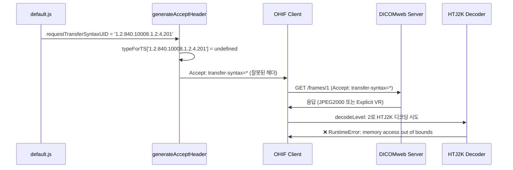

### 2.3 코드 흐름 분석

1. **설정 파일** (`default.js`):
   ```javascript
   requestTransferSyntaxUID: '1.2.840.10008.1.2.4.201', // HTJ2K Lossless
   ```

2. **Accept 헤더 생성** (`generateAcceptHeader.ts`):
   ```typescript
   // 조건 실패: typeForTS[requestTransferSyntaxUID]가 undefined
   if (requestTransferSyntaxUID && typeForTS[requestTransferSyntaxUID]) {
     // 이 블록이 실행되지 않음
     acceptHeader.push('transfer-syntax=' + requestTransferSyntaxUID);
   } else {
     acceptHeader.push('type=application/octet-stream');
   }

   if (!hasTransferSyntax) {
     acceptHeader.push('transfer-syntax=*'); // 모든 Transfer Syntax 허용
   }
   ```

3. **결과 Accept 헤더**:
   ```
   multipart/related; type="application/octet-stream"; transfer-syntax="*"
   ```
   HTJ2K가 아닌 모든 형식을 허용하게 됨.

4. **서버 응답**:
   - 서버는 DICOMweb 표준에 따라 `transfer-syntax=*`를 받으면 아무 형식으로나 응답 가능
   - 서버가 JPEG2000, Explicit VR Little Endian 등으로 응답할 수 있음

5. **디코더 오류**:
   - 클라이언트는 `decodeLevel: 2` 설정으로 HTJ2K 디코딩을 시도
   - 받은 데이터가 HTJ2K가 아니므로 디코더 실패

---

## 3. 결론

### 3.1 책임 소재

| 구분 | 상태 | 설명 |
|------|------|------|
| **DICOMweb 서버** | ✅ 정상 | DICOMweb 표준에 따라 Accept 헤더에 맞게 응답 |
| **OHIF 뷰어** | ❌ 버그 | `typeForTS` 맵에 HTJ2K Transfer Syntax 누락 |

### 3.2 왜 로컬 파일은 동작하는가?

로컬 파일 로딩 시:
- 파일의 Transfer Syntax를 직접 파싱하여 확인
- HTJ2K 파일인 경우에만 `decodeLevel: 2` 적용
- 메타데이터 조정 로직이 정상 동작

DICOMweb 로딩 시:
- Accept 헤더가 잘못 생성되어 HTJ2K가 아닌 형식으로 응답받음
- 하지만 클라이언트는 무조건 `decodeLevel: 2`로 디코딩 시도
- 형식 불일치로 디코더 실패

---

## 4. 해결 방안

### 4.1 필수 수정: HTJ2K Transfer Syntax 추가

**파일**: `platform/core/src/utils/generateAcceptHeader.ts`

```typescript
const typeForTS = {
  // ... 기존 항목들

  // HTJ2K Transfer Syntax 추가
  '1.2.840.10008.1.2.4.201': 'image/jphc', // HTJ2K Lossless
  '1.2.840.10008.1.2.4.202': 'image/jphc', // HTJ2K Lossless RPCL
  '1.2.840.10008.1.2.4.203': 'image/jphc', // HTJ2K
};
```

**MIME 타입 참고**:
- `image/jphc`: JPEG 2000 Part 15 - High-Throughput JPEG 2000 (HTJ2K) 표준 MIME 타입

### 4.2 수정 후 예상 동작

```mermaid
sequenceDiagram
    participant Config as default.js
    participant Header as generateAcceptHeader
    participant Client as OHIF Client
    participant Server as DICOMweb Server
    participant Decoder as HTJ2K Decoder

    Config->>Header: requestTransferSyntaxUID = '1.2.840.10008.1.2.4.201'
    Header->>Header: typeForTS['1.2.840.10008.1.2.4.201'] = 'image/jphc'
    Header->>Client: Accept: type=image/jphc; transfer-syntax=1.2.840.10008.1.2.4.201
    Client->>Server: GET /frames/1 (올바른 Accept 헤더)
    Server->>Client: 응답 (HTJ2K Lossless)
    Client->>Decoder: decodeLevel: 2로 HTJ2K 디코딩
    Decoder->>Client: ✅ 성공 (1/4 해상도 이미지)
```

---

## 5. 추가 검토 필요 사항

### 5.1 서버 HTJ2K 지원 여부

- 서버가 HTJ2K를 지원하지 않으면 올바른 Accept 헤더를 보내도 406 Not Acceptable 또는 다른 형식으로 응답
- 서버의 HTJ2K 지원 여부 확인 필요

### 5.2 Fallback 처리

현재 코드는 무조건 `decodeLevel: 2`를 적용:

```typescript
// extensions/cornerstone/src/index.tsx
const volumeRetrieveOptions = {
  retrieveOptions: {
    default: {
      streaming: true,
      decodeLevel: 2, // 항상 적용됨
    },
  },
};
```

개선 검토 사항:
- 서버가 HTJ2K로 응답하지 않을 경우 graceful fallback
- Transfer Syntax 확인 후 조건부 `decodeLevel` 적용

### 5.3 DicomWebDataSource 메타데이터 조정

`extensions/default/src/DicomWebDataSource/index.ts`에 추가된 HTJ2K 메타데이터 조정 로직:
- 현재 `HTJ2K_ADJUSTMENT_ENABLED = false`로 비활성화됨
- Accept 헤더 수정 후 활성화 테스트 필요

---

## 6. 관련 파일

| 파일 | 역할 |
|------|------|
| `platform/core/src/utils/generateAcceptHeader.ts` | Accept 헤더 생성 (수정 필요) |
| `platform/app/public/config/default.js` | 데이터소스 설정 |
| `extensions/cornerstone/src/initWADOImageLoader.js` | WADO 이미지 로더 초기화 |
| `extensions/cornerstone/src/index.tsx` | decodeLevel 설정 |
| `extensions/default/src/DicomWebDataSource/index.ts` | DICOMweb 데이터소스 |

---

## 7. 테스트 체크리스트

수정 후 확인 사항:

- [x] yarn build 성공
- [ ] DICOMweb에서 이미지 로딩 시 HTJ2K 디코딩 오류 해결 ❌ 아직 미해결
- [x] Accept 헤더가 올바르게 생성되는지 Network 탭에서 확인
- [x] 서버가 HTJ2K로 응답하는지 확인 (~600KB, Transfer-Syntax: 1.2.840.10008.1.2.4.202)
- [ ] MPR 뷰포트에서 Volume 렌더링 정상 동작 ❌ 메모리 오류
- [x] 로컬 파일 로딩 기능 영향 없음

---

## 8. 추가 분석: wadors 로더의 decodeLevel 문제 (2025-12-22)

### 8.1 현재 상황

Accept 헤더 수정 후에도 여전히 "memory access out of bounds" 오류 발생.

**확인된 사항:**
- 서버 응답 데이터: ~600KB (로컬 파일과 동일)
- Transfer-Syntax: `1.2.840.10008.1.2.4.202` (HTJ2K RPCL)
- 메타데이터 조정 로그: `[HTJ2K-DICOMweb] Adjusted metadata: 1686x3460 → 421x865`

### 8.2 근본 원인: wadors 로더의 decodeLevel 계산 로직

**문제 파일**: `node_modules/@cornerstonejs/dicom-image-loader/dist/esm/imageLoader/wadors/loadImage.js`

```javascript
// 원본 코드
function loadImage(imageId, options = {}) {
  async function sendXHR(imageURI, imageId, mediaType) {
    for await (const result of compressedIt) {
      const { percentComplete } = result;

      // 문제: options.retrieveOptions.decodeLevel을 무시하고 자체 계산
      const decodeLevel = decodeLevelFromComplete(percentComplete);

      const useOptions = {
        ...options,
        decodeLevel,  // 자체 계산한 값으로 덮어씀!
      };

      const image = await createImage(imageId, pixelData, transferSyntax, useOptions);
    }
  }
}

function decodeLevelFromComplete(percent) {
  const testSize = percent / 100 - 0.02;
  if (testSize > 1 / 4) return 0;  // 100% 다운로드 시 level 0 (full resolution)
  if (testSize > 1 / 16) return 1;
  if (testSize > 1 / 64) return 2;
  return 3;
}
```

**핵심 문제:**
1. wadors 로더는 `options.retrieveOptions.decodeLevel` (OHIF 설정)을 **무시**
2. 자체적으로 `percentComplete`에서 `decodeLevel` 계산
3. 100% 다운로드 완료 시 `decodeLevel = 0` (full resolution)으로 설정
4. Full resolution 디코딩 시 메모리 부족 발생

### 8.3 시도한 해결 방법

#### 방법 1: node_modules 직접 수정 (적용됨, 효과 미확인)

```javascript
// 수정된 코드 (loadImage.js)
// [TEST] Force decodeLevel to 2 for HTJ2K testing
const decodeLevel = 2;

// [TEST] Force FULL_RESOLUTION to stop progressive loading at level 2
image.imageQualityStatus = ImageQualityStatus.FULL_RESOLUTION;
```

#### 방법 2: webpack 캐시 삭제

삭제된 캐시 경로:
- `platform/app/node_modules/.cache/webpack`
- `node_modules/.cache/nx`

#### 방법 3: 커스텀 wadors 로더 래퍼 (생성됨, 미적용)

파일: `extensions/cornerstone/src/utils/customWadorsLoader.ts`

원본 wadors 로더를 래핑하여 `retrieveOptions.decodeLevel`을 강제 적용하려 했으나,
원본 로더 내부에서 decodeLevel을 덮어쓰기 때문에 효과 없음.

### 8.4 미해결 원인 가설

1. **webpack 캐시 문제**: 캐시 삭제 후에도 번들에 반영되지 않음
2. **동시 디코딩 메모리 문제**: 다수의 이미지를 동시에 디코딩하면서 WASM 메모리 초과
3. **HTJ2K WASM 디코더 한계**: openjph 디코더의 메모리 관리 이슈

### 8.5 향후 시도할 방법

1. **patch-package 사용**: npm postinstall에서 자동 패치 적용
2. **동시 디코딩 수 제한**: `maxNumberOfWebWorkers` 감소
3. **순차 디코딩**: 병렬 대신 순차적으로 이미지 디코딩
4. **메모리 풀 크기 증가**: WASM 메모리 설정 조정

---

## 9. 생성된 파일 목록

| 파일 | 목적 | 상태 |
|------|------|------|
| `extensions/cornerstone/src/utils/customWadorsLoader.ts` | 커스텀 wadors 로더 래퍼 | 생성됨, 미사용 |
| `extensions/cornerstone/src/utils/patchHTJ2KDecoder.ts` | HTJ2K 디코더 패치 유틸 | 생성됨, 미사용 |
| `patches/@cornerstonejs+dicom-image-loader+4.14.4.patch` | patch-package용 패치 파일 | 생성됨, 미적용 |

---

## 10. 관련 코드 흐름

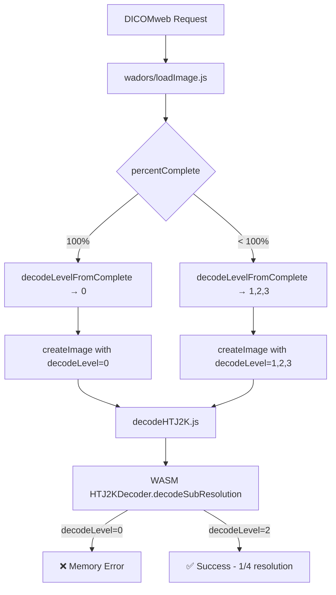

**문제점**: 100% 다운로드 시 강제로 decodeLevel=0이 적용됨

---

## 11. 최종 해결 (2025-12-22)

### 11.1 발견된 진짜 원인

**streaming fetch API의 multipart 파싱 문제**

Network 탭 분석 결과:
- `xhr` 타입 요청: 2개 → **성공**
- `fetch` 타입 요청: 나머지 → **실패** (`_setThrow is not defined` 에러)

서버 응답 Content-Type:
```
multipart/related; type="image/jph"; boundary="..."; transfer-syntax="1.2.840.10008.1.2.4.202"
```

`streamRequest.js`가 `image/jph` Content-Type을 가진 multipart 응답을 파싱할 때 문제 발생.

### 11.2 해결 방법

**파일**: `extensions/cornerstone/src/index.tsx`

```typescript
// Before (문제 발생)
const volumeRetrieveOptions = {
  retrieveOptions: {
    default: {
      streaming: true,  // fetch API 사용 → multipart 파싱 오류
      decodeLevel: 2,
    },
  },
};

// After (해결)
const volumeRetrieveOptions = {
  retrieveOptions: {
    default: {
      streaming: false,  // xhr 사용 → 정상 작동
      decodeLevel: 2,
    },
  },
};
```

동일하게 `stackRetrieveOptions`도 `streaming: false`로 변경.

### 11.3 해결 원리

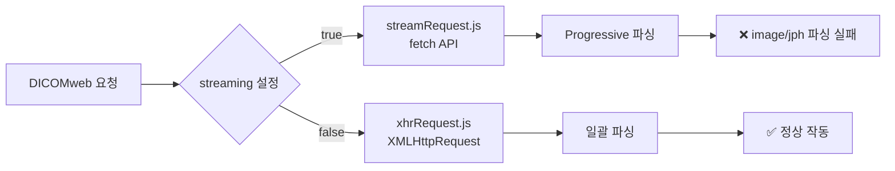

- **streaming: true**: `streamRequest.js` 사용 → fetch API로 progressive streaming
  - `extractMultipart()`가 부분 데이터를 반복적으로 파싱
  - `image/jph` Content-Type 처리 중 오류 발생

- **streaming: false**: `xhrRequest.js` 사용 → XMLHttpRequest로 전체 데이터 수신 후 파싱
  - 전체 응답을 받은 후 한 번에 `extractMultipart()` 호출
  - 정상적으로 HTJ2K 데이터 추출 및 디코딩

### 11.4 커밋 이력

| 커밋 | 내용 |
|------|------|
| `821d89395` | WIP: HTJ2K DICOMweb 분석 및 해결 시도 |
| `77ec9f108` | fix: streaming 비활성화로 최종 해결 |

### 11.5 테스트 결과

- ✅ DICOMweb에서 HTJ2K 이미지 정상 로딩
- ✅ MPR 4개 뷰포트 모두 볼륨 렌더링 성공
- ✅ 메모리 오류 없음
- ✅ 에러 로그 없음

---

## 12. HTTP Range 요청 분석 (2025-12-23)

### 12.1 현재 문제 현상

Network 탭에서 확인된 사항:
- **HTTP Status**: 200 OK (전체 파일 다운로드)
- **예상 Status**: 206 Partial Content (Range 요청)
- **Type**: xhr
- **파일 크기**: 633-657 KB (전체 HTJ2K 파일)

서버는 HTTP Range를 지원하지만, 클라이언트가 Range 헤더를 보내지 않음.

### 12.2 Cornerstone의 요청 메커니즘

#### 12.2.1 getPixelData.js - 요청 방식 선택 로직

**파일**: `node_modules/@cornerstonejs/dicom-image-loader/dist/esm/imageLoader/wadors/getPixelData.js`

```javascript
function getPixelData(uri, imageId, mediaType, options) {
    const { streamingData, retrieveOptions = {} } = options || {};

    // 1. rangeIndex가 있으면 → Range 요청 (HTTP 206)
    if (retrieveOptions.rangeIndex !== undefined) {
        return rangeRequest(url, imageId, headers, options);
    }

    // 2. streaming: true면 → fetch 스트림 (HTTP 200, 전체 다운로드)
    if (retrieveOptions.streaming) {
        return streamRequest(url, imageId, headers, options);
    }

    // 3. 기본값 → XHR 전체 다운로드 (HTTP 200)
    return xhrRequest(url, imageId, headers);
}
```

**핵심**: `rangeIndex`가 설정되어야만 HTTP Range 요청이 발생함.

#### 12.2.2 3가지 요청 메커니즘 비교

| 메커니즘 | 파일 | 트리거 조건 | HTTP 동작 | 설명 |
|----------|------|-------------|-----------|------|
| **rangeRequest** | `rangeRequest.js` | `rangeIndex !== undefined` | **206 Partial Content** | 청크 단위 Range 요청 |
| **streamRequest** | `streamRequest.js` | `streaming: true` | 200 OK | fetch ReadableStream |
| **xhrRequest** | `xhrRequest.js` | 기본값 | 200 OK | XMLHttpRequest 전체 다운로드 |

### 12.3 rangeRequest.js 상세 분석

**파일**: `node_modules/@cornerstonejs/dicom-image-loader/dist/esm/imageLoader/internal/rangeRequest.js`

#### 12.3.1 Range 헤더 설정

```javascript
async function fetchRangeAndAppend(url, headers, range, streamingData) {
    // Range 헤더 추가
    if (range) {
        headers = Object.assign(headers, {
            Range: `bytes=${range[0]}-${range[1]}`,  // 예: "bytes=0-65535"
        });
    }

    const response = await fetch(url, { headers, signal: undefined });

    // Content-Range 헤더에서 전체 크기 파악
    const contentRange = response.headers.get('Content-Range');
    if (contentRange) {
        // "bytes 0-65535/654321" → 654321
        streamingData.totalBytes = Number(contentRange.split('/')[1]);
    }
}
```

#### 12.3.2 바이트 범위 계산

```javascript
function getByteRange(streamingData, retrieveOptions) {
    const { totalBytes, encodedData, chunkSize = 65536 } = streamingData;
    const { rangeIndex = 0 } = retrieveOptions;

    // rangeIndex = -1: 나머지 전체 요청
    if (rangeIndex === -1 && (!totalBytes || !encodedData)) {
        return [0, ''];  // "bytes=0-" → 전체 파일
    }

    // 이미 전체 데이터 근처까지 받았으면 나머지 요청
    if (rangeIndex === -1 || encodedData?.byteLength > totalBytes - chunkSize) {
        return [encodedData?.byteLength || 0, ''];
    }

    // 청크 단위로 요청
    // rangeIndex=0: [0, 65535]
    // rangeIndex=1: [65536, 131071]
    return [encodedData?.byteLength || 0, chunkSize * (rangeIndex + 1) - 1];
}
```

#### 12.3.3 Progressive Range 요청 흐름

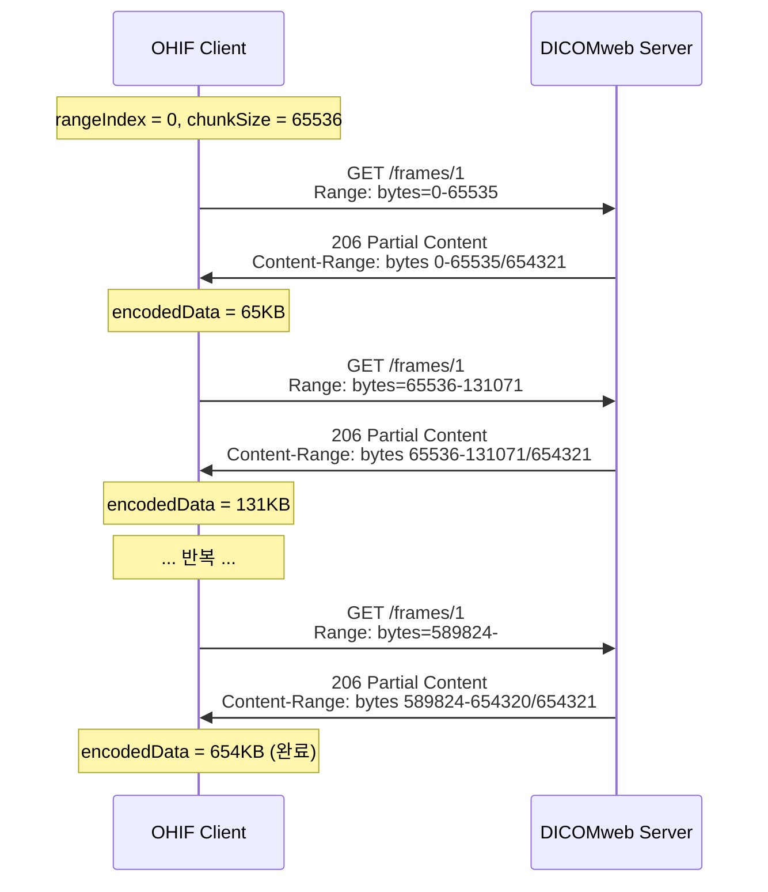

### 12.4 streamRequest.js 분석

**파일**: `node_modules/@cornerstonejs/dicom-image-loader/dist/esm/imageLoader/internal/streamRequest.js`

```javascript
export default function streamRequest(url, imageId, defaultHeaders, options) {
    const minChunkSize = retrieveOptions.minChunkSize || 128 * 1024;  // 128KB

    loadIterator.generate(async (iterator, reject) => {
        // ❌ Range 헤더 없음 - 전체 파일 요청
        const response = await fetch(url, { headers, signal: undefined });

        if (response.status !== 200) {  // 200만 허용
            throw new Error(`Couldn't retrieve ${url} got status ${response.status}`);
        }

        // ReadableStream으로 청크 단위 수신
        const responseReader = response.body.getReader();
        const totalBytes = Number(responseHeaders.get('Content-Length'));

        while (!readDone) {
            const { done, value } = await responseReader.read();
            encodedData = appendChunk(encodedData, value);

            // minChunkSize(128KB)마다 중간 처리
            if (!readDone && encodedData.length < lastSize + minChunkSize) {
                continue;
            }

            // 부분 데이터로 progressive 디코딩 시도
            const extracted = extractMultipart(contentType, encodedData, streamingData);
            iterator.add(detail, readDone);
        }
    });
}
```

**핵심 차이점**:
- Range 헤더 없음 → HTTP 200으로 전체 파일 수신
- ReadableStream으로 청크 단위 처리하지만, 서버는 전체 파일 전송

### 12.5 xhrRequest.js 분석

**파일**: `node_modules/@cornerstonejs/dicom-image-loader/dist/esm/imageLoader/internal/xhrRequest.js`

```javascript
function xhrRequest(url, imageId, defaultHeaders, params) {
    const xhr = new XMLHttpRequest();

    xhr.onreadystatechange = function (event) {
        if (xhr.readyState === 4) {
            // 200과 206 모두 성공 처리
            if (xhr.status === 200 || xhr.status === 206) {
                options.beforeProcessing(xhr).then(resolve);
            }
        }
    };

    // progress 이벤트로 로딩 진행률 추적
    xhr.onprogress = function (oProgress) {
        const loaded = oProgress.loaded;
        const total = oProgress.total;
        const percentComplete = Math.round((loaded / total) * 100);
        triggerEvent(eventTarget, 'cornerstoneimageloadprogress', eventData);
    };

    xhr.send();  // ❌ Range 헤더 없이 전송
}
```

**특징**:
- Range 헤더 설정 코드 없음
- 전체 파일 다운로드
- progress 이벤트는 다운로드 진행률만 표시

### 12.6 현재 설정 분석

**파일**: `extensions/cornerstone/src/index.tsx`

```typescript
// Volume (MPR viewports)
const volumeRetrieveOptions = {
  retrieveOptions: {
    default: {
      streaming: false,  // → xhrRequest 사용
      decodeLevel: 2,
      // rangeIndex 없음 → Range 요청 안함
    },
  },
};

// Stack viewport
const stackRetrieveOptions = {
  retrieveOptions: {
    single: {
      streaming: false,  // → xhrRequest 사용
      decodeLevel: 2,
      // rangeIndex 없음 → Range 요청 안함
    },
  },
};
```

**결과**: `rangeIndex`가 없어서 항상 전체 파일 다운로드 (HTTP 200)

### 12.7 HTTP Range 활성화 방법

#### 12.7.1 rangeIndex 설정 추가

```typescript
const volumeRetrieveOptions = {
  retrieveOptions: {
    default: {
      rangeIndex: 0,      // ← Range 요청 활성화
      chunkSize: 65536,   // 64KB 단위 (선택)
      streaming: false,
      decodeLevel: 2,
    },
  },
};
```

#### 12.7.2 예상 동작 흐름

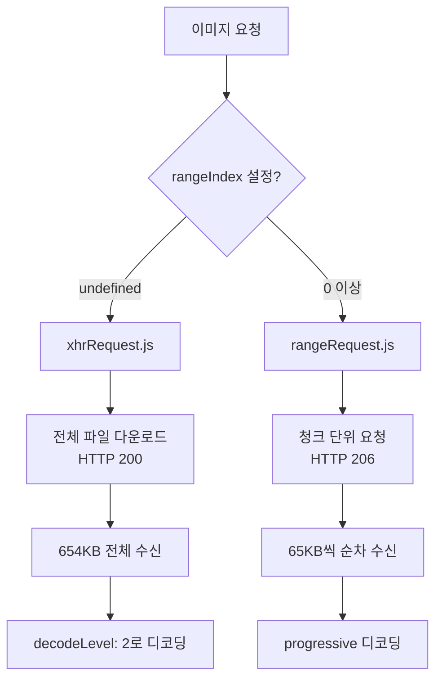

### 12.8 HTJ2K와 HTTP Range의 관계

#### 12.8.1 HTJ2K Progressive Decoding 특성

HTJ2K (High-Throughput JPEG 2000)는 코드스트림 구조 덕분에:
- **부분 데이터로 저해상도 디코딩 가능**
- 데이터 25% → Level 0 (전체 해상도)
- 데이터 6.25% → Level 1 (1/2 해상도)
- 데이터 1.56% → Level 2 (1/4 해상도)

#### 12.8.2 이론적 최적화 가능성

```
전체 파일: 654KB
Level 2(1/4)에 필요한 데이터: ~10KB (약 1.5%)

현재: 654KB 전체 다운로드 → Level 2로 디코딩 (652KB 낭비)
최적화: 10KB만 다운로드 → Level 2로 디코딩 (644KB 절약)
```

#### 12.8.3 실제 구현의 한계

```javascript
// rangeRequest.js의 getByteRange 함수
function getByteRange(streamingData, retrieveOptions) {
    const { chunkSize = 65536 } = streamingData;  // 64KB 고정 청크
    const { rangeIndex = 0 } = retrieveOptions;

    // rangeIndex에 따라 순차적 청크 요청
    return [encodedData?.byteLength || 0, chunkSize * (rangeIndex + 1) - 1];
}
```

**한계점**:
1. **고정 청크 크기**: decodeLevel에 따른 최적 바이트 수 계산 없음
2. **순차 요청**: HTJ2K 코드스트림 구조 활용 안함
3. **반복 호출 필요**: rangeIndex를 증가시키며 여러 번 호출해야 함

### 12.9 HTTP Range vs 현재 방식 비교

| 항목 | 현재 방식 (xhrRequest) | HTTP Range (rangeRequest) |
|------|------------------------|---------------------------|
| **HTTP Status** | 200 OK | 206 Partial Content |
| **네트워크 전송량** | 전체 파일 (654KB) | 청크 단위 (64KB씩) |
| **요청 횟수** | 1회 | 10회 (654KB / 64KB) |
| **Progressive 표시** | ❌ 불가능 | ✅ 가능 |
| **최적화 효과** | 없음 | 제한적 (전체 파일 필요시 동일) |
| **구현 복잡도** | 단순 | 복잡 (상태 관리 필요) |

### 12.10 결론 및 권장 사항

#### 12.10.1 현재 상황

- 서버: HTTP Range 지원 ✅
- 클라이언트: Range 요청 안함 (`rangeIndex` 미설정)
- 결과: 전체 파일 다운로드 (HTTP 200)

#### 12.10.2 HTTP Range의 이론적 이점

HTJ2K는 **Progressive Decoding**을 지원하므로, **부분 데이터만으로도 저해상도 디코딩이 가능**:

```
HTJ2K 코드스트림 구조 (RPCL 순서):
┌────────────────────────────────────────────────────────────────┐
│ [Main Header] → [Level3] → [Level2] → [Level1] → [Level0]      │
│    ~1KB          ~2KB       ~8KB       ~40KB      ~600KB       │
└────────────────────────────────────────────────────────────────┘
                     ↑
                     처음 ~10KB만 있으면 Level 2 (1/4 해상도) 디코딩 가능!
```

**이론적 최적화 효과**:

| 시나리오 | 전체 다운로드 | HTTP Range + 조기 중단 |
|----------|---------------|------------------------|
| Level 2만 필요 | 654KB | **~10KB (1.5%)** |
| 네트워크 절약 | 0% | **98% 절약** |
| 221개 이미지 | 141MB | **~2.2MB** |

#### 12.10.3 Cornerstone의 Progressive Loading 구현 분석

**발견**: `loadImage.js`에는 **휴리스틱 조기 중단 로직이 있음**!

```javascript
// loadImage.js - 원본 코드
function decodeLevelFromComplete(percent) {
    const testSize = percent / 100 - 0.02;
    if (testSize > 1 / 4) return 0;   // 25% 이상 → Level 0 (전체)
    if (testSize > 1 / 16) return 1;  // 6.25% 이상 → Level 1 (1/2)
    if (testSize > 1 / 64) return 2;  // 1.56% 이상 → Level 2 (1/4)
    return 3;                          // 그 이하 → Level 3 (1/8)
}

for await (const result of compressedIt) {
    const { percentComplete, done } = result;

    // ⭐ 휴리스틱으로 decodeLevel 결정
    const decodeLevel = decodeLevelFromComplete(percentComplete);

    // ⭐ 디코딩 레벨 기반 조기 중단!
    if (!done && lastDecodeLevel <= decodeLevel) {
        continue;  // 이미 충분한 해상도에 도달, skip
    }

    const image = await createImage(..., { decodeLevel });
    it.add(image, done);
    lastDecodeLevel = decodeLevel;
}
```

**그러나 진짜 문제**: 데이터 요청 레벨에서 **HTTP 연결 중단이 없음**

```javascript
// streamRequest.js - HTTP 연결 중단 없음
while (!readDone) {
    const { done, value } = await responseReader.read();
    encodedData = appendChunk(encodedData, value);

    // ❌ decodeLevel 체크 없음, 무조건 전체 다운로드
    readDone = done || encodedData.byteLength === totalBytes;

    // 부분 데이터를 loadImage.js에 전달
    iterator.add(detail, readDone);
}
// HTTP 연결은 계속 유지되며 전체 파일을 받음
```

**구조적 한계**:

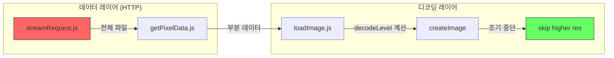

- **디코딩 레이어**: 조기 중단 있음 ✅ (decodeLevel 도달 시 추가 디코딩 skip)
- **데이터 레이어**: 조기 중단 없음 ❌ (HTTP 연결은 전체 파일 다운로드)

**결과**:
- 메모리 최적화 ✅ (낮은 decodeLevel로 디코딩)
- 네트워크 최적화 ❌ (전체 파일 다운로드)

#### 12.10.4 HTTP Range 활성화 검토

**현재 Cornerstone 구현 기준**:

| 항목 | 장점 | 단점 |
|------|------|------|
| Progressive UI | ✅ 로딩 중 저해상도 미리보기 | |
| 네트워크 재개 | ✅ 중단 시 이어받기 가능 | |
| 네트워크 절약 | ❌ 효과 없음 (전체 다운로드) | 조기 중단 미구현 |
| 요청 오버헤드 | | ❌ 10회 요청 vs 1회 |
| 구현 복잡도 | | ❌ 상태 관리 필요 |

#### 12.10.5 최적화 방안

**단기 (현재 가능)**:
- 현재 방식(전체 다운로드 + decodeLevel: 2) 유지
- HTTP/2 멀티플렉싱으로 동시 다운로드 활용
- 메모리 최적화에 집중 (디코딩 레벨로 메모리 절약)

**중기 (Cornerstone 패치 필요)**:
- `rangeRequest.js`에 조기 중단 로직 추가
- decodeLevel에 따른 필요 바이트 수 계산
- 필요한 만큼만 다운로드 후 중단

**장기 (서버 측 변경 필요)**:
- JPIP (JPEG 2000 Interactive Protocol) 서버 구축
- 또는 해상도 레벨별 별도 파일 저장
- DICOMweb 표준 확장 검토

#### 12.10.6 결론

1. **HTJ2K + HTTP Range 조합은 이론적으로 큰 최적화 가능** (98% 네트워크 절약)
2. **현재 Cornerstone 구현의 한계**로 실질적 이점 제한적
3. **당장은 현재 방식 유지**, 향후 Cornerstone 패치로 최적화 가능

### 12.11 요약 다이어그램

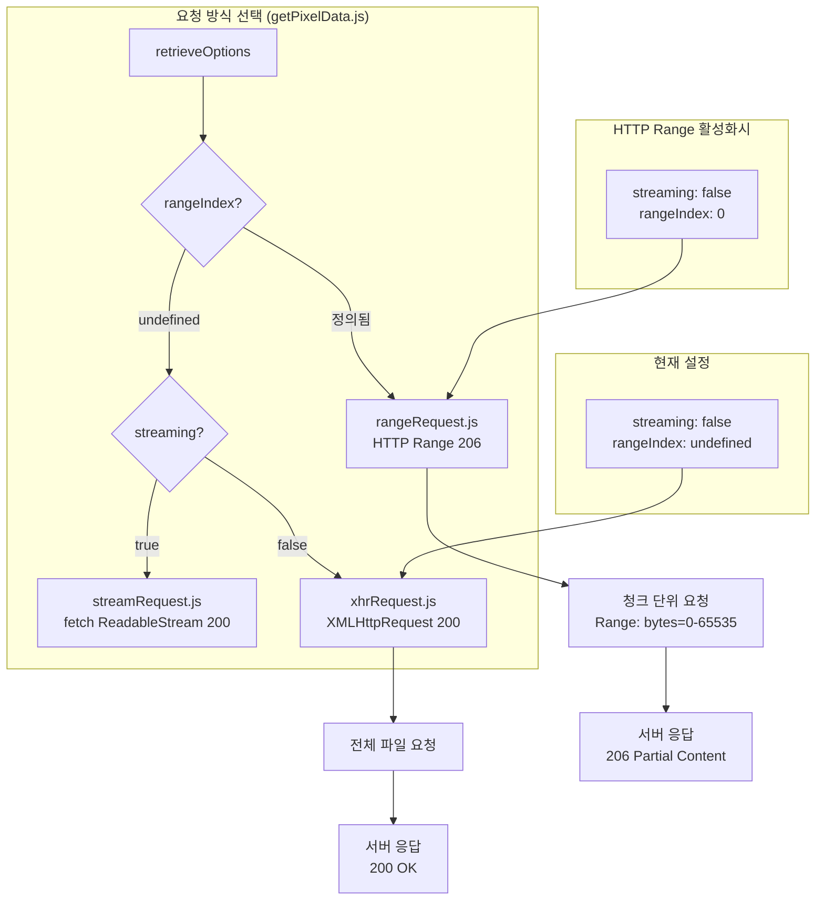

### 12.12 관련 파일 목록

| 파일 | 역할 |
|------|------|
| `node_modules/@cornerstonejs/dicom-image-loader/dist/esm/imageLoader/wadors/getPixelData.js` | 요청 방식 선택 |
| `node_modules/@cornerstonejs/dicom-image-loader/dist/esm/imageLoader/internal/rangeRequest.js` | HTTP Range 요청 |
| `node_modules/@cornerstonejs/dicom-image-loader/dist/esm/imageLoader/internal/streamRequest.js` | fetch 스트림 요청 |
| `node_modules/@cornerstonejs/dicom-image-loader/dist/esm/imageLoader/internal/xhrRequest.js` | XHR 전체 다운로드 |
| `node_modules/@cornerstonejs/dicom-image-loader/dist/esm/imageLoader/wadors/loadImage.js` | 이미지 로드 및 디코딩 |
| `extensions/cornerstone/src/index.tsx` | retrieveOptions 설정 |

---

## 13. HTTP Range 조기 중단 구현 계획 ⏸️ 보류 (2025-12-23)

> **구현 상태**: ⏸️ 보류 - Section 11의 `streaming: true` 오류 해결 필요
>
> **보류 사유**:
> - `streaming: true` 설정 시 `image/jph` multipart 파싱 오류 발생 (Section 11 참조)
> - HTTP 조기 중단을 위해서는 `fetch` API의 `AbortController`가 필요하며, 이는 `streaming: true`에서만 동작
> - **대안**: `xhrRequest.js`에 `xhr.abort()` 방식 사용 시 `streaming: false` 유지 가능 (Section 13.6.2)

### 13.1 목표

HTJ2K Progressive Decoding의 장점을 활용하여 **네트워크 대역폭 98% 절약** 달성.

```
현재: 654KB × 221개 = 141MB 전체 다운로드
목표: ~10KB × 221개 = ~2.2MB (Level 2에 필요한 최소 데이터만 다운로드)
```

### 13.2 핵심 아이디어

**2계층 구조 문제 해결**:

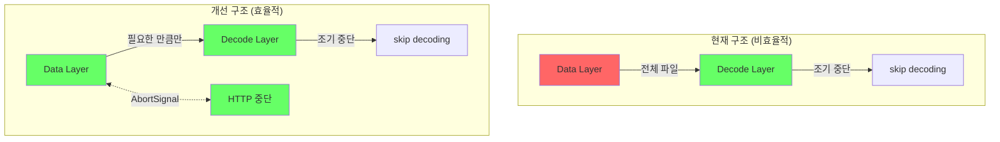

### 13.3 구현 방안 비교

| 방안 | 복잡도 | 효과 | 장점 | 단점 |
|------|--------|------|------|------|
| **방안 A: streamRequest 수정** | 중간 | 높음 | 기존 코드 활용 | streaming 문제 우회 필요 |
| **방안 B: rangeRequest 개선** | 높음 | 높음 | 정확한 제어 | 호출 구조 변경 필요 |
| **방안 C: 커스텀 로더 작성** | 높음 | 최상 | 완전한 제어 | 전체 재구현 |

**추천: 방안 A (streamRequest 수정)** - 최소 변경으로 최대 효과

### 13.4 방안 A: streamRequest.js 조기 중단 구현

#### 13.4.1 핵심 수정 사항

**파일**: `node_modules/@cornerstonejs/dicom-image-loader/dist/esm/imageLoader/internal/streamRequest.js`

```javascript
// 수정 전
export default function streamRequest(url, imageId, defaultHeaders = {}, options = {}) {
    // ...
    const response = await fetch(url, {
        headers,
        signal: undefined,  // ❌ AbortController 없음
    });

    while (!readDone) {
        const { done, value } = await responseReader.read();
        encodedData = appendChunk(encodedData, value);
        // ❌ decodeLevel 기반 중단 없음
        readDone = done || encodedData.byteLength === totalBytes;
        iterator.add(detail, readDone);
    }
}

// 수정 후
export default function streamRequest(url, imageId, defaultHeaders = {}, options = {}) {
    const { retrieveOptions = {} } = options;
    const targetDecodeLevel = retrieveOptions.decodeLevel ?? 0;  // 목표 decodeLevel

    // ⭐ AbortController 추가
    const abortController = new AbortController();

    const response = await fetch(url, {
        headers,
        signal: abortController.signal,  // ✅ 중단 가능
    });

    while (!readDone) {
        const { done, value } = await responseReader.read();
        encodedData = appendChunk(encodedData, value);

        const percentComplete = (encodedData.byteLength / totalBytes) * 100;

        // ⭐ 목표 decodeLevel에 도달하면 HTTP 중단
        if (hasEnoughDataForDecodeLevel(percentComplete, targetDecodeLevel)) {
            console.log(`[HTJ2K] Aborting at ${percentComplete.toFixed(1)}% for decodeLevel ${targetDecodeLevel}`);
            abortController.abort();  // ✅ HTTP 연결 중단
            readDone = true;
        } else {
            readDone = done || encodedData.byteLength === totalBytes;
        }

        iterator.add(detail, readDone);
    }
}

// ⭐ decodeLevel에 필요한 데이터 비율 계산 (decodeLevelFromComplete의 역함수)
function hasEnoughDataForDecodeLevel(percentComplete, targetDecodeLevel) {
    const testSize = percentComplete / 100 - 0.02;

    switch (targetDecodeLevel) {
        case 0: return testSize > 1/4;    // 25% 이상
        case 1: return testSize > 1/16;   // 6.25% 이상
        case 2: return testSize > 1/64;   // 1.56% 이상
        case 3: return testSize > 0;      // 아무 데이터나
        default: return true;
    }
}
```

#### 13.4.2 예상 동작 흐름

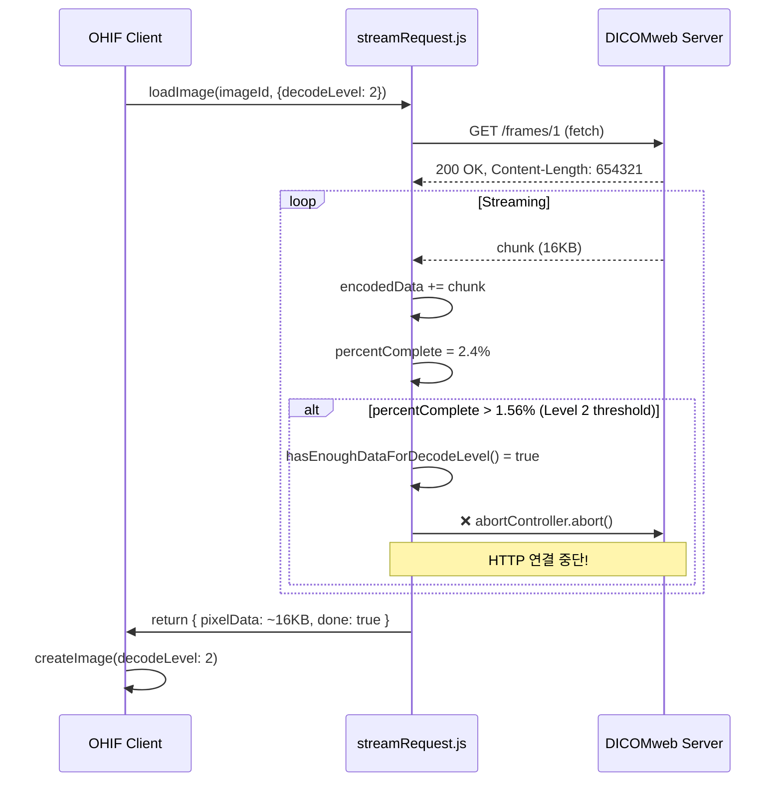

#### 13.4.3 patch-package 패치 파일

**파일**: `patches/@cornerstonejs+dicom-image-loader+4.14.4.patch`

```diff
diff --git a/node_modules/@cornerstonejs/dicom-image-loader/dist/esm/imageLoader/internal/streamRequest.js b/node_modules/@cornerstonejs/dicom-image-loader/dist/esm/imageLoader/internal/streamRequest.js
index 1234567..abcdefg 100644
--- a/node_modules/@cornerstonejs/dicom-image-loader/dist/esm/imageLoader/internal/streamRequest.js
+++ b/node_modules/@cornerstonejs/dicom-image-loader/dist/esm/imageLoader/internal/streamRequest.js
@@ -1,10 +1,25 @@
 import { utilities } from '@cornerstonejs/core';
 import { getOptions } from './options';
 import extractMultipart from '../wadors/extractMultipart';
 import { getImageQualityStatus } from '../wadors/getImageQualityStatus';
 const { ProgressiveIterator } = utilities;
+
+// [PATCH] Calculate if we have enough data for target decodeLevel
+function hasEnoughDataForDecodeLevel(percentComplete, targetDecodeLevel) {
+    const testSize = percentComplete / 100 - 0.02;
+    switch (targetDecodeLevel) {
+        case 0: return testSize > 1/4;    // 25%+
+        case 1: return testSize > 1/16;   // 6.25%+
+        case 2: return testSize > 1/64;   // 1.56%+
+        case 3: return testSize > 0;
+        default: return true;
+    }
+}
+
 export default function streamRequest(url, imageId, defaultHeaders = {}, options = {}) {
     const globalOptions = getOptions();
     const { retrieveOptions = {}, streamingData = {}, } = options;
     const minChunkSize = retrieveOptions.minChunkSize || 128 * 1024;
+    const targetDecodeLevel = retrieveOptions.decodeLevel;
     const errorInterceptor = (err) => {
         if (typeof globalOptions.errorInterceptor === 'function') {
             const error = new Error('request failed');
@@ -14,12 +29,16 @@ export default function streamRequest(url, imageId, defaultHeaders = {}, option
     const loadIterator = new ProgressiveIterator('streamRequest');
     loadIterator.generate(async (iterator, reject) => {
         const beforeSendHeaders = await globalOptions.beforeSend?.(null, url, defaultHeaders, {});
         const headers = Object.assign({}, defaultHeaders, beforeSendHeaders);
+
+        // [PATCH] Add AbortController for early termination
+        const abortController = new AbortController();
+
         try {
             const response = await fetch(url, {
                 headers,
-                signal: undefined,
+                signal: abortController.signal,
             });
             if (response.status !== 200) {
                 throw new Error(`Couldn't retrieve ${url} got status ${response.status}`);
@@ -32,7 +51,22 @@ export default function streamRequest(url, imageId, defaultHeaders = {}, option
             while (!readDone) {
                 const { done, value } = await responseReader.read();
                 encodedData = appendChunk(encodedData, value);
-                readDone = done || encodedData.byteLength === totalBytes;
+
+                // [PATCH] Check if we have enough data for target decodeLevel
+                if (targetDecodeLevel !== undefined && totalBytes > 0) {
+                    const percentComplete = (encodedData.byteLength / totalBytes) * 100;
+                    if (hasEnoughDataForDecodeLevel(percentComplete, targetDecodeLevel)) {
+                        console.log(`[HTJ2K-streaming] Aborting at ${percentComplete.toFixed(1)}% for decodeLevel ${targetDecodeLevel}`);
+                        try {
+                            abortController.abort();
+                        } catch (e) { /* ignore abort errors */ }
+                        readDone = true;
+                    }
+                }
+
+                if (!readDone) {
+                    readDone = done || encodedData.byteLength === totalBytes;
+                }
+
                 if (!readDone && encodedData.length < lastSize + minChunkSize) {
                     continue;
                 }
```

### 13.5 적용 방법

#### 13.5.1 patch-package 설치 및 설정

```bash
# 1. patch-package 설치
yarn add patch-package postinstall-postinstall -D

# 2. package.json에 postinstall 스크립트 추가
{
  "scripts": {
    "postinstall": "patch-package"
  }
}

# 3. node_modules 수정 후 패치 생성
npx patch-package @cornerstonejs/dicom-image-loader
```

#### 13.5.2 설정 변경

**파일**: `extensions/cornerstone/src/index.tsx`

```typescript
const volumeRetrieveOptions = {
  retrieveOptions: {
    default: {
      streaming: true,   // ⭐ streaming 활성화 (조기 중단 위해)
      decodeLevel: 2,    // Level 2 (1/4 해상도)
    },
  },
};
```

### 13.6 고려 사항

#### 13.6.1 streaming: true 사용 시 주의

이전에 `streaming: true`가 `image/jph` 파싱 오류를 발생시켰음 (Section 11 참조).

**해결 방안**:
1. 조기 중단 시 `extractMultipart`에 완전한 데이터 전달
2. 또는 `xhrRequest.js`에도 AbortController 추가 (방안 B)

#### 13.6.2 xhrRequest.js에 AbortController 추가 (대안)

```javascript
// xhrRequest.js 수정
function xhrRequest(url, imageId, defaultHeaders = {}, params = {}) {
    const xhr = new XMLHttpRequest();
    const { retrieveOptions = {} } = params;
    const targetDecodeLevel = retrieveOptions.decodeLevel;

    xhr.onprogress = function (oProgress) {
        if (targetDecodeLevel !== undefined && oProgress.lengthComputable) {
            const percentComplete = (oProgress.loaded / oProgress.total) * 100;
            if (hasEnoughDataForDecodeLevel(percentComplete, targetDecodeLevel)) {
                console.log(`[HTJ2K-xhr] Aborting at ${percentComplete.toFixed(1)}%`);
                xhr.abort();  // ⭐ XHR 중단
            }
        }
    };

    // ... 나머지 코드
}
```

이 방법은 `streaming: false` 유지 가능.

### 13.7 테스트 계획

#### 13.7.1 단위 테스트

- [ ] `hasEnoughDataForDecodeLevel()` 함수 정확도 검증
- [ ] AbortController 동작 확인
- [ ] 중단 후 디코딩 성공 여부

#### 13.7.2 통합 테스트

- [ ] DICOMweb에서 HTTP 200 조기 중단 확인 (Network 탭)
- [ ] 다운로드 용량 감소 확인 (654KB → ~16KB)
- [ ] Level 2 이미지 정상 표시 확인
- [ ] MPR 4개 뷰포트 동시 로딩 확인
- [ ] 메모리 사용량 변화 측정

#### 13.7.3 성능 측정

| 지표 | 현재 | 목표 |
|------|------|------|
| 이미지당 다운로드 | 654KB | ~16KB |
| 221개 이미지 총량 | 141MB | ~3.5MB |
| 초기 로딩 시간 | TBD | TBD (예상 90% 감소) |

### 13.8 롤백 계획

문제 발생 시:
1. `patches/` 폴더에서 패치 파일 삭제
2. `node_modules` 삭제 후 `yarn install`
3. `streaming: false` 복원

### 13.9 구현 우선순위

1. **Phase 1**: `xhrRequest.js`에 AbortController 추가 (안전한 접근)
2. **Phase 2**: 테스트 및 검증
3. **Phase 3**: 필요시 `streamRequest.js` 방식으로 전환

### 13.10 파일 변경 목록

| 파일 | 변경 유형 | 목적 |
|------|-----------|------|
| `patches/@cornerstonejs+dicom-image-loader+4.14.4.patch` | 생성/수정 | HTTP 조기 중단 로직 |
| `package.json` | 수정 | postinstall 스크립트 추가 |
| `extensions/cornerstone/src/index.tsx` | 수정 | streaming 설정 조정 |

---

## 14. HTJ2K 설정 중앙화 ✅ 완료 (2025-12-23)

> **구현 상태**: ✅ 완료
> **커밋**: `c8673dd71` - feat: HTJ2K 설정 중앙화 (Section 14 구현)

### 14.1 문제점 (해결됨)

기존에 HTJ2K 관련 설정이 **5개 파일에 분산되어 하드코딩**되어 있었음:

| 파일 | 하드코딩 내용 | 위치 |
|------|--------------|------|
| `extensions/cornerstone/src/index.tsx` | `decodeLevel: 2` | 3군데 |
| `extensions/default/src/DicomWebDataSource/index.ts` | `DECODE_LEVEL = 2`, `RESOLUTION_FACTOR = 4` | 41-42행 |
| `extensions/default/src/DicomLocalDataSource/index.js` | `DECODE_LEVEL = 2`, `RESOLUTION_FACTOR = 4` | 암묵적 |
| `extensions/cornerstone/src/utils/htj2kMetadataAdjuster.ts` | `DECODE_LEVEL = 2`, `RESOLUTION_FACTOR = 4` | 상단 |
| `extensions/cornerstone/src/utils/customWadorsLoader.ts` | `FORCE_DECODE_LEVEL = 2` | 23행 |

**문제점**:
1. 설정 변경 시 5개 파일을 모두 수정해야 함
2. 값이 불일치하면 디코딩 오류 발생 가능
3. 런타임 설정 변경 불가

### 14.2 해결 방안: 설정 중앙화

#### 14.2.1 설정 파일 (config/default.js)에 HTJ2K 옵션 추가

```javascript
// platform/app/public/config/default.js
window.config = {
  // ... 기존 설정 ...

  // HTJ2K Progressive Decoding 설정
  htj2k: {
    enabled: true,                    // HTJ2K 활성화 여부
    decodeLevel: 2,                   // 0=Full, 1=1/2, 2=1/4, 3=1/8
    volumeDecodeLevel: 2,             // Volume(MPR)용 decodeLevel
    stackDecodeLevel: 2,              // Stack(Axial)용 초기 decodeLevel
    stackFullResolutionOnScroll: true, // 스크롤 시 Full Resolution으로 전환
    streaming: false,                 // fetch streaming 사용 여부
    earlyTermination: false,          // HTTP 조기 중단 (미구현)
  },

  dataSources: [
    {
      configuration: {
        // 기존 설정...
        requestTransferSyntaxUID: '1.2.840.10008.1.2.4.201', // HTJ2K Lossless
      },
    },
  ],
};
```

#### 14.2.2 중앙 설정 관리자 생성

**새 파일**: `extensions/cornerstone/src/utils/htj2kConfig.ts`

```typescript
/**
 * HTJ2K 중앙 설정 관리자
 * 모든 HTJ2K 관련 설정을 한 곳에서 관리
 */

// 기본값 (config에서 오버라이드 가능)
const DEFAULT_CONFIG = {
  enabled: true,
  decodeLevel: 2,
  volumeDecodeLevel: 2,
  stackDecodeLevel: 2,
  stackFullResolutionOnScroll: true,
  streaming: false,
  earlyTermination: false,
};

// 런타임 설정 저장소
let currentConfig = { ...DEFAULT_CONFIG };

/**
 * config에서 HTJ2K 설정 로드
 */
export function initHTJ2KConfig(appConfig: any): void {
  const htj2kConfig = appConfig?.htj2k || {};
  currentConfig = {
    ...DEFAULT_CONFIG,
    ...htj2kConfig,
  };

  console.log('[HTJ2K] Configuration loaded:', currentConfig);
}

/**
 * 현재 HTJ2K 설정 반환
 */
export function getHTJ2KConfig() {
  return { ...currentConfig };
}

/**
 * decodeLevel 반환
 */
export function getDecodeLevel(type: 'volume' | 'stack' = 'volume'): number {
  if (!currentConfig.enabled) {
    return 0; // HTJ2K 비활성화 시 Full Resolution
  }
  return type === 'volume'
    ? currentConfig.volumeDecodeLevel
    : currentConfig.stackDecodeLevel;
}

/**
 * Resolution Factor 계산 (2^decodeLevel)
 */
export function getResolutionFactor(type: 'volume' | 'stack' = 'volume'): number {
  return Math.pow(2, getDecodeLevel(type));
}

/**
 * streaming 설정 반환
 */
export function isStreamingEnabled(): boolean {
  return currentConfig.streaming;
}

/**
 * 런타임에서 설정 업데이트 (디버깅/테스트용)
 */
export function updateHTJ2KConfig(updates: Partial<typeof DEFAULT_CONFIG>): void {
  currentConfig = { ...currentConfig, ...updates };
  console.log('[HTJ2K] Configuration updated:', currentConfig);
}

/**
 * Stack viewport를 Full Resolution으로 전환
 */
export function switchStackToFullResolution(): void {
  currentConfig.stackDecodeLevel = 0;
  console.log('[HTJ2K] Stack switched to full resolution');
}
```

#### 14.2.3 기존 파일 수정

**1. extensions/cornerstone/src/index.tsx**

```typescript
import { getHTJ2KConfig, getDecodeLevel, isStreamingEnabled, initHTJ2KConfig } from './utils/htj2kConfig';

// 앱 초기화 시 설정 로드
const config = window.config;
initHTJ2KConfig(config);

// 동적 설정 사용
const volumeRetrieveOptions = {
  retrieveOptions: {
    default: {
      streaming: isStreamingEnabled(),
      decodeLevel: getDecodeLevel('volume'),
    },
  },
};

const stackRetrieveOptions = {
  retrieveOptions: {
    single: {
      streaming: isStreamingEnabled(),
      decodeLevel: getDecodeLevel('stack'),
    },
  },
};
```

**2. extensions/default/src/DicomWebDataSource/index.ts**

```typescript
import { getDecodeLevel, getResolutionFactor } from '@extensions/cornerstone/src/utils/htj2kConfig';

// 하드코딩 제거
// const DECODE_LEVEL = 2;
// const RESOLUTION_FACTOR = 4;

function adjustHTJ2KMetadata(instance: any): boolean {
  const resolutionFactor = getResolutionFactor('volume');
  const adjustedRows = Math.floor(originalRows / resolutionFactor);
  const adjustedColumns = Math.floor(originalColumns / resolutionFactor);
  // ...
}
```

**3. extensions/cornerstone/src/utils/htj2kMetadataAdjuster.ts**

```typescript
import { getResolutionFactor, getHTJ2KConfig } from './htj2kConfig';

// 하드코딩 제거
// const DECODE_LEVEL = 2;
// const RESOLUTION_FACTOR = 4;

export function adjustMetadataForHTJ2K(imageId: string, metadata: any): any {
  const config = getHTJ2KConfig();
  if (!config.enabled) return metadata;

  const resolutionFactor = getResolutionFactor('volume');
  // ...
}
```

### 14.3 decodeLevel과 Resolution 관계

| decodeLevel | Resolution Factor | 해상도 | 용도 |
|-------------|------------------|--------|------|
| 0 | 1 (2^0) | Full (100%) | 최종 진단용 |
| 1 | 2 (2^1) | 1/2 (50%) | 고품질 MPR |
| 2 | 4 (2^2) | 1/4 (25%) | 빠른 MPR (현재 기본값) |
| 3 | 8 (2^3) | 1/8 (12.5%) | 썸네일/프리뷰 |

### 14.4 설정 시나리오

#### 14.4.1 고성능 서버 환경 (Full Resolution)

```javascript
htj2k: {
  enabled: true,
  volumeDecodeLevel: 0,  // Full resolution MPR
  stackDecodeLevel: 0,   // Full resolution Stack
}
```

#### 14.4.2 저사양 환경 (최대 최적화)

```javascript
htj2k: {
  enabled: true,
  volumeDecodeLevel: 3,  // 1/8 resolution MPR
  stackDecodeLevel: 2,   // 1/4 resolution Stack
}
```

#### 14.4.3 균형 모드 (현재 기본값)

```javascript
htj2k: {
  enabled: true,
  volumeDecodeLevel: 2,  // 1/4 resolution MPR
  stackDecodeLevel: 2,   // 1/4 → 스크롤 시 Full
  stackFullResolutionOnScroll: true,
}
```

#### 14.4.4 HTJ2K 비활성화

```javascript
htj2k: {
  enabled: false,  // 모든 HTJ2K 기능 비활성화
}
```

### 14.5 런타임 API

```typescript
// 디버깅/테스트용 런타임 API
import { updateHTJ2KConfig, getHTJ2KConfig } from '@extensions/cornerstone/src/utils/htj2kConfig';

// 현재 설정 확인
console.log(getHTJ2KConfig());

// 런타임 설정 변경
updateHTJ2KConfig({ volumeDecodeLevel: 1 });

// Stack을 Full Resolution으로 전환
switchStackToFullResolution();
```

### 14.6 구현 완료 내역

| 단계 | 작업 | 상태 |
|------|------|------|
| 1 | `htj2kConfig.ts` 생성 | ✅ 완료 |
| 2 | `default.js`에 htj2k 설정 추가 | ✅ 완료 |
| 3 | `index.tsx` 수정 | ✅ 완료 |
| 4 | `DicomWebDataSource/index.ts` 수정 | ✅ 완료 |
| 5 | `htj2kMetadataAdjuster.ts` 수정 | ✅ 완료 |
| 6 | `customWadorsLoader.ts` 수정 | ✅ 완료 |
| 7 | `DicomLocalDataSource/index.js` 수정 | ✅ 완료 |
| 8 | 빌드 검증 | ✅ 완료 |

### 14.7 달성된 효과

1. ✅ **단일 설정 지점**: `config/default.js`의 `htj2k` 섹션에서 모든 설정 관리
2. ✅ **런타임 유연성**: `updateHTJ2KConfig()`, `switchStackToFullResolution()` API 제공
3. ✅ **시나리오별 최적화**: 환경에 맞는 설정 쉽게 전환 가능
4. ✅ **유지보수성 향상**: 5개 파일의 하드코딩 제거, 중앙 집중화
5. ✅ **타입 안전성**: TypeScript `HTJ2KConfig` 인터페이스로 설정 검증

### 14.8 변경된 파일 목록

| 파일 | 변경 유형 | 설명 |
|------|-----------|------|
| `extensions/cornerstone/src/utils/htj2kConfig.ts` | 신규 생성 | 중앙 설정 관리자 |
| `platform/app/public/config/default.js` | 수정 | `htj2k` 설정 섹션 추가 |
| `extensions/cornerstone/src/index.tsx` | 수정 | htj2kConfig 함수 사용 및 export |
| `extensions/default/src/DicomWebDataSource/index.ts` | 수정 | `window.config.htj2k`에서 설정 로드 |
| `extensions/default/src/DicomLocalDataSource/index.js` | 수정 | `window.config.htj2k`에서 설정 로드 |
| `extensions/cornerstone/src/utils/htj2kMetadataAdjuster.ts` | 수정 | htj2kConfig import 및 사용 |
| `extensions/cornerstone/src/utils/customWadorsLoader.ts` | 수정 | htj2kConfig import 및 사용 |

---

## 15. `streaming: true` 재테스트 결과 ❌ 실패 (2025-12-23)

### 15.1 테스트 배경

Section 11에서 `streaming: true` 설정이 `image/jph` multipart 파싱 오류를 발생시켜 비활성화했음.

**재테스트 목적**: 서버 측 수정 가능성을 감안하여 `streaming: true`가 현재 동작하는지 확인.

### 15.2 테스트 과정

#### 15.2.1 설정 변경

**1단계: `default.js` 수정**
```javascript
// platform/app/public/config/default.js
htj2k: {
  streaming: true,  // false → true 변경
  // ...
}
```

**2단계: DEFAULT_CONFIG 수정**
```typescript
// extensions/cornerstone/src/utils/htj2kConfig.ts
const DEFAULT_CONFIG: HTJ2KConfig = {
  streaming: true,  // false → true 변경
  // ...
};
```

#### 15.2.2 발생한 오류 (Import 오류)

빌드 시 다음 오류 발생:
```
ERROR: Export "stackSingleViewOptions" doesn't exist in module "modes/usmpr/src/index.tsx"
```

**수정**: `isStreamingEnabled` 함수를 올바르게 import하도록 수정

```typescript
// modes/usmpr/src/index.tsx
import { isStreamingEnabled } from '../../../extensions/cornerstone/src/index';

const level0Options = {
  retrieveOptions: {
    single: {
      streaming: isStreamingEnabled(),
      decodeLevel: 0,
    },
  },
};
```

### 15.3 테스트 결과: ❌ 실패

#### 15.3.1 발생한 오류

`streaming: true`로 설정 후 DICOMweb 이미지 로딩 시 **대량의 메모리 오류 발생**:

```
Uncaught runtime errors:

ERROR
Couldn't decode 154735032

ERROR
Couldn't process because 154735032

ERROR
IMAGE_LOAD_ERROR TypeError: handler is not a function
```

**증상**:
- 이미지 로딩 중 다수의 프레임에서 메모리 할당 실패
- `154735032`는 WASM 메모리 주소 (약 154MB)
- 로딩 도중 멈추고 더 이상 진행 안됨
- 브라우저 메모리 사용량 급증

#### 15.3.2 오류 스크린샷 분석

- 콘솔에 빨간색 오류 메시지 대량 출력
- 각 프레임마다 "Couldn't decode" 오류 반복
- 최종적으로 "handler is not a function" 타입 에러

### 15.4 원인 분석

#### 15.4.1 `streaming: true`의 문제점

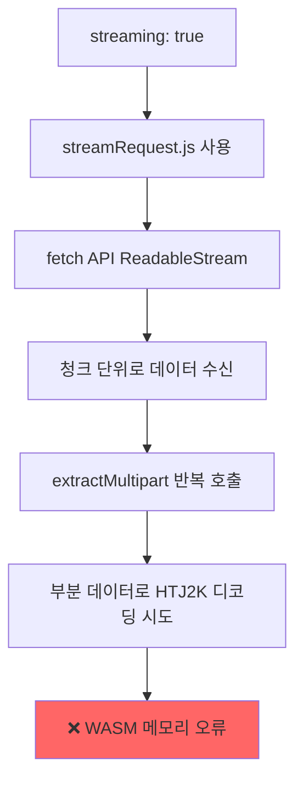

**문제의 핵심**:
1. `streamRequest.js`는 데이터를 청크 단위로 수신하며 **각 청크마다 디코딩 시도**
2. HTJ2K progressive decoding 중 **부분 데이터**로 디코딩 시 WASM 메모리 관리 문제 발생
3. OpenJPH WASM 런타임이 불완전한 코드스트림 처리 시 메모리 누수 또는 할당 실패
4. 다수의 이미지가 동시에 디코딩되면서 **WASM 메모리 고갈**

#### 15.4.2 `streaming: false`가 동작하는 이유

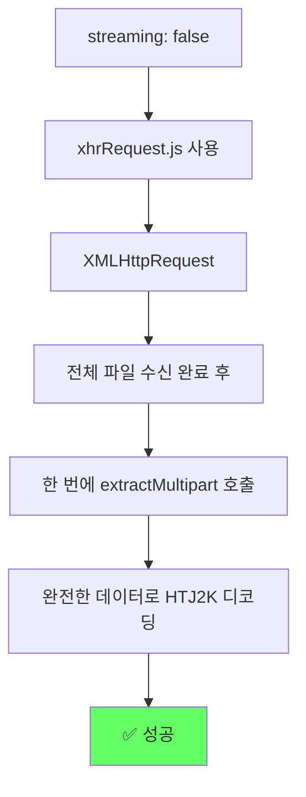

**동작하는 이유**:
1. `xhrRequest.js`는 **전체 파일 수신 후** 처리
2. `extractMultipart`가 완전한 데이터를 받아 정상 파싱
3. HTJ2K 디코더가 완전한 코드스트림으로 안정적 디코딩
4. WASM 메모리 관리가 예측 가능

### 15.5 결론

| 항목 | `streaming: true` | `streaming: false` |
|------|-------------------|-------------------|
| **HTTP 방식** | fetch ReadableStream | XMLHttpRequest |
| **데이터 처리** | 청크 단위 progressive | 전체 수신 후 일괄 |
| **HTJ2K 디코딩** | ❌ 메모리 오류 | ✅ 안정적 |
| **상태** | 사용 불가 | **권장** |

### 15.6 설정 복원

테스트 후 안정적인 동작을 위해 설정을 복원:

```typescript
// extensions/cornerstone/src/utils/htj2kConfig.ts
const DEFAULT_CONFIG: HTJ2KConfig = {
  enabled: true,
  volumeDecodeLevel: 2,
  stackDecodeLevel: 2,
  stackFullResolutionOnScroll: true,
  streaming: false,  // ✅ fetch streaming 비활성화 (HTJ2K 메모리 오류 발생)
  earlyTermination: false,
};
```

### 15.7 향후 고려사항

#### 15.7.1 `streaming: true`를 사용하려면

1. **Cornerstone HTJ2K 디코더 업그레이드**: OpenJPH WASM의 부분 데이터 처리 안정화 필요
2. **메모리 풀 관리**: WASM 메모리 사전 할당 및 재사용
3. **동시 디코딩 제한**: `maxNumberOfWebWorkers` 감소
4. **청크 크기 조정**: `minChunkSize` 증가로 더 큰 단위로 디코딩

#### 15.7.2 HTTP 조기 중단 대안

Section 13의 HTTP 조기 중단을 구현하려면 `streaming: true` 대신 **`xhrRequest.js`에 `xhr.abort()` 방식** 사용:

```javascript
// xhrRequest.js 수정 방안
xhr.onprogress = function (oProgress) {
    if (hasEnoughDataForDecodeLevel(percentComplete, targetDecodeLevel)) {
        xhr.abort();  // 조기 중단
    }
};
```

이 방법은 `streaming: false`를 유지하면서 HTTP 조기 중단을 구현할 수 있음.

### 15.8 테스트 이력

| 날짜 | 설정 | 결과 | 비고 |
|------|------|------|------|
| 2025-12-22 | `streaming: true` | ❌ 실패 | `_setThrow is not defined` 오류 |
| 2025-12-23 | `streaming: false` | ✅ 성공 | Section 11에서 해결 |
| 2025-12-23 | `streaming: true` (재테스트) | ❌ 실패 | 메모리 오류 (`Couldn't decode`) |

**최종 결론**: `streaming: true`는 현재 HTJ2K DICOMweb 환경에서 **사용 불가**. `streaming: false` 유지 필수.
