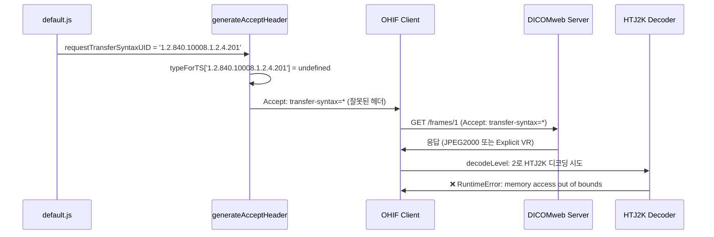
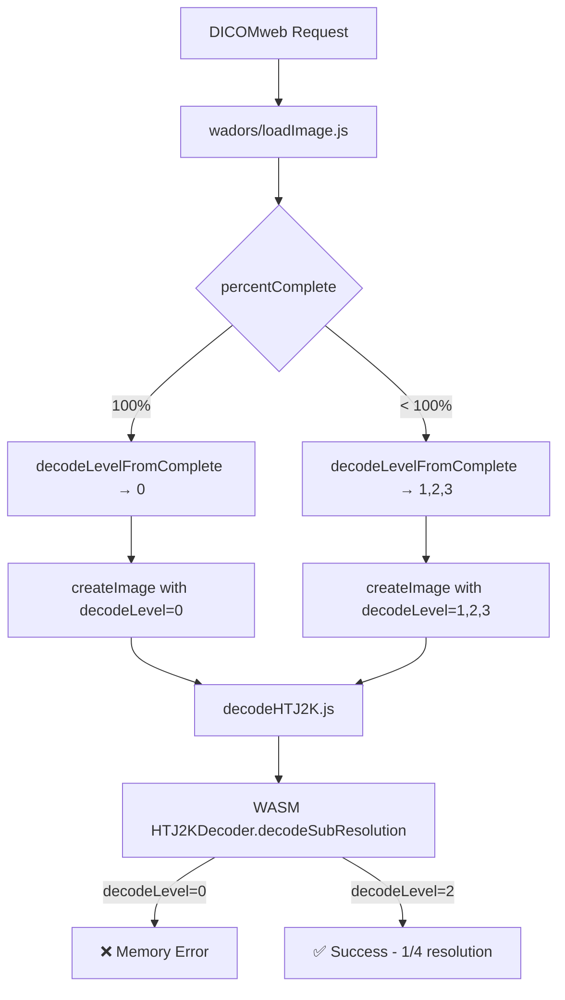

# HTJ2K DICOMweb 디코딩 오류 분석 보고서

**작성일**: 2025-12-22
**최종 수정**: 2025-12-22
**상태**: 진행 중 - 메모리 부족 오류 지속

---

## 1. 문제 현상

DICOMweb을 통해 이미지를 로드할 때 다음과 같은 오류가 발생:

```
RuntimeError: memory access out of bounds at HTJ2KDecoder
Couldn't decode 219270488
_setThrow is not defined
IMAGE_LOAD_ERROR TypeError: handler is not a function
```

로컬 파일 로딩 시에는 정상 동작하나, DICOMweb에서만 오류 발생.

---

## 2. 근본 원인 분석

### 2.1 핵심 문제: Accept 헤더 생성 버그

**문제 파일**: `platform/core/src/utils/generateAcceptHeader.ts`

```typescript
const typeForTS = {
  '*': 'application/octet-stream',
  '1.2.840.10008.1.2.1': 'application/octet-stream',
  '1.2.840.10008.1.2': 'application/octet-stream',
  '1.2.840.10008.1.2.2': 'application/octet-stream',
  '1.2.840.10008.1.2.4.70': 'image/jpeg',
  '1.2.840.10008.1.2.4.50': 'image/jpeg',
  '1.2.840.10008.1.2.4.51': 'image/dicom+jpeg',
  '1.2.840.10008.1.2.4.57': 'image/jpeg',
  '1.2.840.10008.1.2.5': 'image/dicom-rle',
  '1.2.840.10008.1.2.4.80': 'image/jls',
  '1.2.840.10008.1.2.4.81': 'image/jls',
  '1.2.840.10008.1.2.4.90': 'image/jp2',
  '1.2.840.10008.1.2.4.91': 'image/jp2',
  '1.2.840.10008.1.2.4.92': 'image/jpx',
  '1.2.840.10008.1.2.4.93': 'image/jpx',
  // ❌ HTJ2K Transfer Syntax가 누락됨!
  // '1.2.840.10008.1.2.4.201': 'image/jphc', // HTJ2K Lossless
  // '1.2.840.10008.1.2.4.202': 'image/jphc', // HTJ2K Lossless RPCL
  // '1.2.840.10008.1.2.4.203': 'image/jphc', // HTJ2K
};
```

### 2.2 문제 발생 흐름



### 2.3 코드 흐름 분석

1. **설정 파일** (`default.js`):
   ```javascript
   requestTransferSyntaxUID: '1.2.840.10008.1.2.4.201', // HTJ2K Lossless
   ```

2. **Accept 헤더 생성** (`generateAcceptHeader.ts`):
   ```typescript
   // 조건 실패: typeForTS[requestTransferSyntaxUID]가 undefined
   if (requestTransferSyntaxUID && typeForTS[requestTransferSyntaxUID]) {
     // 이 블록이 실행되지 않음
     acceptHeader.push('transfer-syntax=' + requestTransferSyntaxUID);
   } else {
     acceptHeader.push('type=application/octet-stream');
   }

   if (!hasTransferSyntax) {
     acceptHeader.push('transfer-syntax=*'); // 모든 Transfer Syntax 허용
   }
   ```

3. **결과 Accept 헤더**:
   ```
   multipart/related; type="application/octet-stream"; transfer-syntax="*"
   ```
   HTJ2K가 아닌 모든 형식을 허용하게 됨.

4. **서버 응답**:
   - 서버는 DICOMweb 표준에 따라 `transfer-syntax=*`를 받으면 아무 형식으로나 응답 가능
   - 서버가 JPEG2000, Explicit VR Little Endian 등으로 응답할 수 있음

5. **디코더 오류**:
   - 클라이언트는 `decodeLevel: 2` 설정으로 HTJ2K 디코딩을 시도
   - 받은 데이터가 HTJ2K가 아니므로 디코더 실패

---

## 3. 결론

### 3.1 책임 소재

| 구분 | 상태 | 설명 |
|------|------|------|
| **DICOMweb 서버** | ✅ 정상 | DICOMweb 표준에 따라 Accept 헤더에 맞게 응답 |
| **OHIF 뷰어** | ❌ 버그 | `typeForTS` 맵에 HTJ2K Transfer Syntax 누락 |

### 3.2 왜 로컬 파일은 동작하는가?

로컬 파일 로딩 시:
- 파일의 Transfer Syntax를 직접 파싱하여 확인
- HTJ2K 파일인 경우에만 `decodeLevel: 2` 적용
- 메타데이터 조정 로직이 정상 동작

DICOMweb 로딩 시:
- Accept 헤더가 잘못 생성되어 HTJ2K가 아닌 형식으로 응답받음
- 하지만 클라이언트는 무조건 `decodeLevel: 2`로 디코딩 시도
- 형식 불일치로 디코더 실패

---

## 4. 해결 방안

### 4.1 필수 수정: HTJ2K Transfer Syntax 추가

**파일**: `platform/core/src/utils/generateAcceptHeader.ts`

```typescript
const typeForTS = {
  // ... 기존 항목들

  // HTJ2K Transfer Syntax 추가
  '1.2.840.10008.1.2.4.201': 'image/jphc', // HTJ2K Lossless
  '1.2.840.10008.1.2.4.202': 'image/jphc', // HTJ2K Lossless RPCL
  '1.2.840.10008.1.2.4.203': 'image/jphc', // HTJ2K
};
```

**MIME 타입 참고**:
- `image/jphc`: JPEG 2000 Part 15 - High-Throughput JPEG 2000 (HTJ2K) 표준 MIME 타입

### 4.2 수정 후 예상 동작

```mermaid
sequenceDiagram
    participant Config as default.js
    participant Header as generateAcceptHeader
    participant Client as OHIF Client
    participant Server as DICOMweb Server
    participant Decoder as HTJ2K Decoder

    Config->>Header: requestTransferSyntaxUID = '1.2.840.10008.1.2.4.201'
    Header->>Header: typeForTS['1.2.840.10008.1.2.4.201'] = 'image/jphc'
    Header->>Client: Accept: type=image/jphc; transfer-syntax=1.2.840.10008.1.2.4.201
    Client->>Server: GET /frames/1 (올바른 Accept 헤더)
    Server->>Client: 응답 (HTJ2K Lossless)
    Client->>Decoder: decodeLevel: 2로 HTJ2K 디코딩
    Decoder->>Client: ✅ 성공 (1/4 해상도 이미지)
```

---

## 5. 추가 검토 필요 사항

### 5.1 서버 HTJ2K 지원 여부

- 서버가 HTJ2K를 지원하지 않으면 올바른 Accept 헤더를 보내도 406 Not Acceptable 또는 다른 형식으로 응답
- 서버의 HTJ2K 지원 여부 확인 필요

### 5.2 Fallback 처리

현재 코드는 무조건 `decodeLevel: 2`를 적용:

```typescript
// extensions/cornerstone/src/index.tsx
const volumeRetrieveOptions = {
  retrieveOptions: {
    default: {
      streaming: true,
      decodeLevel: 2, // 항상 적용됨
    },
  },
};
```

개선 검토 사항:
- 서버가 HTJ2K로 응답하지 않을 경우 graceful fallback
- Transfer Syntax 확인 후 조건부 `decodeLevel` 적용

### 5.3 DicomWebDataSource 메타데이터 조정

`extensions/default/src/DicomWebDataSource/index.ts`에 추가된 HTJ2K 메타데이터 조정 로직:
- 현재 `HTJ2K_ADJUSTMENT_ENABLED = false`로 비활성화됨
- Accept 헤더 수정 후 활성화 테스트 필요

---

## 6. 관련 파일

| 파일 | 역할 |
|------|------|
| `platform/core/src/utils/generateAcceptHeader.ts` | Accept 헤더 생성 (수정 필요) |
| `platform/app/public/config/default.js` | 데이터소스 설정 |
| `extensions/cornerstone/src/initWADOImageLoader.js` | WADO 이미지 로더 초기화 |
| `extensions/cornerstone/src/index.tsx` | decodeLevel 설정 |
| `extensions/default/src/DicomWebDataSource/index.ts` | DICOMweb 데이터소스 |

---

## 7. 테스트 체크리스트

수정 후 확인 사항:

- [x] yarn build 성공
- [ ] DICOMweb에서 이미지 로딩 시 HTJ2K 디코딩 오류 해결 ❌ 아직 미해결
- [x] Accept 헤더가 올바르게 생성되는지 Network 탭에서 확인
- [x] 서버가 HTJ2K로 응답하는지 확인 (~600KB, Transfer-Syntax: 1.2.840.10008.1.2.4.202)
- [ ] MPR 뷰포트에서 Volume 렌더링 정상 동작 ❌ 메모리 오류
- [x] 로컬 파일 로딩 기능 영향 없음

---

## 8. 추가 분석: wadors 로더의 decodeLevel 문제 (2025-12-22)

### 8.1 현재 상황

Accept 헤더 수정 후에도 여전히 "memory access out of bounds" 오류 발생.

**확인된 사항:**
- 서버 응답 데이터: ~600KB (로컬 파일과 동일)
- Transfer-Syntax: `1.2.840.10008.1.2.4.202` (HTJ2K RPCL)
- 메타데이터 조정 로그: `[HTJ2K-DICOMweb] Adjusted metadata: 1686x3460 → 421x865`

### 8.2 근본 원인: wadors 로더의 decodeLevel 계산 로직

**문제 파일**: `node_modules/@cornerstonejs/dicom-image-loader/dist/esm/imageLoader/wadors/loadImage.js`

```javascript
// 원본 코드
function loadImage(imageId, options = {}) {
  async function sendXHR(imageURI, imageId, mediaType) {
    for await (const result of compressedIt) {
      const { percentComplete } = result;

      // 문제: options.retrieveOptions.decodeLevel을 무시하고 자체 계산
      const decodeLevel = decodeLevelFromComplete(percentComplete);

      const useOptions = {
        ...options,
        decodeLevel,  // 자체 계산한 값으로 덮어씀!
      };

      const image = await createImage(imageId, pixelData, transferSyntax, useOptions);
    }
  }
}

function decodeLevelFromComplete(percent) {
  const testSize = percent / 100 - 0.02;
  if (testSize > 1 / 4) return 0;  // 100% 다운로드 시 level 0 (full resolution)
  if (testSize > 1 / 16) return 1;
  if (testSize > 1 / 64) return 2;
  return 3;
}
```

**핵심 문제:**
1. wadors 로더는 `options.retrieveOptions.decodeLevel` (OHIF 설정)을 **무시**
2. 자체적으로 `percentComplete`에서 `decodeLevel` 계산
3. 100% 다운로드 완료 시 `decodeLevel = 0` (full resolution)으로 설정
4. Full resolution 디코딩 시 메모리 부족 발생

### 8.3 시도한 해결 방법

#### 방법 1: node_modules 직접 수정 (적용됨, 효과 미확인)

```javascript
// 수정된 코드 (loadImage.js)
// [TEST] Force decodeLevel to 2 for HTJ2K testing
const decodeLevel = 2;

// [TEST] Force FULL_RESOLUTION to stop progressive loading at level 2
image.imageQualityStatus = ImageQualityStatus.FULL_RESOLUTION;
```

#### 방법 2: webpack 캐시 삭제

삭제된 캐시 경로:
- `platform/app/node_modules/.cache/webpack`
- `node_modules/.cache/nx`

#### 방법 3: 커스텀 wadors 로더 래퍼 (생성됨, 미적용)

파일: `extensions/cornerstone/src/utils/customWadorsLoader.ts`

원본 wadors 로더를 래핑하여 `retrieveOptions.decodeLevel`을 강제 적용하려 했으나,
원본 로더 내부에서 decodeLevel을 덮어쓰기 때문에 효과 없음.

### 8.4 미해결 원인 가설

1. **webpack 캐시 문제**: 캐시 삭제 후에도 번들에 반영되지 않음
2. **동시 디코딩 메모리 문제**: 다수의 이미지를 동시에 디코딩하면서 WASM 메모리 초과
3. **HTJ2K WASM 디코더 한계**: openjph 디코더의 메모리 관리 이슈

### 8.5 향후 시도할 방법

1. **patch-package 사용**: npm postinstall에서 자동 패치 적용
2. **동시 디코딩 수 제한**: `maxNumberOfWebWorkers` 감소
3. **순차 디코딩**: 병렬 대신 순차적으로 이미지 디코딩
4. **메모리 풀 크기 증가**: WASM 메모리 설정 조정

---

## 9. 생성된 파일 목록

| 파일 | 목적 | 상태 |
|------|------|------|
| `extensions/cornerstone/src/utils/customWadorsLoader.ts` | 커스텀 wadors 로더 래퍼 | 생성됨, 미사용 |
| `extensions/cornerstone/src/utils/patchHTJ2KDecoder.ts` | HTJ2K 디코더 패치 유틸 | 생성됨, 미사용 |
| `patches/@cornerstonejs+dicom-image-loader+4.14.4.patch` | patch-package용 패치 파일 | 생성됨, 미적용 |

---

## 10. 관련 코드 흐름



**문제점**: 100% 다운로드 시 강제로 decodeLevel=0이 적용됨
