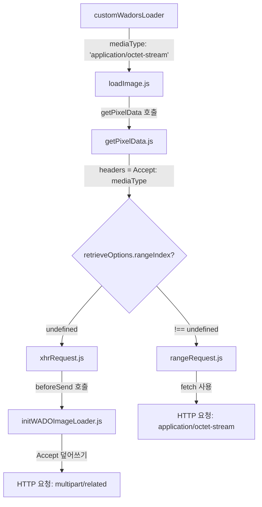
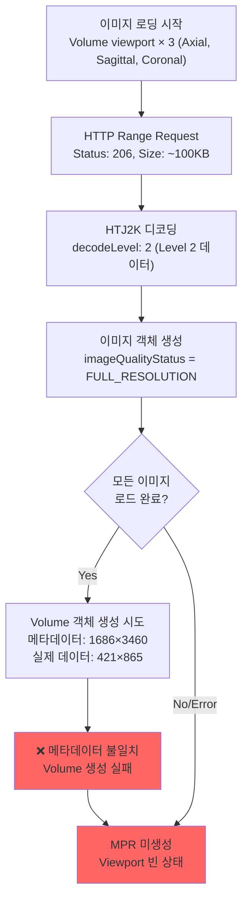

# HTJ2K Range Request 문제점 분석

## 목표
HTTP Range Request를 사용하여 HTJ2K 이미지의 일부만 다운로드하여 대역폭 최적화

## 현재 상태
- `Range: bytes=0-99999` 헤더는 정상적으로 전송됨
- **문제**: `Accept` 헤더가 `multipart/related`로 전송되어 서버가 Range Request를 무시함

---

## 요청 흐름 분석



---

## 문제점 1: xhrRequest vs rangeRequest

### getPixelData.js 분기 로직
```javascript
if (retrieveOptions.rangeIndex !== undefined) {
    return rangeRequest(url, imageId, headers, options);  // fetch() 사용 ✓
}
// ...
const loadPromise = xhrRequest(url, imageId, headers);  // XHR 사용 ✗
```

| 경로 | 사용 API | beforeSend 영향 | Accept 헤더 |
|------|----------|-----------------|-------------|
| rangeRequest | fetch() | 받지 않음 | application/octet-stream (정상) |
| xhrRequest | XMLHttpRequest | beforeSend가 덮어씀 | multipart/related (문제) |

### 현재 상태
- 콘솔에 `[CustomWadors] Range Request enabled: { rangeIndex: 0 }` 출력됨
- **하지만** 실제 요청은 `xhrRequest`로 가고 있음
- **원인**: `retrieveOptions.rangeIndex`가 `getPixelData`까지 전달되지 않음

---

## 문제점 2: beforeSend의 Accept 헤더 덮어쓰기

### xhrRequest.js 헤더 병합
```javascript
const beforeSendHeaders = await options.beforeSend(xhr, imageId, defaultHeaders, params);
const headers = Object.assign({}, defaultHeaders, beforeSendHeaders);
```

`beforeSendHeaders`가 `defaultHeaders`를 덮어씁니다.

### initWADOImageLoader.js beforeSend
```javascript
beforeSend: function (xhr) {
  const sourceConfig = extensionManager.getActiveDataSource()?.[0].getConfig() ?? {};
  const acceptHeader = utils.generateAcceptHeader(
    sourceConfig.acceptHeader,  // ← config에서 가져옴
    sourceConfig.requestTransferSyntaxUID,
    sourceConfig.omitQuotationForMultipartRequest
  );
  return { Accept: acceptHeader };
}
```

### generateAcceptHeader 함수 (platform/core/src/utils/generateAcceptHeader.ts)
```javascript
const generateAcceptHeader = (configAcceptHeader = [], ...) => {
  // config에 acceptHeader가 있으면 그대로 반환!
  if (configAcceptHeader.length > 0) {
    return configAcceptHeader;  // ← ['application/octet-stream'] 반환해야 함
  }
  // 없으면 multipart/related 생성
  return ['multipart/related; type=...'];
};
```

---

## 문제점 3: sourceConfig.acceptHeader 확인 필요

### 디버그 로그 확인
콘솔에서 `[WADO] sourceConfig.acceptHeader:` 출력값 확인 필요

| 출력값 | 의미 |
|--------|------|
| `['application/octet-stream']` | config 정상 로드 → generateAcceptHeader가 multipart 반환 중 (버그) |
| `undefined` 또는 `[]` | config가 beforeSend까지 전달되지 않음 |

### local_dcm4chee.js 설정
```javascript
dataSources: [{
  configuration: {
    acceptHeader: ['application/octet-stream'],  // ← 설정됨
    // ...
  }
}]
```

---

## 근본 원인 분석

### 의문점
- 콘솔: `[CustomWadors] Range Request enabled: { rangeIndex: 0 }` 출력됨 ✓
- 콘솔: `[HTJ2K-loadImage] options.retrieveOptions: { rangeIndex: 0 }` 출력됨 ✓
- **하지만** 실제 요청은 `xhrRequest`로 감 (XHR, multipart/related)

### 가설: customWadorsLoader가 호출되지 않음
`imageLoader.registerImageLoader('wadors', customWadorsLoader)`로 등록했지만,
실제 이미지 로드 시 **다른 경로로 호출**될 가능성:

1. **등록 시점 문제**: 등록 전에 이미 다른 로더가 등록됨
2. **덮어쓰기**: 나중에 다른 코드가 wadors 로더를 다시 등록
3. **다른 imageId scheme**: wadors가 아닌 다른 scheme 사용

### 확인 필요
```javascript
// 콘솔에서 확인
import { imageLoader } from '@cornerstonejs/core';
console.log(imageLoader.getImageLoaders()); // 등록된 로더 확인
```

---

## 해결 방안

### 방안 1: getPixelData.js 직접 패치 (확실한 해결책)
`getPixelData.js`에서 `rangeIndex` 확인 전에 디버그 로그 추가,
또는 조건을 확장하여 `rangeRequest` 호출을 보장

```diff
// getPixelData.js 패치
function getPixelData(uri, imageId, mediaType = 'application/octet-stream', options) {
    const { streamingData, retrieveOptions = {} } = options || {};
+   console.log('[getPixelData] retrieveOptions:', retrieveOptions);
+   console.log('[getPixelData] rangeIndex:', retrieveOptions.rangeIndex);
    const headers = { Accept: mediaType };
    // ...
    if (retrieveOptions.rangeIndex !== undefined) {
+       console.log('[getPixelData] → rangeRequest 호출');
        return rangeRequest(url, imageId, headers, options);
    }
+   console.log('[getPixelData] → xhrRequest 호출');
    // ...
}
```

### 방안 2: beforeSend에서 singlepart Accept 유지
xhrRequest가 호출되더라도 Accept 헤더를 유지:

```javascript
// initWADOImageLoader.js
beforeSend: function (xhr, imageId, defaultHeaders) {
  // singlepart 요청인 경우 Accept 헤더 덮어쓰지 않음
  if (defaultHeaders?.Accept === 'application/octet-stream') {
    const authHeaders = userAuthenticationService.getAuthorizationHeader();
    return authHeaders || {};
  }
  // 기존 로직...
  return { Accept: acceptHeader };
}
```

### 방안 3: rangeRequest에서 beforeSend 미적용 확인
`rangeRequest.js`는 `fetch()` 사용하므로 `beforeSend` 영향 없음.
문제는 `rangeRequest`가 호출되지 않는 것.

---

## 디버깅 체크리스트

- [ ] 콘솔에서 `[WADO] sourceConfig.acceptHeader:` 값 확인
- [ ] `getPixelData`에 진입할 때 `retrieveOptions` 값 확인
- [ ] `rangeRequest`가 호출되는지 `xhrRequest`가 호출되는지 확인
- [ ] Network 탭에서 실제 요청이 fetch인지 XHR인지 확인

---

## 실패한 시도들 (교훈)

### 시도 1: config/default.js 수정
**문제**: `yarn dev:dcm4chee`는 `config/local_dcm4chee.js`를 사용함
**결과**: 설정이 적용되지 않음
**교훈**: 어떤 config 파일이 사용되는지 먼저 확인해야 함

### 시도 2: earlyTermination으로 xhr.abort() 시도
**문제**: xhr을 중단해도 이미 전체 파일이 다운로드됨
**결과**: 대역폭 절약 효과 없음
**교훈**: HTTP Range Request는 서버에서 지원해야 하며, 클라이언트에서 중단하는 것은 해결책이 아님

### 시도 3: customWadorsLoader에서 mediaType 설정
**문제**: loadImage.js에서 mediaType이 하드코딩되어 있음
**결과**: 설정이 무시됨
**교훈**: node_modules 코드도 패치가 필요할 수 있음

### 시도 4: loadImage.js 패치로 mediaType 지원 추가
**문제**: getPixelData → xhrRequest → beforeSend에서 Accept 헤더 덮어씀
**결과**: multipart/related로 여전히 요청됨
**교훈**: 전체 요청 흐름을 추적해야 함

### 시도 5: config에 acceptHeader 설정 추가
**문제**:
1. `sourceConfig.acceptHeader`가 beforeSend에 전달되는지 확인 안 함
2. `rangeRequest` vs `xhrRequest` 분기 조건을 확인 안 함
**결과**: 여전히 multipart로 요청됨
**교훈**: 설정을 추가하는 것만으로는 부족, 실제로 사용되는지 확인해야 함

### 시도 6: 동일한 문제를 반복 수정
**문제**: Accept 헤더가 덮어써지는 근본 원인을 해결하지 않고 여러 곳을 수정
**결과**: 같은 문제가 계속 발생
**교훈**:
- 문제의 근본 원인을 정확히 파악한 후 수정해야 함
- 추측으로 수정하지 말고, 디버그 로그로 실제 값을 확인해야 함
- 코드 흐름을 끝까지 추적해야 함

---

## 핵심 교훈

1. **전체 흐름 파악**: 설정 → 코드 → 실제 요청까지 전체 흐름을 추적
2. **디버그 로그 활용**: 각 단계에서 실제 값을 확인
3. **config 파일 확인**: 어떤 config가 사용되는지 먼저 확인
4. **node_modules 패치**: 외부 라이브러리 동작을 변경해야 할 때 patch-package 사용
5. **분기 조건 확인**: if문의 조건이 실제로 충족되는지 확인

---

## 디버깅 세션 기록 (2025-12-23)

### 1단계: htj2kDebugLogger 추가
**목적**: 로그를 배열에 저장하여 나중에 테이블/파일로 확인

**파일**: `extensions/cornerstone/src/utils/htj2kDebugLogger.ts`

**사용법**:
```javascript
window.__htj2kDebug.show()     // 테이블로 출력
window.__htj2kDebug.download() // JSON 파일 다운로드
window.__htj2kDebug.filter('getPixelData') // 소스별 필터링
```

### 2단계: customWadorsLoader 로그 확인
**결과**: `customWadorsLoader`는 정상 호출됨
```
[CustomWadors] Range Request enabled: {
  decodeLevel: 2,
  rangeIndex: 0,
  chunkSize: 100000,
  mediaType: "application/octet-stream"
}
```

### 3단계: getPixelData 패치 추가
**목적**: `getPixelData`에서 `rangeIndex` 값 확인

**패치 내용**:
```javascript
console.log('[getPixelData] rangeIndex:', retrieveOptions.rangeIndex, 'mediaType:', mediaType);
```

**결과**: `window.__htj2kDebug.filter('getPixelData')` → `[]` (빈 배열)

### 4단계: loadImage.js 패치 추가
**목적**: `loadImage.sendXHR`에서 로그 확인

**결과**: `[loadImage.sendXHR]` 로그도 안 나옴

### 5단계: 캐시 삭제 시도
```bash
rm -rf node_modules/.cache .next
```
**결과**: 여전히 패치된 로그가 안 나옴

### 중간 발견 (5단계까지)
패치가 번들에 포함되지 않는 것처럼 보였음:
- `customWadorsLoader`의 로그는 나오는데, `originalWadorsLoader` 내부 로그는 안 나옴
- 캐시 삭제 후에도 동일

### 현재 상태 (6단계 이후)
- `customWadorsLoader`가 `rangeIndex: 0`과 `mediaType: 'application/octet-stream'` 설정 ✓
- `originalWadorsLoader` 호출 ✓
- **패치는 적용됨** (`originalWadorsLoader.toString()`으로 확인) ✓
- **하지만** `sendXHR` 함수 내부 로그가 출력되지 않음
- 이는 **비동기 실행 또는 다른 경로**로 인한 것으로 추정

### 6단계: originalWadorsLoader.toString() 확인 ⭐ 중요 발견
**목적**: 런타임에서 실제로 사용되는 `loadImage` 함수의 코드 확인

**방법**:
```javascript
// customWadorsLoader.ts에 추가
console.log('[CustomWadors] originalWadorsLoader:', originalWadorsLoader.toString().substring(0, 200));
```

**결과**: 패치가 적용됨을 확인! ✅
```javascript
function loadImage(imageId, options = {}) {
    // [DEBUG] Log options at loadImage level
    console.log('[HTJ2K-loadImage] options.retrieveOptions:', JSON.stringify(options?.retrieveOptions, null, 2
```

### 핵심 발견 (수정됨)
**패치는 적용되어 있음!** 🎉

`originalWadorsLoader.toString()` 출력에서 `[HTJ2K-loadImage]` 로그 코드가 포함되어 있음을 확인.
이는 `patch-package`가 정상적으로 적용되었음을 의미.

### 새로운 의문점
패치가 적용되었는데 왜 로그가 안 나오는가?

**가능한 원인**:
1. **imageRetrievalPool 비동기 실행**: `sendXHR`은 `imageRetrievalPool.addRequest()`로 큐에 추가됨
   - 요청이 즉시 실행되지 않고 풀에서 관리됨
   - 풀의 동시 요청 수 제한에 의해 대기 중일 수 있음

2. **에러 발생**: `sendXHR` 호출 전에 에러가 발생하여 함수가 실행되지 않음

3. **다른 코드 경로**: `customWadorsLoader` → `originalWadorsLoader` 경로 외에
   다른 경로로 이미지가 로드될 가능성

### 7단계: loadImage 함수 진입점에 로그 추가
**목적**: `loadImage` 함수가 실제로 호출되는지, 그리고 `options`가 어떤 값인지 확인

**패치 추가**:
```javascript
function loadImage(imageId, options = {}) {
    // HTJ2K Debug: loadImage 함수 진입 확인
    console.log('[loadImage] ENTRY - imageId:', imageId.substring(0, 50),
                'options.mediaType:', options.mediaType,
                'options.retrieveOptions:', JSON.stringify(options.retrieveOptions));
    const mediaType = options.mediaType || defaultMediaType;
    console.log('[loadImage] Using mediaType:', mediaType);
    // ...
}
```

**확인 사항**:
- `[loadImage] ENTRY` 로그가 출력되면 → `loadImage` 함수 자체는 호출됨
- `options.mediaType`이 `application/octet-stream`이면 → `customWadorsLoader`에서 전달됨
- `options.retrieveOptions.rangeIndex`가 `0`이면 → Range Request 설정 전달됨

### 다음 디버깅 방향
1. `[loadImage] ENTRY` 로그 출력 확인
2. `mediaType`과 `retrieveOptions` 값 확인
3. Network 탭에서 실제 요청 확인 (XHR vs Fetch, Accept 헤더 값)

---

## 파일 위치

| 파일 | 역할 |
|------|------|
| `extensions/cornerstone/src/utils/customWadorsLoader.ts` | mediaType, rangeIndex 설정 |
| `patches/@cornerstonejs+dicom-image-loader+4.14.4.patch` | loadImage.js에 mediaType 지원 추가 |
| `node_modules/.../wadors/loadImage.js` | getPixelData 호출, options 전달 |
| `node_modules/.../wadors/getPixelData.js` | rangeRequest vs xhrRequest 분기 |
| `node_modules/.../internal/xhrRequest.js` | beforeSend 호출 |
| `node_modules/.../internal/rangeRequest.js` | fetch() 사용, beforeSend 영향 없음 |
| `extensions/cornerstone/src/initWADOImageLoader.js` | beforeSend 정의 |
| `platform/core/src/utils/generateAcceptHeader.ts` | Accept 헤더 생성 |
| `platform/app/public/config/local_dcm4chee.js` | acceptHeader 설정 |

---

## MPR Progressive Loading 실패 분석 (2025-12-30)

### 문제 현상

HTTP Range Request로 Level 2 부분 데이터(~100KB) 다운로드는 성공하지만:
- **MPR(Multi-Planar Reconstruction)이 생성되지 않음**
- **이미지 로딩이 중간에 멈춤**

### 성공한 부분

| 항목 | 상태 | 값 |
|------|------|-----|
| HTTP Status | ✅ | 206 Partial Content |
| 다운로드 크기 | ✅ | ~101KB (Level 2) |
| `_setThrew` 오류 | ✅ 해결 | codec-openjph 패치 적용 |

### Level 2 데이터의 한계

| 항목 | Level 2 (현재) | Full Resolution |
|------|---------------|-----------------|
| 해상도 | 1/4 (421×865) | 원본 (1686×3460) |
| 데이터 크기 | ~100KB | ~654KB |
| Stack 이미지 | ✅ 가능 | ✅ 가능 |
| Volume/MPR | ❌ 불완전 | ✅ 가능 |

### 근본 원인 분석

#### 원인 1: Progressive Loading 중단

```typescript
// customWadorsLoader.ts (Line 248-250)
if (forcedDecodeLevel !== undefined && forcedDecodeLevel > 0) {
  image.imageQualityStatus = ImageQualityStatus.FULL_RESOLUTION;  // ← 문제!
}
```

**FULL_RESOLUTION으로 설정하면**:
- Cornerstone이 "이미지 로딩 완료"로 인식
- 추가 데이터 요청(Full Resolution) 중단
- Volume 생성 시 불완전한 데이터 사용

#### 원인 2: 메타데이터 불일치

```
원본 메타데이터: 1686 × 3460 pixels
Level 2 디코딩 결과: 421 × 865 pixels (1/4)
```

Volume 생성 시:
- 메타데이터는 원본 크기 기대
- 실제 픽셀 데이터는 1/4 크기
- **3D 재구성 불가능**

#### 원인 3: MPR 생성 조건 미충족

MPR 생성 전제 조건:
- ✅ 충분한 이미지 개수
- ❌ **모든 이미지가 동일한 해상도** (Level 2는 1/4 크기)
- ❌ **메타데이터와 실제 픽셀 데이터 일치**

### 이미지 로딩 흐름



### 권장 해결 방안

#### 방안 A: Volume은 Range Request 비활성화 (단기)

```javascript
// local_dcm4chee.js
htj2k: {
  rangeRequest: {
    enabled: true,
    volumeEnabled: false,  // Volume은 전체 다운로드
    stackEnabled: true,    // Stack만 Range Request
  }
}
```

**장점**: 즉시 적용 가능
**단점**: Volume 로딩 시 대역폭 절약 없음

#### 방안 B: Full Resolution 후속 요청 구현 (중기)

```
1단계: Level 2 먼저 로드 (빠른 미리보기)
    ↓
2단계: imageQualityStatus = SUBRESOLUTION 설정
    ↓
3단계: Volume 생성 시 Full Resolution 재요청
    ↓
4단계: 완전한 MPR 생성
```

**장점**: 빠른 초기 로딩 + 완전한 MPR
**단점**: 구현 복잡도 높음

#### 방안 C: 메타데이터 동적 조정 (장기)

```typescript
// htj2kMetadataAdjuster.ts 확장
export function adjustMetadataForDecodeLevel(metadata, decodeLevel) {
  const factor = Math.pow(2, decodeLevel);  // Level 2 → factor 4
  return {
    ...metadata,
    Rows: Math.floor(metadata.Rows / factor),
    Columns: Math.floor(metadata.Columns / factor),
    PixelSpacing: metadata.PixelSpacing.map(s => s * factor),
  };
}
```

**장점**: Level 2 데이터로도 저해상도 MPR 가능
**단점**: 품질 저하, 임상 사용 부적합

### 핵심 체크리스트

```
1. Network 탭 확인
   ☐ HTTP Status: 206 (Partial Content)
   ☐ Size: ~100KB (Level 2)
   ☐ 모든 이미지 요청 완료?

2. 콘솔 로그 확인
   ☐ imageQualityStatus 값?
   ☐ Volume 생성 시도 로그?
   ☐ 메모리 오류 메시지?

3. Volume 생성 검증
   ☐ 메타데이터 Rows/Columns 값?
   ☐ 실제 픽셀 데이터 크기?
   ☐ cornerstoneStreamingImageVolumeLoader 호출?
```

### 관련 코드 파일

| 파일 | 역할 | 수정 필요 |
|------|------|----------|
| `customWadorsLoader.ts` | imageQualityStatus 설정 | ⭐ 핵심 |
| `htj2kConfig.ts` | volumeDecodeLevel 설정 | 설정 분리 |
| `htj2kMetadataAdjuster.ts` | 메타데이터 조정 | 선택적 |
| `index.tsx` | Volume retrieveOptions | 분기 로직 |

### 결론

**현재 상태**: HTTP Range Request 동작 성공, 하지만 MPR 생성 실패

**원인**: Level 2 부분 데이터와 원본 메타데이터 불일치, Progressive Loading 조기 중단

**권장 조치**:
1. 단기: Volume은 Range Request 비활성화
2. 중기: Full Resolution 후속 요청 메커니즘 구현
