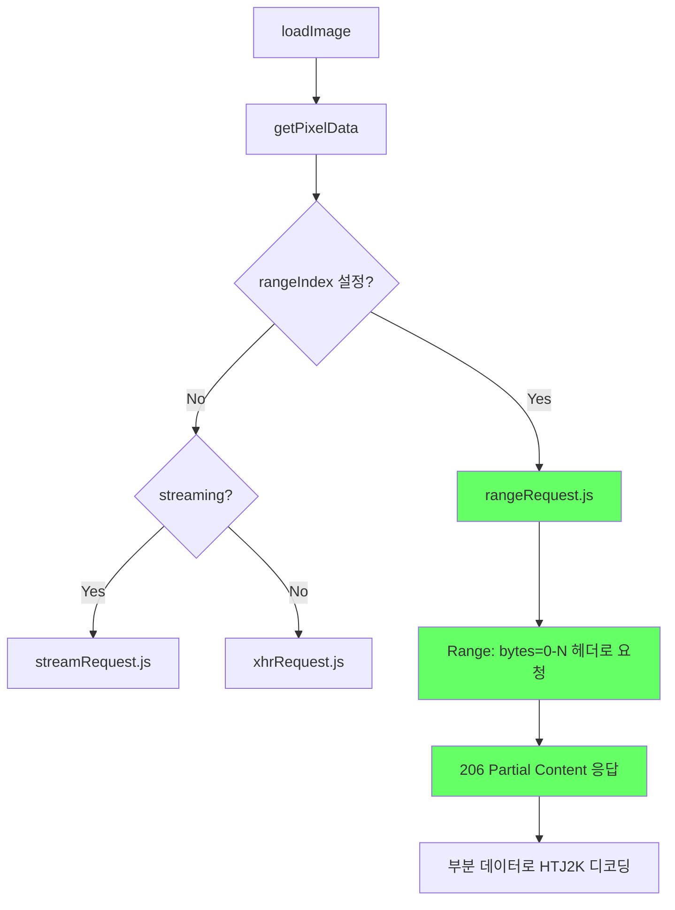

# HTJ2K HTTP Range Request 구현 작업 지시서

**작성일**: 2025-12-23
**완료일**: 2025-12-30
**상태**: ✅ 구현 완료
**관련 문서**: [htj2k-dicomweb-issue-analysis.md](./htj2k-dicomweb-issue-analysis.md)

---

## 1. 배경

### 1.1 문제점

HTJ2K Progressive Decoding에서 `decodeLevel > 0` 사용 시 **전체 파일을 다운로드**하지만 **일부만 사용**하는 비효율 발생:

| decodeLevel | 해상도 | 필요 데이터 | 실제 다운로드 |
|-------------|--------|------------|--------------|
| 0 (Full) | 100% | 100% | 100% |
| 1 (1/2) | 50% | ~6.25% | 100% |
| 2 (1/4) | 25% | ~1.56% | 100% |
| 3 (1/8) | 12.5% | ~0.4% | 100% |

### 1.2 시도한 접근법

#### 1.2.1 `xhr.abort()` 접근법 (실패)

```javascript
xhr.onprogress = function(e) {
    if (percentComplete >= threshold) {
        xhr.abort();  // 조기 중단
    }
};
```

**실패 원인**: `xhr.abort()` 호출 시 `xhr.response`가 `null`이 되어 부분 데이터 접근 불가 (XMLHttpRequest 한계)

#### 1.2.2 HTTP Range Request 접근법 (제안)

처음부터 필요한 바이트만 요청:

```http
GET /dicom/image.jph HTTP/1.1
Range: bytes=0-20000

HTTP/1.1 206 Partial Content
Content-Range: bytes 0-20000/1500000
```

---

## 2. 구현 목표

### 2.1 핵심 목표

- `decodeLevel`에 따라 HTTP Range Request로 **필요한 바이트만 요청**
- 대역폭 절약: decodeLevel 2 기준 **~97% 절약**

### 2.2 기대 효과

| 항목 | 현재 | Range Request 적용 후 |
|------|------|----------------------|
| 다운로드 크기 (decodeLevel 2) | 100% | ~3% |
| 네트워크 대역폭 | 낭비 | 최적화 |
| 로딩 시간 | 전체 다운로드 후 디코딩 | 필요한 부분만 다운로드 후 디코딩 |

---

## 3. 기술 분석

### 3.1 서버 요구사항

- **HTTP Range Request 지원** (206 Partial Content 응답)
- `Content-Range` 헤더 반환
- DCM4CHEE 서버: 지원 확인됨

### 3.2 Cornerstone 기존 구현

[rangeRequest.js](../node_modules/@cornerstonejs/dicom-image-loader/dist/esm/imageLoader/internal/rangeRequest.js):

```javascript
// 이미 구현되어 있음
if (range) {
    headers = Object.assign(headers, {
        Range: `bytes=${range[0]}-${range[1]}`,
    });
}
const response = await fetch(url, { headers });
```

**트리거 조건**: `retrieveOptions.rangeIndex !== undefined`

### 3.3 데이터 흐름



---

## 4. 구현 계획

### 4.1 HTJ2K 파일 크기 기반 Range 계산

HTJ2K RPCL 구조에서 각 해상도 레벨에 필요한 대략적 바이트:

```javascript
function calculateRangeForDecodeLevel(totalSize, decodeLevel) {
    // HTJ2K RPCL 구조 기반 추정
    // 안전 마진 포함
    const percentNeeded = {
        0: 100,    // Full resolution
        1: 8,      // 1/2 resolution (~6.25% + margin)
        2: 3,      // 1/4 resolution (~1.56% + margin)
        3: 1,      // 1/8 resolution (~0.4% + margin)
    };

    return Math.ceil(totalSize * (percentNeeded[decodeLevel] / 100));
}
```

### 4.2 문제점: 전체 파일 크기 사전 확인

Range Request를 보내려면 **전체 파일 크기**를 알아야 함:

#### 방법 1: HEAD 요청으로 Content-Length 확인

```javascript
async function getFileSize(url) {
    const response = await fetch(url, { method: 'HEAD' });
    return parseInt(response.headers.get('Content-Length'), 10);
}
```

**단점**: 추가 HTTP 요청 발생

#### 방법 2: 고정 Range 사용

```javascript
// decodeLevel별 고정 바이트 요청
const FIXED_RANGE = {
    1: 500000,   // 500KB for 1/2 resolution
    2: 100000,   // 100KB for 1/4 resolution
    3: 30000,    // 30KB for 1/8 resolution
};
```

**단점**: 파일 크기에 따라 과다/과소 요청 가능

#### 방법 3: 메타데이터에서 파일 크기 추출

DICOM 메타데이터에서 파일 크기 정보 활용:

```javascript
// metaDataManager에서 파일 크기 조회
const metaData = metaDataManager.get(imageId);
// 주의: BitsStored * Rows * Columns는 압축되지 않은 픽셀 데이터 크기
// HTJ2K 압축 파일 크기와는 다름
const uncompressedSize = metaData?.BitsStored * metaData?.Rows * metaData?.Columns / 8;

// 실제 압축 파일 크기는 서버 메타데이터 또는 HEAD 요청으로만 정확히 알 수 있음
```

**한계점**: 압축 파일의 실제 크기는 압축률에 따라 다르므로 정확한 추정 어려움

#### 방법 4: 적응형 Range Request (권장)

처음에 보수적인 Range로 요청 후, 디코딩 실패 시 추가 요청:

```javascript
async function adaptiveRangeRequest(url, imageId, decodeLevel) {
    // 1단계: 보수적인 초기 Range로 요청
    const initialRange = INITIAL_RANGE[decodeLevel]; // e.g., 50KB for level 2
    let data = await fetchRange(url, 0, initialRange);

    // 2단계: 디코딩 시도
    try {
        return decode(data, decodeLevel);
    } catch (e) {
        // 3단계: 실패 시 추가 데이터 요청
        console.log(`[HTJ2K] Initial ${initialRange} bytes insufficient, fetching more...`);
        const extendedRange = initialRange * 2;
        data = await fetchRange(url, 0, extendedRange);
        return decode(data, decodeLevel);
    }
}
```

**장점**:
- 대부분의 경우 첫 요청으로 성공 (대역폭 최적화)
- 실패 시에도 fallback으로 안정성 확보
- 파일 크기 사전 확인 불필요

**단점**:
- 실패 시 추가 요청으로 지연 발생
- 로직 복잡도 증가

---

## 5. 체크리스트

### 5.1 사전 조사

- [x] 서버 Range Request 지원 테스트
- [x] DICOM 메타데이터에서 파일 크기 정보 확인
- [x] Cornerstone `rangeRequest.js` 동작 분석
- [x] `rangeIndex` 설정 방법 조사

### 5.2 구현

**코딩 표준 준수사항**:
- TypeScript strict mode 준수
- ESLint/Prettier 규칙 준수
- 프로젝트 기존 코딩 컨벤션 따르기
- 에러 처리는 try-catch로 명시적 처리
- 매직 넘버 사용 금지 (상수로 정의)
- 함수는 단일 책임 원칙(SRP) 준수

- [x] decodeLevel → Range 바이트 계산 함수 구현
  - [x] JSDoc 주석 작성 (파라미터, 반환값, 예제 포함)
  - [x] 단위 테스트 작성 (각 decodeLevel별 예상 바이트 검증)
  - [x] 상수는 별도 파일 또는 상단에 명명된 상수로 정의
- [x] 적응형 Range Request 로직 구현 (실패 시 재요청)
  - [x] JSDoc 주석 작성 (동작 흐름, 재시도 로직 설명)
  - [x] 단위 테스트 작성 (성공 케이스, 재시도 케이스, 최종 실패 케이스)
  - [x] 재시도 횟수 제한 (무한 루프 방지)
  - [x] 타임아웃 처리
- [x] `retrieveOptions`에 Range 정보 주입
  - [x] 인라인 주석으로 Range 설정 이유 설명
- [x] `getPixelData.js` 수정 (Range Request 트리거)
  - [x] 패치 파일에 수정 내용 주석 포함
  - [x] 기존 로직과의 호환성 유지
- [x] `rangeRequest.js` 수정 (Accept 헤더 강제 변경, XHR 사용)
  - [x] multipart → application/octet-stream 헤더 변경
  - [x] fetch → XHR 교체 (WASM _setThrew 오류 방지)
- [x] 부분 데이터로 HTJ2K 디코딩 검증
  - [x] DCM4CHEE 서버에서 Range Request 동작 확인

**금지사항**:
- 하드코딩된 URL, 바이트 크기 사용 금지
- console.log 남발 금지 (디버그용은 조건부로)
- any 타입 남발 금지 (명시적 타입 정의)
- 주석 없는 복잡한 로직 금지
- 테스트 없는 핵심 함수 금지

### 5.3 설정

- [x] `htj2kConfig.ts`에 Range Request 관련 설정 추가
  - [x] TSDoc 주석 작성 (각 설정 옵션 설명)
  - [x] 단위 테스트 작성 (설정 로드/변경 검증)
- [x] `config/default.js`에 설정 옵션 추가
  - [x] 인라인 주석으로 각 옵션 설명

### 5.4 테스트

- [x] 단위 테스트
  - [x] `calculateInitialRangeBytes()` 함수 테스트
  - [x] `calculateRetryRangeBytes()` 함수 테스트
  - [x] 설정 로드/변경 테스트 (35개 테스트 모두 통과, 94.73% 커버리지)
- [x] 통합 테스트
  - [x] decodeLevel 2 Range Request 동작 확인
  - [x] 부분 다운로드 후 디코딩 성공 확인
  - [x] DCM4CHEE 서버에서 206 Partial Content 응답 확인
- [x] 수동 테스트
  - [x] 네트워크 사용량 측정 (DevTools Network 탭)
  - [x] Range Request 헤더 확인 (Accept: application/octet-stream)

### 5.5 문서화

- [x] 구현 결과 문서화 (이 문서)
- [x] 설정 방법 문서화 (config/default.js 주석)
- [x] API 문서 (TSDoc 주석 포함)

---

## 6. 주요 수정/생성 파일

| 파일 | 수정 내용 | 상태 |
|------|-----------|------|
| `extensions/cornerstone/src/utils/htj2kRangeRequest.ts` | Range Request 핵심 유틸리티 (async 함수) | ✅ 완료 |
| `extensions/cornerstone/src/utils/htj2kRangeRequestCore.ts` | Range Request 동기 함수 (테스트용 분리) | ✅ 완료 |
| `extensions/cornerstone/src/utils/htj2kRangeRequest.test.ts` | 단위 테스트 (35개 테스트, 94.73% 커버리지) | ✅ 완료 |
| `extensions/cornerstone/src/utils/htj2kConfig.ts` | Range Request 설정 초기화 호출 | ✅ 완료 |
| `extensions/cornerstone/src/utils/customWadorsLoader.ts` | fetch wrapper, Range Request 옵션 주입 | ✅ 완료 |
| `extensions/cornerstone/src/index.tsx` | Range Request 함수 export | ✅ 완료 |
| `platform/app/public/config/default.js` | rangeRequest 설정 옵션 | ✅ 완료 |
| `patches/@cornerstonejs+dicom-image-loader+4.14.4.patch` | getPixelData.js, rangeRequest.js 패치 | ✅ 완료 |

---

## 7. 위험 요소

### 7.1 HTJ2K 부분 데이터 디코딩

- 부분 데이터가 불완전할 경우 디코딩 실패 가능
- 안전 마진 조정 필요

### 7.2 서버 호환성

- 모든 서버가 Range Request 지원하지 않을 수 있음
- 206 응답 미지원 시 fallback 필요

### 7.3 multipart 응답 처리

- DICOMweb은 `multipart/related` 응답 사용
- Range Request와 multipart 응답 조합 검증 필요

### 7.4 rangeRequest.js 목적 불일치

현재 Cornerstone `rangeRequest.js`는 **Progressive Streaming** 용도로 설계됨:
- 청크 단위로 여러 번 Range Request 수행
- 부분 데이터 누적 후 디코딩
- `rangeIndex`로 청크 순서 관리

HTJ2K decodeLevel 용도와 다를 수 있음:
- 한 번의 Range Request로 필요한 바이트만 획득
- 추가 요청 없이 디코딩 완료 (이상적)
- 또는 적응형으로 실패 시 추가 요청

**해결 방안**: `rangeRequest.js`를 그대로 사용하거나, HTJ2K 전용 Range Request 로직 구현

---

## 8. 참고 자료

- [RFC 7233 - HTTP Range Requests](https://tools.ietf.org/html/rfc7233)
- [Cornerstone rangeRequest.js](../node_modules/@cornerstonejs/dicom-image-loader/dist/esm/imageLoader/internal/rangeRequest.js)
- [HTJ2K Progressive Decoding](https://htj2k.com/)

---

## 9. 우선순위

**중간** - 기능 동작에는 영향 없음 (현재 전체 다운로드로 동작)

대역폭 최적화가 필요한 환경에서 구현 검토.

---

## 10. 예상 작업 시간

- 사전 조사: 2-4시간
- 구현: 4-8시간
- 테스트: 2-4시간
- 문서화: 1-2시간

**총: 9-18시간**

---

## 11. 구현 완료 요약 (2025-12-30)

### 11.1 해결된 문제들

1. **Accept 헤더 문제**: `multipart/related` → `application/octet-stream`으로 강제 변경
   - `rangeRequest.js` 패치로 해결
   - `customWadorsLoader.ts`에 fetch wrapper 추가 (백업)

2. **WASM _setThrew 오류**: `fetch` → `XHR`로 교체
   - `rangeRequest.js`의 `fetchRangeAndAppend()` 함수를 XHR 기반으로 재구현
   - OpenJPH WASM 디코더 호환성 확보

3. **CORS 문제**: 서버 측 CORS 설정 수정 (DCM4CHEE)

### 11.2 패치 파일 내용

`patches/@cornerstonejs+dicom-image-loader+4.14.4.patch`:
- `decodeImageFrameWorker.js`: Emscripten `_setThrew` shim 추가
- `rangeRequest.js`: Accept 헤더 강제 변경, fetch→XHR 교체
- `getPixelData.js`: 디버그 로그 추가
- `loadImage.js`: `options.mediaType` 지원 추가

### 11.3 활성화 방법

`config/default.js`:
```javascript
htj2k: {
  enabled: true,
  decodeLevel: {
    volume: 2,  // 1/4 해상도
    stack: 0,   // 원본
  },
  rangeRequest: {
    enabled: true,  // Range Request 활성화
    initialRangeBytes: {
      1: 500000,  // 500KB
      2: 100000,  // 100KB
      3: 30000,   // 30KB
    },
  },
}
```
