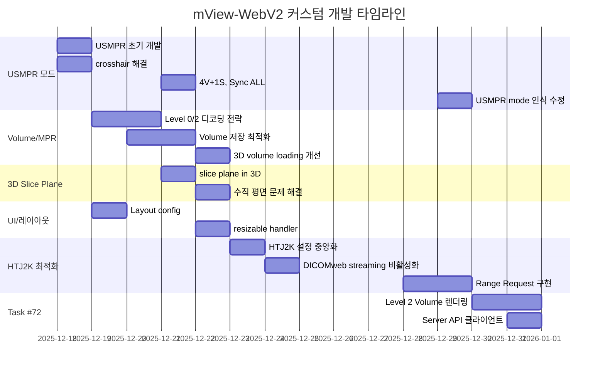
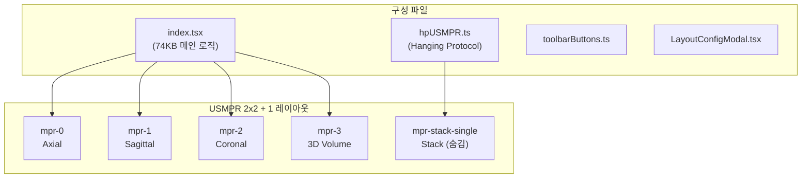
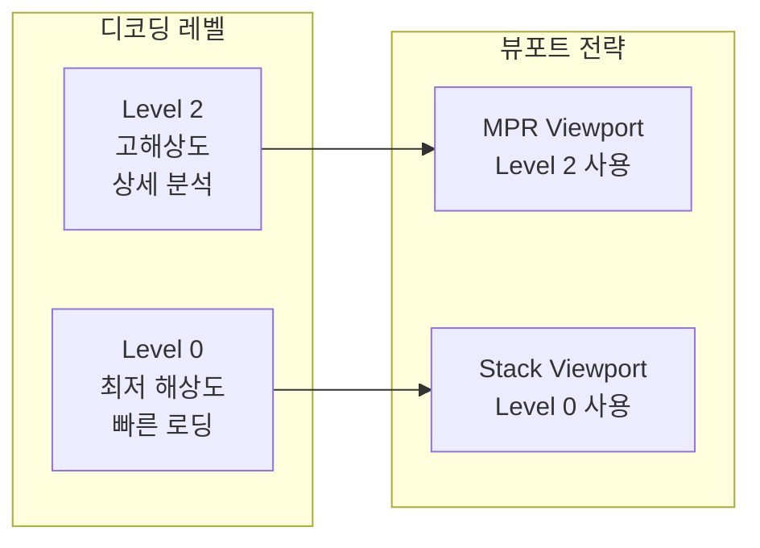
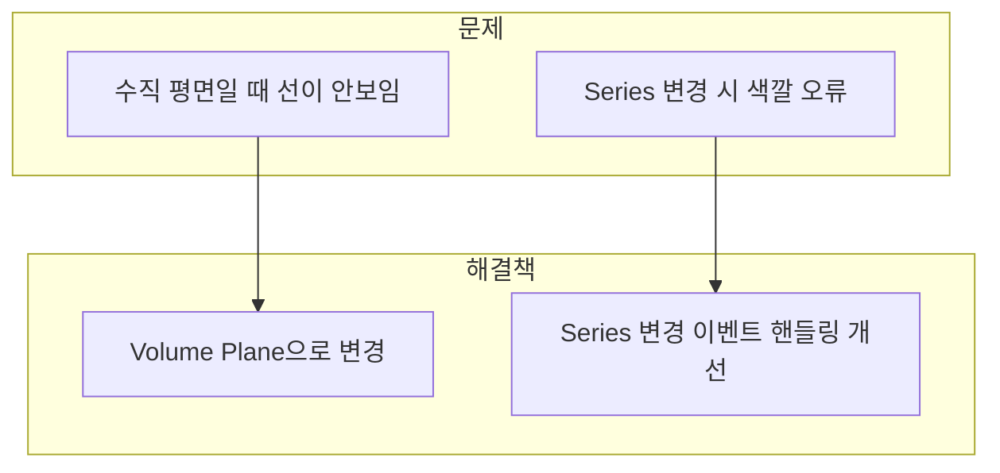
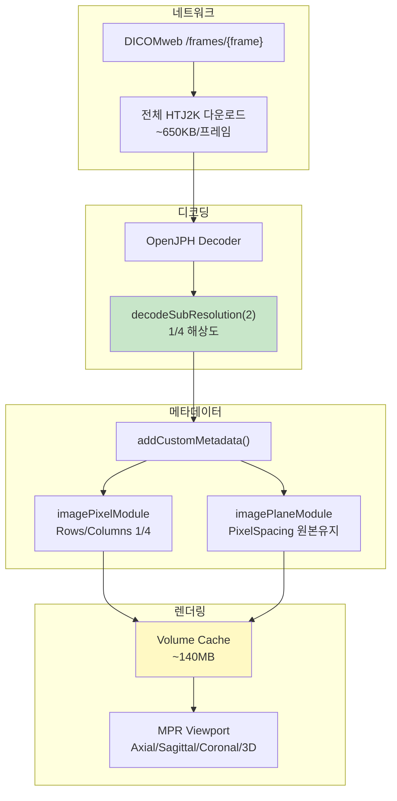
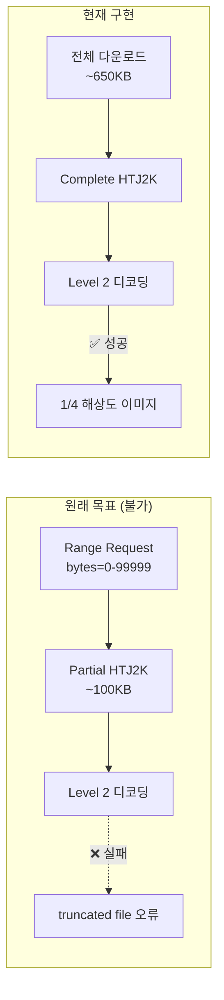
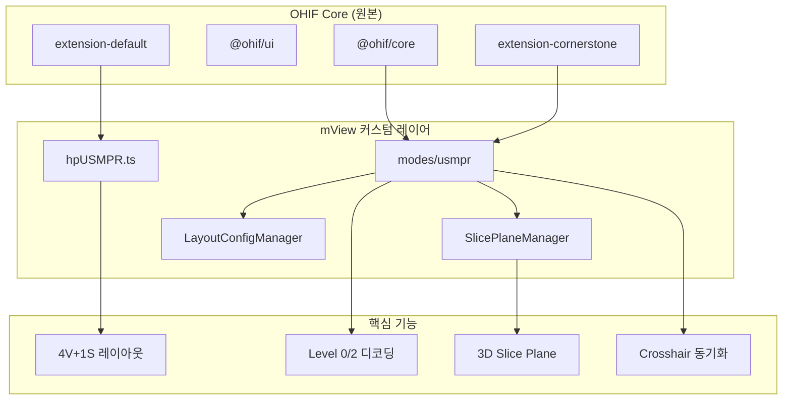
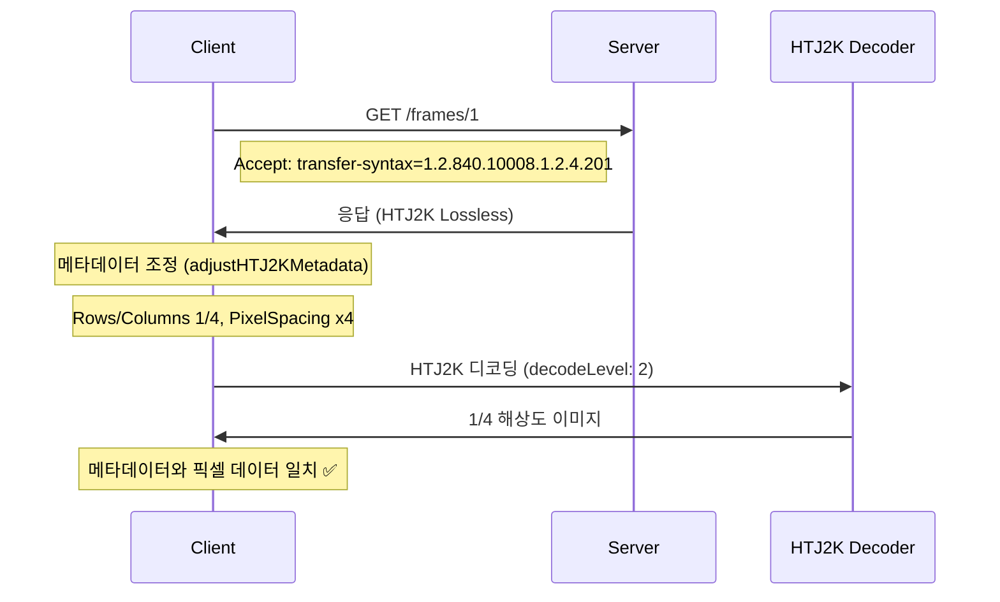

# mView-WebV2 커스터마이징 분석 보고서

## 개요

이 문서는 OHIF Viewer를 기반으로 한 mView-WebV2 프로젝트의 커스텀 변경사항을 Git 로그 기반으로 분석한 내용입니다.

- **분석 기준일**: 2025-12-31
- **분석 대상 브랜치**: `feature/yongminbae`
- **기준 커밋**: `ef98516b4` (OHIF 원본) → `5e8e02c52` (최신 커스텀)
- **커스텀 커밋 수**: 약 45개

---

## 커밋 히스토리 요약



---

## 주요 변경사항 상세

### 1. USMPR 모드 신규 개발 (핵심 기능)

**관련 커밋:**
- `be8a95b9d` - USMPR 4V+1S, Sync ALL, Semifinal version
- `b1c08ed65` - USMPR cross hair 해결
- `1e97115b4` - USMPR size handle 2->1

**변경 파일:**
- `modes/usmpr/` - 완전히 신규 생성된 모드
- `extensions/default/src/hangingprotocols/hpUSMPR.ts` - 321줄의 신규 Hanging Protocol

**기능 설명:**

USMPR(Ultrasound MPR)은 초음파/CT/MR 영상을 위한 Multi-Planar Reconstruction 뷰어 모드입니다.



**핵심 기능:**
- **4V+1S 레이아웃**: 4개 Volume viewport + 1개 Stack viewport (토글)
- **Sync ALL**: 모든 viewport 간 동기화
- **사용자 설정 저장**: sessionStorage/localStorage 기반 레이아웃 설정 저장
- **3D 프리셋**: US 3D 전용 Volume Rendering 프리셋

---

### 2. Volume/Stack 디코딩 레벨 전략

**관련 커밋:**
- `500a8e122` - 4 volume(level0) + 1 stack 전략 구현
- `9c04059e0` - axial viewport volume → stack 전환
- `1e788d59b` - Axial은 level 0, MPR은 level 2
- `38f30a9f9` - level2 MPR - axial도 level2

**기술적 배경:**

HTJ2K 코덱의 Progressive Decoding 레벨을 활용한 메모리/성능 최적화:



**작동 시퀀스:**

```
1. 사용자가 스터디 로드 → MPR이 Level 2로 초기화
   (volume은 "dicomfile:X" 형태로 캐시)

2. 사용자가 Axial 더블클릭 → STACK viewport 활성화
   - ImageId가 "dicomfile:X?stackView=X"로 변환 (별도 캐시)
   - Decode level이 0으로 설정 (STACK 로드에만 영향)

3. STACK viewport가 변환된 imageId를 Level 0으로 로드
   - 메모리 관리가 ±5 이미지를 Level 0으로 프리페치

4. 사용자가 스크롤 → 먼 STACK 이미지 클리어, 가까운 것 로드

5. 사용자가 STACK 종료 → STACK imageId만 클리어
   - Volume은 그대로 유지!
   - 2×2 MPR이 **즉시** 복원 (volume 재디코딩 없음)
```

---

### 3. 3D Slice Plane 렌더링

**관련 커밋:**
- `c05cf7833` - 3D slice plane 색깔 series 변경 error fix
- `33499f845` - 3D slice 평면이 수직일 때 선이 안보이는 문제 해결
- `774be1d12` - slice plane in 3D
- `078f9d291` - slice plane in 3D debug logging 삭제

**변경 파일:**
- `modes/usmpr/src/utils/SlicePlaneManager.ts`
- `modes/usmpr/src/utils/SlicePlaneSync.ts`

**문제 해결:**



---

### 4. 레이아웃 및 UI 개선

**관련 커밋:**
- `b4db703e6` - 초기 50% layout 삭제, resizable handler 보이게
- `badd5c0c0` - sessionStorage, LocalStorage configLayout 설정 가능
- `7dd5dde89` - Layout config 수정, reload 방지
- `a5a42276c` - configure viewport layout -fits on screen 수정

**변경 내용:**

| 항목 | 기존 OHIF | mView 커스텀 |
|------|-----------|--------------|
| 초기 레이아웃 | 50% 분할 | 전체 화면 |
| Resizable Handler | 숨김 | 항상 표시 |
| 레이아웃 설정 저장 | 미지원 | sessionStorage/localStorage 지원 |
| Viewport 전환 | - | 4 viewport ↔ 1 viewport 토글 |

---

### 5. Crosshair 기능 개선

**관련 커밋:**
- `58579e55d` - Cross hair always on 해결
- `b30ed92e9` - cross hair 색깔과 이동성 회복
- `b1c08ed65` - USMPR cross hair 해결

**개선 내용:**
- Crosshair가 항상 표시되도록 수정
- Crosshair 색상 및 이동 기능 복원
- USMPR 모드에서의 Crosshair 동작 안정화

---

### 6. 3D Volume 렌더링 개선

**관련 커밋:**
- `900d83af1` - 3D volume image loading 개선
- `adc4a9310` - 3D volume 보다 잘 보이게 함
- `a70957e95` - MPR 초기 화면 변경 후 volume 저장 안하고 다시 decoding하는 문제 개선

**개선 내용:**
- 3D Volume 이미지 로딩 속도 개선
- Volume 렌더링 품질 향상
- Volume 캐싱 최적화 (불필요한 재디코딩 방지)

---

### 7. 기타 변경사항

| 커밋 | 변경 내용 |
|------|-----------|
| `e57829dfa` | Mview-web 로고 변경 |
| `ccc46f4e0` | 왼쪽 패널 썸네일의 경고 아이콘 삭제 (US ImagePositionPatient) |
| `bd85567a4` | 왼쪽 패널에서 더블클릭으로 Series 로딩 가능 |
| `f843ca616` | 4 viewport ↔ 1 viewport 전환 문제 해결 |
| `a72dd02ea` | testdata 폴더 git 무시 설정 |

---

### 8. Task #72: HTJ2K Level 2 Volume 렌더링 (2025-12-30~31)

**관련 커밋:**
- `5e8e02c52` - Task #72 HTJ2K Level 2 Volume 렌더링 구현
- `d74af54e1` - HTJ2K HTTP Range Request _setThrew 오류 해결
- `c8673dd71` - HTJ2K 설정 중앙화 (Section 14)
- `77ec9f108` - HTJ2K DICOMweb 로딩 오류 해결 - streaming 비활성화
- `1c72a3aa4` - HTJ2K Level 2 메타데이터 조정 및 DICOMweb 설정 변경

**신규 생성 파일:**

| 파일 | 역할 |
|------|------|
| `htj2kConfig.ts` | HTJ2K 설정 중앙화 (volumeDecodeLevel, stackDecodeLevel 등) |
| `htj2kBackgroundLoader.ts` | Background Progressive Loading (Server API 연동) |
| `htj2kDataMerger.ts` | Level + Complement 데이터 병합 |
| `htj2kRangeRequest.ts` | HTTP Range Request 유틸리티 |
| `htj2kRangeRequestCore.ts` | Range Request 코어 로직 |
| `htj2kDebugLogger.ts` | HTJ2K 디버그 로깅 |
| `htj2kTruncatedTest.ts` | Truncated 데이터 테스트 유틸 |
| `htj2kMetadataAdjuster.ts` | 메타데이터 조정 (Rows, Columns, PixelSpacing) |

**기능 설명:**

MPR Volume에서 HTJ2K Level 2 (1/4 해상도)를 사용하여 메모리/성능 최적화:



**메모리 최적화 효과:**

| 항목 | Full Resolution | Level 2 | 개선율 |
|------|-----------------|---------|--------|
| **디코딩 메모리** | 2.2GB | 140MB | **94% 절감** |
| **디코딩 속도** | 느림 | 빠름 | **~4배 향상** |

**Server API 연동 (선택적):**

서버가 `?level=2` 파라미터를 지원하면 네트워크 최적화도 가능:

```javascript
// local_dcm4chee.js 설정
htj2k: {
  serverApi: {
    enabled: true,  // Server API 활성화
  },
}
```

---

### 9. Range Request 한계 분석 (2025-12-31)

**핵심 발견:**

OpenJPH WASM 디코더는 **truncated HTJ2K 데이터를 지원하지 않음**.



**테스트 결과 (`htj2kTruncatedTest.ts`):**

| 데이터 크기 | 비율 | Level 0~3 | 오류 |
|------------|------|-----------|------|
| 50KB | 0.9% | 모두 ❌ | `error reading SIZ marker, truncated file` |
| 100KB | 1.8% | 모두 ❌ | 동일 |
| 500KB | 8.8% | 모두 ❌ | 동일 |

**결론:**
- `decodeSubResolution(level)`: **완전한 파일**을 낮은 해상도로 디코딩
- Truncated 데이터: **지원하지 않음**
- 네트워크 최적화: **서버 측 Level 추출 API 필요**

---

## 커스텀 파일 구조

```
mview-webv2/
├── modes/
│   └── usmpr/                          # [신규] USMPR 모드
│       ├── src/
│       │   ├── index.tsx               # 메인 모드 로직 (74KB)
│       │   ├── toolbarButtons.ts       # 툴바 버튼 정의
│       │   ├── components/
│       │   │   └── LayoutConfigModal.tsx  # 레이아웃 설정 모달
│       │   └── utils/
│       │       ├── SlicePlaneManager.ts   # 3D Slice Plane 관리
│       │       ├── SlicePlaneSync.ts      # Slice Plane 동기화
│       │       ├── ResizableGridManager.ts # 그리드 크기 조절
│       │       ├── LayoutConfigManager.tsx # 레이아웃 설정 관리
│       │       ├── usVolumePresets.ts     # US Volume 프리셋
│       │       └── usVolumeQuality.ts     # Volume 품질 설정
│       └── package.json
│
├── extensions/
│   ├── default/
│   │   └── src/
│   │       ├── hangingprotocols/
│   │       │   └── hpUSMPR.ts          # [신규] USMPR Hanging Protocol
│   │       ├── commandsModule.ts       # [수정] 명령어 모듈
│   │       ├── DicomWebDataSource/
│   │       │   └── index.ts            # [수정] HTJ2K 메타데이터 조정
│   │       ├── DicomLocalDataSource/
│   │       │   └── index.js            # [수정] HTJ2K 메타데이터 조정
│   │       └── customizations/
│   │           └── studyBrowserCustomization.ts  # [수정] 썸네일 경고 제거
│   │
│   └── cornerstone/
│       └── src/
│           ├── index.tsx               # [수정] 확장 초기화
│           ├── initDoubleClick.ts      # [수정] 더블클릭 핸들링
│           └── utils/
│               ├── getCornerstoneOrientation.ts  # [신규]
│               ├── customWadorsLoader.ts         # [수정] HTJ2K 디코딩 레벨
│               │
│               │   # ===== HTJ2K 유틸리티 (Task #72) =====
│               ├── htj2kConfig.ts                # [신규] HTJ2K 설정 중앙화
│               ├── htj2kConfig.test.ts           # [신규] 설정 테스트
│               ├── htj2kMetadataAdjuster.ts      # [신규] 메타데이터 조정
│               ├── htj2kBackgroundLoader.ts      # [신규] Background Loading
│               ├── htj2kBackgroundLoader.test.ts # [신규] Background Loading 테스트
│               ├── htj2kDataMerger.ts            # [신규] 데이터 병합
│               ├── htj2kDataMerger.test.ts       # [신규] 데이터 병합 테스트
│               ├── htj2kRangeRequest.ts          # [신규] Range Request
│               ├── htj2kRangeRequestCore.ts      # [신규] Range Request 코어
│               ├── htj2kRangeRequest.test.ts     # [신규] Range Request 테스트
│               ├── htj2kDebugLogger.ts           # [신규] 디버그 로깅
│               └── htj2kTruncatedTest.ts         # [신규] Truncated 테스트
│
├── platform/
│   └── app/
│       └── public/config/
│           ├── default.js              # [수정] HTJ2K Transfer Syntax
│           └── local_dcm4chee.js       # [수정] HTJ2K/Server API 설정
│
└── document/                           # 프로젝트 문서
    ├── TASK-72-LEVEL2-MPR-VOLUME.md              # Task #72 메인 작업지시서
    ├── TASK-72-CLIENT-API-IMPLEMENTATION.md      # Server API 클라이언트 구현
    ├── TASK-72-CLIENT-FALLBACK-IMPLEMENTATION.md # Fallback 구현 가이드
    ├── REPORT-HTJ2K-PROGRESSIVE-LOADING.md       # 경과 보고서
    └── mview-webv2-customization-analysis.md     # 커스터마이징 분석 (본 문서)
```

---

## 아키텍처 다이어그램



---

## 원본 OHIF 대비 주요 차이점

| 카테고리 | OHIF 원본 | mView 커스텀 |
|----------|-----------|--------------|
| **MPR 모드** | Basic MPR | USMPR (4V+1S) |
| **디코딩 전략** | 단일 레벨 | Level 0/2 하이브리드 |
| **HTJ2K 최적화** | 미지원 | Level 2 Volume (94% 메모리 절감) |
| **레이아웃 저장** | 미지원 | sessionStorage/localStorage |
| **3D Slice Plane** | 기본 렌더링 | 수직 평면 지원, 색상 동기화 |
| **Crosshair** | 기본 동작 | Always-on, 색상/이동 개선 |
| **Volume 캐싱** | 레이아웃 변경 시 재로딩 | 지능형 캐싱 (즉시 복원) |
| **US 지원** | 제한적 | 전용 프리셋 및 최적화 |
| **Server API** | 미지원 | Progressive Loading API 클라이언트 |

---

## ✅ 해결된 이슈: DICOMweb HTJ2K Level 디코딩

### 문제 요약 (해결됨)

HTJ2K Level 0/2 하이브리드 디코딩 기능은 **Task #72**를 통해 **DICOMweb에서도 완전히 구현**되었습니다.

### 구현 현황 비교

| 구분 | 로컬 파일 | DICOMweb |
|------|-----------|----------|
| **decodeLevel 설정** | ✅ 적용됨 | ✅ 적용됨 |
| **메타데이터 조정** | ✅ 구현됨 | ✅ **구현됨 (Task #72)** |
| **정상 동작** | ✅ | ✅ **정상 동작** |

### 기술적 배경 (해결 후)

```mermaid
flowchart TB
    subgraph "로컬 파일 (DicomLocalDataSource)"
        L1["1. HTJ2K 감지"]
        L2["2. 메타데이터 조정<br/>Rows: 3460 → 865<br/>Columns: 1686 → 421"]
        L3["3. addCustomMetadata() 호출"]
        L4["4. decodeLevel=2로 디코딩"]
        L5["5. 픽셀(865×421) = 메타데이터(865×421)<br/>✅ 일치"]

        L1 --> L2 --> L3 --> L4 --> L5
    end

    subgraph "DICOMweb (DicomWebDataSource) - Task #72 해결"
        W1["1. 서버에서 메타데이터 수신"]
        W2["2. 메타데이터 조정 (Task #72)<br/>Rows: 3460 → 865<br/>Columns: 1686 → 421"]
        W3["3. addCustomMetadata() 호출"]
        W4["4. decodeLevel=2로 디코딩"]
        W5["5. 픽셀(865×421) = 메타데이터(865×421)<br/>✅ 일치"]

        W1 --> W2 --> W3 --> W4 --> W5
    end

    style L5 fill:#c8e6c9
    style W5 fill:#c8e6c9
```



### 코드 위치

**로컬 파일 (구현됨):**
```
extensions/default/src/DicomLocalDataSource/index.js
├── isHTJ2K() - HTJ2K 감지
├── getAdjustedImagePixelModule() - Rows, Columns 조정
└── getAdjustedImagePlaneModule() - PixelSpacing 조정
```

**DICOMweb (Task #72 구현됨):**
```
extensions/default/src/DicomWebDataSource/index.ts
├── isHTJ2K() - HTJ2K 감지
├── getAdjustedImagePixelModule() - Rows, Columns 조정
├── getAdjustedImagePlaneModule() - PixelSpacing 조정
├── storeInstances() - addCustomMetadata() 호출
└── _retrieveSeriesMetadataSync() - addCustomMetadata() 호출
```

### 해결된 문제 (Task #72)

기존에 발생하던 다음 문제들이 모두 해결되었습니다:

| 문제 | 원인 | 해결 방법 |
|------|------|----------|
| Volume 생성 오류 | 메타데이터 불일치 | `addCustomMetadata()` 사용 |
| 측정 도구 4배 오차 | PixelSpacing 미조정 | PixelSpacing 원본 유지 + Camera Scale 보정 |
| Crosshair 위치 불일치 | World 좌표 계산 오류 | Annotation 좌표 일관성 유지 |
| MPR 평면 오류 | Volume dimensions 불일치 | Rows/Columns 조정 |

### ✅ 해결됨 (2025-12-31, Task #72 완료)

DICOMweb에 HTJ2K 메타데이터 조정 로직이 추가되고, **완전한 Volume 렌더링이 구현**되었습니다.

**수정된 파일:**
```
extensions/default/src/DicomWebDataSource/index.ts  - HTJ2K 메타데이터 조정
platform/app/public/config/default.js              - HTJ2K Transfer Syntax 요청
```

#### 1. DICOMweb 설정 변경

```javascript
// platform/app/public/config/default.js
dataSources: [{
  configuration: {
    // HTJ2K Transfer Syntax 명시적 요청
    requestTransferSyntaxUID: '1.2.840.10008.1.2.4.201', // HTJ2K Lossless
    // ...
  }
}]
```

**적용된 데이터 소스:** `ohif`, `ohif2`, `ohif3`

#### 2. HTJ2K 메타데이터 조정 (`HTJ2K_ADJUSTMENT_ENABLED = true`)

```javascript
// extensions/default/src/DicomWebDataSource/index.ts
adjustHTJ2KMetadata(instance):
  - Rows: 3460 → 865 (1/4)
  - Columns: 1686 → 421 (1/4)
  - PixelSpacing: x4 배율
```

#### 동작 흐름



#### 주의사항

**서버가 HTJ2K를 지원하지 않는 경우:**
```javascript
// extensions/default/src/DicomWebDataSource/index.ts
const HTJ2K_ADJUSTMENT_ENABLED = false;  // 비활성화

// platform/app/public/config/default.js
// requestTransferSyntaxUID 제거 또는 주석 처리
```

---

## 결론

mView-WebV2는 OHIF Viewer를 기반으로 **초음파(US) 및 다중 모달리티 MPR 뷰잉**에 최적화된 커스텀 의료 영상 뷰어입니다.

### 주요 기술적 성과

| 성과 | 설명 | 상태 |
|------|------|------|
| **USMPR 모드** | US/CT/MR을 위한 전용 MPR 뷰어 모드 (4V+1S) | ✅ 완료 |
| **HTJ2K Level 2 최적화** | 메모리 94% 절감 (2.2GB → 140MB) | ✅ 완료 |
| **DICOMweb 완전 지원** | Local/DICOMweb 모두 HTJ2K Level 디코딩 | ✅ 완료 |
| **사용자 경험** | 레이아웃 저장, Crosshair 개선, 3D Slice Plane | ✅ 완료 |
| **Server API 클라이언트** | Progressive Network Loading 준비 완료 | ✅ 완료 |

### 향후 계획

1. **Server API 구현**: 서버 측 `?level=2` 파라미터 지원 시 네트워크 최적화 (130MB → 20MB)
2. **런타임 테스트**: Volume/Stack 전환, Annotation 좌표, Crosshair 동기화 검증

---

## 관련 문서

| 문서 | 설명 |
|------|------|
| `TASK-72-LEVEL2-MPR-VOLUME.md` | Task #72 메인 작업지시서 |
| `TASK-72-CLIENT-API-IMPLEMENTATION.md` | Server API 클라이언트 구현 상세 |
| `TASK-72-CLIENT-FALLBACK-IMPLEMENTATION.md` | 클라이언트 Fallback 구현 가이드 |
| `REPORT-HTJ2K-PROGRESSIVE-LOADING.md` | HTJ2K Progressive Loading 경과 보고서 |

---

**작성일**: 2025-12-22
**최종 수정**: 2025-12-31 (Task #72 완료 반영)
**분석 도구**: Claude Code
